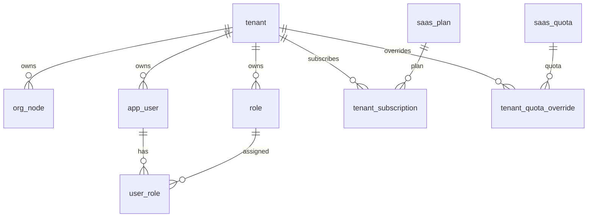

# 01-主体管理-数据库设计

## 1. 模块范围

主体管理涉及 SaaS 租户主体、主体品牌、默认组织、主管理员、主体订阅和租户配额覆盖。当前运行时订阅周期和席位配额以套餐订阅与覆盖表为准，`tenant` 中的历史配额字段仅作兼容展示。

## 2. 关联表清单

| 表名 | 说明 | 主要用途 |
|---|---|---|
| `tenant` | 主体/租户基础表 | 主体编码、名称、状态、品牌、平台主体标记 |
| `org_node` | 组织节点表 | 创建主体时初始化默认公司 |
| `app_user` | 用户表 | 创建主体首个超级管理员 |
| `role` | 角色表 | 创建主体管理员角色 |
| `user_role` | 用户角色关系 | 绑定主管理员角色 |
| `tenant_subscription` | 租户订阅 | 主体绑定套餐、订阅周期、状态 |
| `tenant_quota_override` | 租户配额覆盖 | 主体级用户数、公司数等差异额度 |
| `audit_log` | 操作日志 | 主体创建、编辑、启停、归档、配额配置审计 |

## 3. 核心表结构

### 3.1 `tenant`

| 字段 | 类型 | 约束 | 说明 |
|---|---|---|---|
| `id` | Integer | PK, index | 主体 ID |
| `code` | String(64) | unique, not null, index | 主体编码 |
| `name` | String(200) | not null | 主体名称 |
| `status` | Integer | not null, default 1 | 1 启用，0 停用 |
| `start_date` | Date | nullable | 历史兼容字段，运行时不应作为订阅来源 |
| `expire_date` | Date | nullable | 历史兼容字段，运行时不应作为到期来源 |
| `max_companies` | Integer | not null, default 0 | 历史兼容字段，运行时不应作为配额来源 |
| `max_users` | Integer | not null, default 0 | 历史兼容字段，运行时不应作为配额来源 |
| `contact_name` | String(100) | nullable | 联系人 |
| `contact_phone` | String(32) | nullable | 联系电话 |
| `created_at` | DateTime | default now | 创建时间 |
| `deleted_at` | DateTime | nullable | 逻辑删除时间 |
| `brand_display_name` | String(128) | nullable | 品牌展示名 |
| `brand_logo_data` | MEDIUMTEXT | nullable | 品牌 Logo Data URL |
| `brand_footer_text` | String(256) | nullable | 页脚文案 |
| `is_platform_tenant` | Boolean | default false | 是否平台主体 |

### 3.2 `tenant_subscription`

| 字段 | 类型 | 约束 | 说明 |
|---|---|---|---|
| `id` | Integer | PK, index | 订阅 ID |
| `tenant_id` | Integer | FK tenant.id, index | 主体 ID |
| `plan_id` | Integer | FK saas_plan.id, index | 套餐 ID |
| `subscription_status` | String(32) | not null | 订阅状态 |
| `start_time` | DateTime | not null | 订阅开始时间 |
| `end_time` | DateTime | nullable | 订阅结束时间 |
| `trial_end_time` | DateTime | nullable | 试用结束时间 |
| `auto_renew` | Boolean | default false | 是否自动续费 |
| `frozen_reason` | String(500) | nullable | 冻结原因 |
| `created_at` | DateTime | default now | 创建时间 |
| `updated_at` | DateTime | default now | 更新时间 |

### 3.3 `tenant_quota_override`

| 字段 | 类型 | 约束 | 说明 |
|---|---|---|---|
| `id` | Integer | PK, index | 主键 |
| `tenant_id` | Integer | FK tenant.id, index, unique 组成 | 主体 ID |
| `quota_id` | Integer | FK saas_quota.id, index, unique 组成 | 配额 ID |
| `quota_value` | Integer | not null | 覆盖值，-1 表示不限 |
| `reason` | String(500) | nullable | 覆盖原因 |
| `start_time` | DateTime | nullable | 生效时间 |
| `end_time` | DateTime | nullable | 失效时间 |
| `created_at` | DateTime | default now | 创建时间 |
| `updated_at` | DateTime | default now | 更新时间 |

唯一约束：`tenant_quota_override(tenant_id, quota_id)`。

## 4. 数据关系

## 5. 索引与约束

| 表 | 约束 |
|---|---|
| `tenant` | `code` 全局唯一 |
| `tenant_quota_override` | `(tenant_id, quota_id)` 唯一 |
| `tenant_subscription` | 当前未见租户当前订阅唯一约束，唯一性依赖 service（当前实现未覆盖，按后续增强处理） |

## 6. 删除与归档

主体删除必须逻辑删除，写入 `tenant.deleted_at`。主体编码需要墓碑化释放，避免归档后无法重新创建同编码主体。主体相关用户、组织、角色和日志不应物理删除。

## 7. 风险与后续增强

| 类型 | 内容 |
|---|---|
| 迁移风险 | 当前主体相关表主要由 GORM AutoMigrate 与版本化 migration 维护，缺少版本化迁移 |
| 订阅约束 | `tenant_subscription` 是否允许一个主体保留多条历史订阅需明确 |
| 历史字段 | `tenant.max_users`、`max_companies`、`expire_date` 容易被误用，后续业务应统一读订阅和配额覆盖 |
