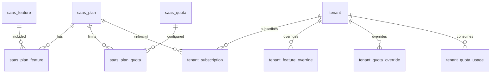

# 02-套餐中心-数据库设计

## 1. 模块范围

套餐中心管理 SaaS 商业化能力，包括套餐定义、功能点、套餐功能关系、配额定义、套餐配额、租户订阅、租户功能覆盖、租户配额覆盖和配额使用量。

## 2. 关联表清单

| 表名 | 说明 |
|---|---|
| `saas_plan` | 套餐定义 |
| `saas_feature` | 可套餐化功能点 |
| `saas_plan_feature` | 套餐与功能点关系 |
| `saas_quota` | 配额定义 |
| `saas_plan_quota` | 套餐与配额值关系 |
| `tenant_subscription` | 租户订阅套餐 |
| `tenant_feature_override` | 租户功能覆盖 |
| `tenant_quota_override` | 租户配额覆盖 |
| `tenant_quota_usage` | 租户周期配额用量 |
| `permission` | 菜单/按钮同步功能点来源 |

## 3. 核心表结构

### 3.1 `saas_plan`

| 字段 | 类型 | 约束 | 说明 |
|---|---|---|---|
| `id` | Integer | PK, index | 套餐 ID |
| `plan_code` | String(64) | unique, not null, index | 套餐编码 |
| `plan_name` | String(100) | not null | 套餐名称 |
| `plan_type` | String(32) | not null | 套餐类型 |
| `billing_cycle` | String(32) | default MONTH | 计费周期 |
| `price` | Numeric(12,2) | default 0 | 套餐价格 |
| `status` | Integer | default 1 | 1 启用，0 停用 |
| `is_default` | Boolean | default false | 是否默认套餐 |
| `sort_order` | Integer | default 0 | 排序 |
| `description` | String(500) | nullable | 说明 |
| `created_at` | DateTime | default now | 创建时间 |
| `updated_at` | DateTime | default now | 更新时间 |
| `deleted_at` | DateTime | nullable | 逻辑删除 |

### 3.2 `saas_feature`

| 字段 | 类型 | 约束 | 说明 |
|---|---|---|---|
| `id` | Integer | PK, index | 功能 ID |
| `feature_code` | String(100) | unique, not null, index | 功能编码 |
| `feature_name` | String(100) | not null | 功能名称 |
| `feature_type` | String(32) | not null | MENU/BUTTON/API/SERVICE/CONFIG |
| `parent_id` | Integer | default 0, index | 父功能 |
| `menu_id` | Integer | nullable, index | 绑定菜单权限 ID |
| `api_method` | String(20) | nullable | API 方法 |
| `api_path` | String(255) | nullable | API 路径 |
| `service_key` | String(100) | nullable | 服务能力标识 |
| `status` | Integer | default 1 | 启用状态 |
| `description` | String(500) | nullable | 说明 |
| `created_at` | DateTime | default now | 创建时间 |
| `updated_at` | DateTime | default now | 更新时间 |

### 3.3 `saas_plan_feature`

| 字段 | 类型 | 约束 | 说明 |
|---|---|---|---|
| `id` | Integer | PK, index | 主键 |
| `plan_id` | Integer | FK saas_plan.id, index | 套餐 ID |
| `feature_id` | Integer | FK saas_feature.id, index | 功能 ID |
| `enabled` | Boolean | default true | 是否启用 |
| `created_at` | DateTime | default now | 创建时间 |
| `updated_at` | DateTime | default now | 更新时间 |

唯一约束：`(plan_id, feature_id)`。

### 3.4 `saas_quota`

| 字段 | 类型 | 约束 | 说明 |
|---|---|---|---|
| `id` | Integer | PK, index | 配额 ID |
| `quota_code` | String(100) | unique, not null, index | 配额编码 |
| `quota_name` | String(100) | not null | 配额名称 |
| `quota_type` | String(32) | not null | STATIC/DYNAMIC |
| `period_type` | String(32) | nullable | NONE/DAY/MONTH/YEAR |
| `unit` | String(32) | nullable | 单位 |
| `status` | Integer | default 1 | 启用状态 |
| `description` | String(500) | nullable | 说明 |
| `created_at` | DateTime | default now | 创建时间 |
| `updated_at` | DateTime | default now | 更新时间 |

### 3.5 `saas_plan_quota`

| 字段 | 类型 | 约束 | 说明 |
|---|---|---|---|
| `id` | Integer | PK, index | 主键 |
| `plan_id` | Integer | FK saas_plan.id, index | 套餐 ID |
| `quota_id` | Integer | FK saas_quota.id, index | 配额 ID |
| `quota_value` | Integer | not null | 配额值，-1 表示不限 |
| `created_at` | DateTime | default now | 创建时间 |
| `updated_at` | DateTime | default now | 更新时间 |

唯一约束：`(plan_id, quota_id)`。

## 4. 租户订阅与覆盖

| 表 | 唯一约束 | 说明 |
|---|---|---|
| `tenant_subscription` | 【待确认】 | 记录租户套餐、订阅状态、开始/结束时间 |
| `tenant_feature_override` | `(tenant_id, feature_id)` | 租户功能单独开启/关闭 |
| `tenant_quota_override` | `(tenant_id, quota_id)` | 租户配额单独覆盖 |
| `tenant_quota_usage` | `(tenant_id, quota_code, period_key)` | 周期配额用量 |

## 5. 数据关系



## 6. 运行时规则

配额来源优先级：

```text
tenant_quota_override > saas_plan_quota
```

功能来源优先级：

```text
saas_plan_feature + tenant_feature_override
```

菜单/按钮功能点来源：

```text
permission(is_package_feature=true, is_platform_only=false) -> saas_feature
```

## 7. 风险与待确认

| 类型 | 内容 |
|---|---|
| 订阅唯一性 | `tenant_subscription` 未见当前订阅唯一约束 |
| 历史订阅 | 是否保留多条历史订阅需明确 |
| 配额联动 | 功能关闭后的历史配额覆盖清理策略需确认 |
