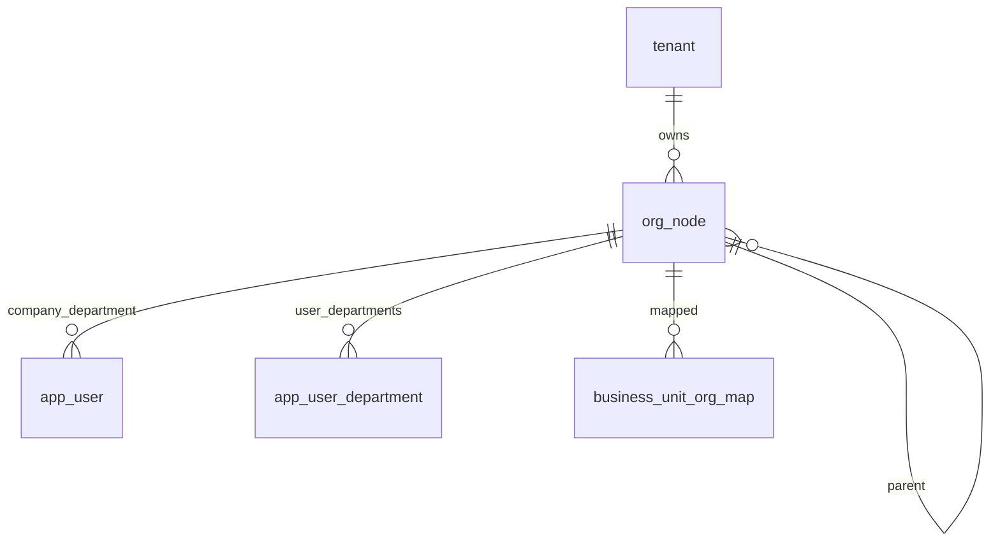

# 03-组织架构-数据库设计

## 1. 模块范围

组织架构使用 `org_node` 单表承载公司、部门、门店、项目组等组织节点，通过 `node_type` 区分节点类型，通过 `parent_id` 构建树，通过 `company_id` 表示所属公司。

## 2. 关联表清单

| 表名 | 说明 |
|---|---|
| `org_node` | 组织树节点 |
| `app_user` | 用户所属公司和主部门 |
| `app_user_department` | 用户多部门任职 |
| `business_unit_org_map` | 业务单元与组织节点映射 |
| `permission_custom_department` | 权限自定义部门范围 |

## 3. 核心表结构

### 3.1 `org_node`

| 字段 | 类型 | 约束 | 说明 |
|---|---|---|---|
| `id` | Integer | PK, index | 节点 ID |
| `tenant_id` | Integer | FK tenant.id, not null, index | 主体 ID |
| `node_type` | String(32) | not null, index | 节点类型 |
| `parent_id` | Integer | FK org_node.id, nullable, index | 父节点 |
| `company_id` | Integer | FK org_node.id, nullable, index | 所属公司 |
| `name` | String(200) | not null | 节点名称 |
| `code` | String(64) | nullable | 节点编码 |
| `company_type` | String(32) | nullable | 公司类型 |
| `status` | Integer | not null, default 1 | 1 启用，0 停用 |
| `created_at` | DateTime | default now | 创建时间 |
| `deleted_at` | DateTime | nullable | 逻辑删除 |

## 4. SQL 脚本

当前仓库存在组织相关 SQL：

| 文件 | 说明 |
|---|---|
| `internal/infrastructure/persistence/postgres/migrations/org_node_postgres.sql` | `org_node` 单表组织模型 PostgreSQL 建表示例 |
| `internal/infrastructure/persistence/postgres/migrations/add_company_parent_department_id.sql` | 旧公司/部门模型补列脚本，属于历史兼容 |

## 5. 数据关系

## 6. 索引与约束

| 字段/组合 | 类型 | 说明 |
|---|---|---|
| `tenant_id` | index | 按主体查询组织 |
| `node_type` | index | 按类型筛选公司/部门/门店 |
| `parent_id` | index | 构建树 |
| `company_id` | index | 查询所属公司 |

当前 ORM 未见 `(tenant_id, code)` 唯一约束。如业务要求同主体组织编码唯一，需要补 DDL 和迁移（当前实现未覆盖，按后续增强处理）。

## 7. 逻辑删除

组织删除写入 `deleted_at`。列表和树默认过滤已归档节点。删除前需检查下级节点、用户、业务单元映射和数据权限引用。

## 8. 风险与后续增强

| 类型 | 内容 |
|---|---|
| 编码约束 | `org_node.code` 未见数据库唯一约束 |
| 父子类型 | 节点类型之间是否限制父子关系需业务确认 |
| 旧表迁移 | 旧 company/department/store 三表迁移状态需结合实际数据库确认 |
