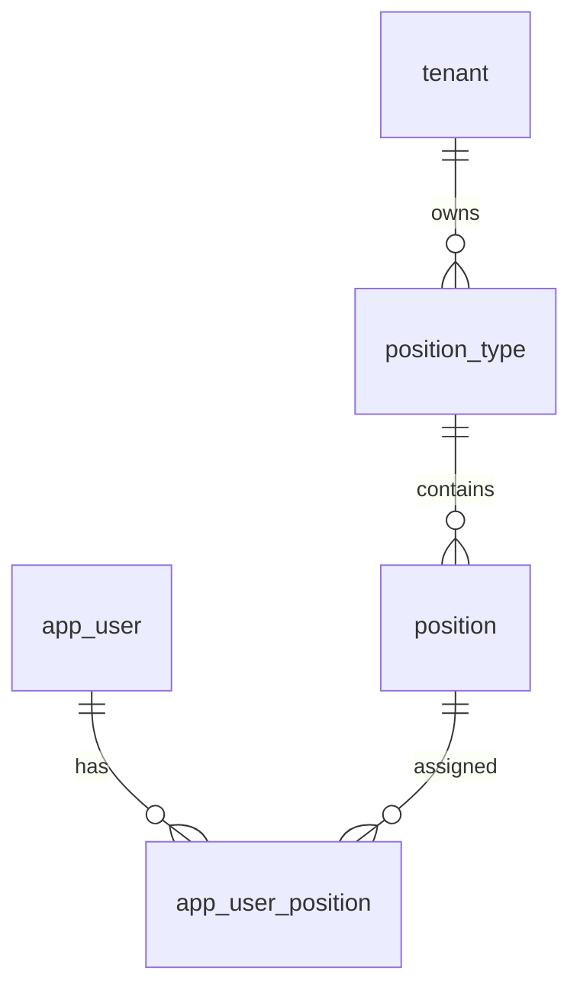

# 04-岗位管理-数据库设计

## 1. 模块范围

岗位管理包括岗位类型和岗位两个主表，用户与岗位通过多对多关系表 `app_user_position` 关联。

## 2. 关联表清单

| 表名 | 说明 |
|---|---|
| `position_type` | 岗位类型 |
| `position` | 岗位 |
| `app_user_position` | 用户岗位关系 |
| `app_user` | 用户 |

## 3. 表结构

### 3.1 `position_type`

| 字段 | 类型 | 约束 | 说明 |
|---|---|---|---|
| `id` | Integer | PK, index | 岗位类型 ID |
| `tenant_id` | Integer | FK tenant.id, not null, index | 主体 ID |
| `name` | String(200) | not null | 类型名称 |
| `code` | String(64) | not null | 类型编码 |
| `created_at` | DateTime | default now | 创建时间 |
| `deleted_at` | DateTime | nullable | 逻辑删除 |

唯一约束：`(tenant_id, code)`。

### 3.2 `position`

| 字段 | 类型 | 约束 | 说明 |
|---|---|---|---|
| `id` | Integer | PK, index | 岗位 ID |
| `tenant_id` | Integer | FK tenant.id, not null, index | 主体 ID |
| `position_type_id` | Integer | FK position_type.id, not null, index | 岗位类型 |
| `name` | String(200) | not null | 岗位名称 |
| `code` | String(64) | not null | 岗位编码 |
| `created_at` | DateTime | default now | 创建时间 |
| `deleted_at` | DateTime | nullable | 逻辑删除 |

唯一约束：`(tenant_id, code)`。

### 3.3 `app_user_position`

| 字段 | 类型 | 约束 | 说明 |
|---|---|---|---|
| `id` | Integer | PK | 主键 |
| `user_id` | Integer | FK app_user.id, not null, index | 用户 ID |
| `position_id` | Integer | FK position.id, not null, index | 岗位 ID |

唯一约束：`(user_id, position_id)`。

## 4. 数据关系

## 5. 逻辑删除

岗位类型和岗位删除均使用 `deleted_at`。删除岗位类型前应检查是否存在未归档岗位；删除岗位前应检查是否存在用户岗位关系（当前实现未覆盖，按后续增强处理）。

## 6. 风险与后续增强

| 类型 | 内容 |
|---|---|
| 状态字段 | 当前 `position_type`、`position` 未见 `status` 字段 |
| 引用检查 | 岗位被用户引用时是否允许归档需明确 |
| 类型来源 | 当前使用 `position_type` 表，不是数据字典 |
