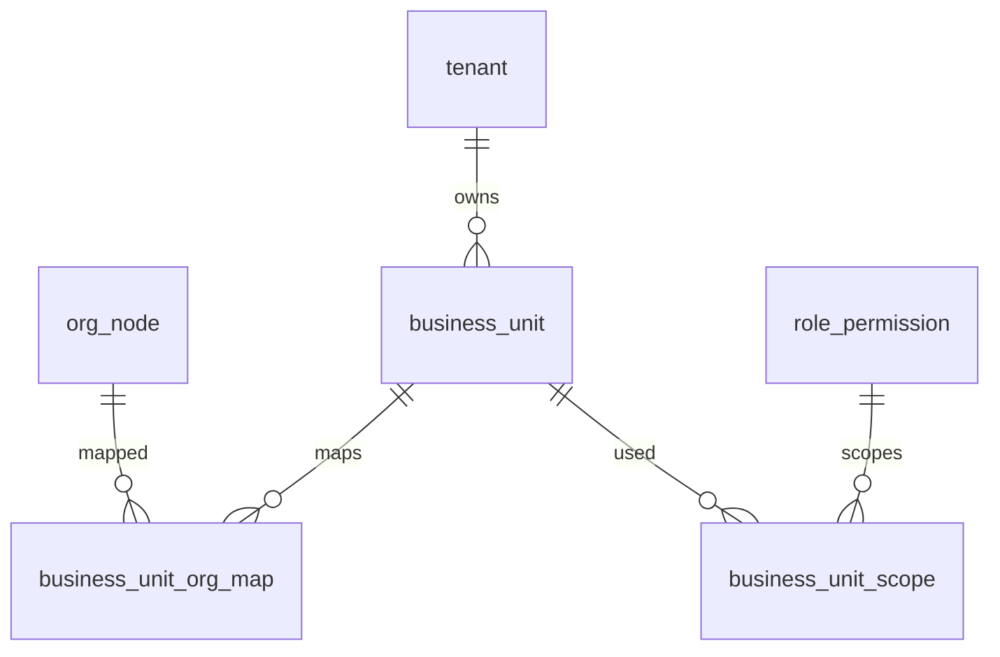

# 05-业务单元-数据库设计

## 1. 模块范围

业务单元用于组织之外的业务归属维度，涉及业务单元主表、组织映射表和角色数据权限范围表。

## 2. 关联表清单

| 表名 | 说明 |
|---|---|
| `business_unit` | 业务单元主数据 |
| `business_unit_org_map` | 业务单元与组织映射 |
| `business_unit_scope` | 角色权限与业务单元范围 |
| `org_node` | 被映射组织节点 |
| `role_permission` | 数据权限来源 |

## 3. 表结构

### 3.1 `business_unit`

| 字段 | 类型 | 约束 | 说明 |
|---|---|---|---|
| `id` | Integer | PK, index | 业务单元 ID |
| `tenant_id` | Integer | FK tenant.id, not null, index | 主体 ID |
| `name` | String(200) | not null | 名称 |
| `code` | String(64) | not null | 编码 |
| `bu_type` | String(32) | nullable | 类型，来自字典 |
| `status` | Integer | default 1 | 状态 |
| `billing_enabled` | Boolean | default false | 是否计费 |
| `statistic_enabled` | Boolean | default true | 是否统计 |
| `remark` | Text | nullable | 备注 |
| `created_at` | DateTime | default now | 创建时间 |
| `updated_at` | DateTime | default now | 更新时间 |
| `deleted_at` | DateTime | nullable | 逻辑删除 |

唯一约束：`(tenant_id, code)`。

### 3.2 `business_unit_org_map`

| 字段 | 类型 | 约束 | 说明 |
|---|---|---|---|
| `id` | Integer | PK, index | 主键 |
| `tenant_id` | Integer | FK tenant.id, not null, index | 主体 ID |
| `business_unit_id` | Integer | FK business_unit.id, not null, index | 业务单元 |
| `org_id` | Integer | FK org_node.id, not null, index | 组织节点 |
| `org_type` | String(32) | not null | 组织类型 |
| `scope_type` | String(32) | default PRIMARY | 范围类型 |
| `priority` | Integer | default 0 | 优先级 |
| `effective_start` | DateTime | nullable | 生效开始 |
| `effective_end` | DateTime | nullable | 生效结束 |
| `status` | Integer | default 1 | 状态 |
| `created_at` | DateTime | default now | 创建时间 |

唯一约束：`(tenant_id, business_unit_id, org_id, scope_type)`。

### 3.3 `business_unit_scope`

| 字段 | 类型 | 约束 | 说明 |
|---|---|---|---|
| `id` | Integer | PK, index | 主键 |
| `role_permission_id` | Integer | FK role_permission.id, not null, index | 角色权限 |
| `business_unit_id` | Integer | FK business_unit.id, not null, index | 业务单元 |

唯一约束：`(role_permission_id, business_unit_id)`。

## 4. 数据关系



## 5. 配额关系

业务单元新增应受套餐配额约束，通常对应 `max_business_units` 一类配额。运行时优先级：

```text
tenant_quota_override > saas_plan_quota
```

## 6. 逻辑删除

`business_unit.deleted_at` 表示归档。归档前应检查组织映射、角色数据权限、业务数据引用。组织映射删除属于关系解除。

## 7. 风险与待确认

| 类型 | 内容 |
|---|---|
| 引用检查 | 被角色数据权限引用时是否允许归档需明确 |
| 组织映射 | 是否允许一个组织映射多个业务单元需按业务规则确认 |
| 状态影响 | `status=0` 后是否影响数据权限计算需确认 |
