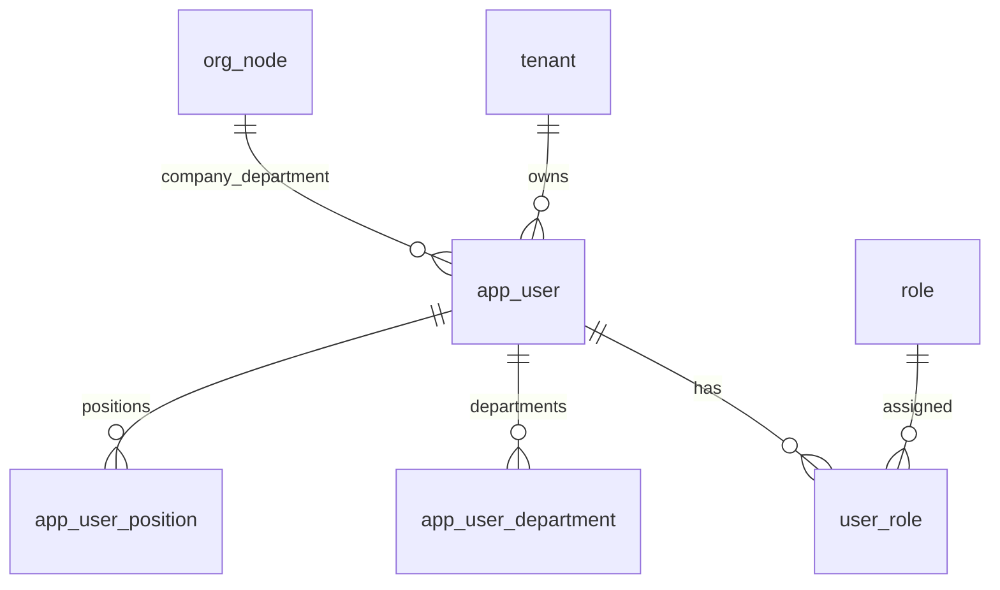

# 06-用户管理-数据库设计

## 1. 模块范围

用户管理涉及登录账号、基础资料、组织归属、角色授权、多部门、多岗位和用户偏好。

## 2. 关联表清单

| 表名 | 说明 |
|---|---|
| `app_user` | 用户账号 |
| `user_role` | 用户角色 |
| `app_user_department` | 用户多部门 |
| `app_user_position` | 用户多岗位 |
| `user_preference` | 用户偏好 |
| `role` | 可分配角色 |
| `org_node` | 用户公司/部门 |
| `position` | 用户岗位 |

## 3. 表结构

### 3.1 `app_user`

| 字段 | 类型 | 约束 | 说明 |
|---|---|---|---|
| `id` | Integer | PK, index | 用户 ID |
| `tenant_id` | Integer | FK tenant.id, not null, index | 主体 ID |
| `company_id` | Integer | FK org_node.id, nullable, index | 所属公司 |
| `department_id` | Integer | FK org_node.id, nullable, index | 主部门 |
| `employee_no` | String(64) | not null, index | 工号/登录账号 |
| `phone` | String(32) | nullable, index | 手机号 |
| `password_hash` | String(200) | not null | 密码哈希 |
| `name` | String(100) | not null | 姓名 |
| `email` | String(200) | nullable | 邮箱 |
| `avatar_url` | Text | nullable | 头像 |
| `status` | Integer | default 1 | 1 启用，0 禁用 |
| `is_platform_admin` | Boolean | default false | 是否平台管理员 |
| `created_at` | DateTime | default now | 创建时间 |
| `deleted_at` | DateTime | nullable | 逻辑删除 |

唯一约束：

- `(tenant_id, employee_no)`
- `(tenant_id, phone)`

### 3.2 `user_role`

| 字段 | 类型 | 约束 | 说明 |
|---|---|---|---|
| `id` | Integer | PK, index | 主键 |
| `user_id` | Integer | FK app_user.id, not null, index | 用户 |
| `role_id` | Integer | FK role.id, not null, index | 角色 |

唯一约束：`(user_id, role_id)`。

### 3.3 `app_user_department`

| 字段 | 类型 | 约束 | 说明 |
|---|---|---|---|
| `id` | Integer | PK | 主键 |
| `user_id` | Integer | FK app_user.id, not null, index | 用户 |
| `department_id` | Integer | FK org_node.id, not null | 部门 |

唯一约束：`(user_id, department_id)`。

### 3.4 `app_user_position`

| 字段 | 类型 | 约束 | 说明 |
|---|---|---|---|
| `id` | Integer | PK | 主键 |
| `user_id` | Integer | FK app_user.id, not null, index | 用户 |
| `position_id` | Integer | FK position.id, not null, index | 岗位 |

唯一约束：`(user_id, position_id)`。

## 4. 数据关系



## 5. 配额关系

新增用户受用户席位配额控制。配额读取优先级：

```text
tenant_quota_override(max_users) > saas_plan_quota(max_users)
```

## 6. 逻辑删除

用户归档写入 `app_user.deleted_at`。用户工号、手机号存在唯一约束，归档时需释放唯一值。用户历史操作日志和登录日志不应删除。

## 7. 风险与后续增强

| 类型 | 内容 |
|---|---|
| 自删控制 | 当前用户是否允许归档自己需确认 |
| 强制下线 | 用户禁用后 Redis session 是否立即失效需确认 |
| 手机唯一 | NULL 手机号在 PostgreSQL unique 下可多条，符合可选手机号语义 |
