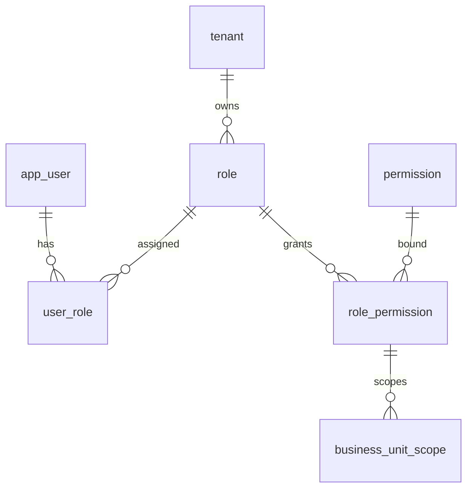

# 07-角色权限-数据库设计

## 1. 模块范围

角色权限模块涉及角色、用户角色、权限源、角色权限关系、数据范围覆盖和业务单元数据权限。

## 2. 关联表清单

| 表名 | 说明 |
|---|---|
| `role` | 角色 |
| `user_role` | 用户角色 |
| `permission` | 权限源 |
| `role_permission` | 角色权限 |
| `business_unit_scope` | 角色权限业务单元范围 |
| `permission_custom_department` | 权限自定义部门 |
| `permission_custom_user` | 权限自定义用户 |

## 3. 表结构

### 3.1 `role`

| 字段 | 类型 | 约束 | 说明 |
|---|---|---|---|
| `id` | Integer | PK, index | 角色 ID |
| `tenant_id` | Integer | FK tenant.id, not null, index | 主体 ID |
| `code` | String(64) | not null | 角色编码 |
| `name` | String(200) | not null | 角色名称 |
| `description` | String(500) | nullable | 描述 |
| `created_at` | DateTime | default now | 创建时间 |
| `deleted_at` | DateTime | nullable | 逻辑删除 |

唯一约束：`(tenant_id, code)`。

### 3.2 `role_permission`

| 字段 | 类型 | 约束 | 说明 |
|---|---|---|---|
| `id` | Integer | PK, index | 主键 |
| `role_id` | Integer | FK role.id, not null, index | 角色 |
| `permission_id` | Integer | FK permission.id, not null, index | 权限 |
| `data_scope_override` | String(32) | nullable | 数据范围覆盖 |
| `custom_company_ids_json` | Text | nullable | 自定义公司 |
| `custom_department_ids_json` | Text | nullable | 自定义部门 |
| `custom_user_ids_json` | Text | nullable | 自定义用户 |
| `custom_business_unit_ids_json` | Text | nullable | 自定义业务单元 |
| `bu_data_access_mode` | String(32) | nullable | 业务单元访问模式 |

唯一约束：`(role_id, permission_id)`。

## 4. 数据权限字段

| 字段 | 说明 |
|---|---|
| `data_scope_override` | `ALL`、`ORG`、`ORG_SUB`、`SELF`、`CUSTOM` |
| `custom_company_ids_json` | 自定义公司范围 |
| `custom_department_ids_json` | 自定义部门范围 |
| `custom_user_ids_json` | 自定义用户范围 |
| `custom_business_unit_ids_json` | 自定义业务单元范围 |
| `bu_data_access_mode` | 当前组织业务单元或指定业务单元模式 |

## 5. 数据关系

## 6. 逻辑删除

角色删除写入 `role.deleted_at`。角色与用户、权限关系如何清理取决于 service 实现（当前实现未覆盖，按后续增强处理）。角色编码逻辑删除后需释放唯一值。

## 7. 风险与后续增强

| 类型 | 内容 |
|---|---|
| 状态字段 | `role` 当前无 `status` 字段，角色禁用未落库 |
| 权限清理 | 角色归档时 `user_role` 和 `role_permission` 是否物理清理需确认 |
| 套餐降级 | 角色中超出套餐的旧权限不应生效但不宜误删 |
