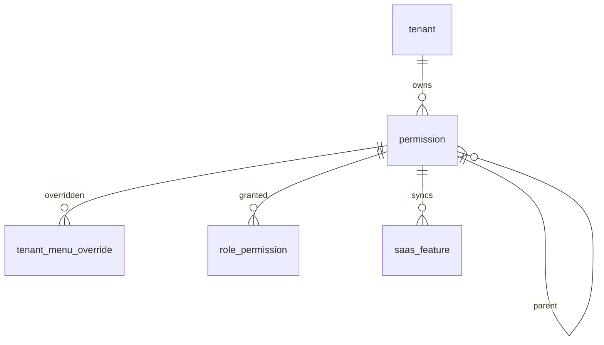

# 08-菜单管理-数据库设计

## 1. 模块范围

菜单管理以 `permission` 表为权限源，统一承载目录、菜单、按钮、操作和数据权限。租户菜单个性化通过 `tenant_menu_override` 保存差异。

## 2. 关联表清单

| 表名 | 说明 |
|---|---|
| `permission` | 菜单/按钮/权限源 |
| `tenant_menu_override` | 租户菜单覆盖 |
| `role_permission` | 角色权限关系 |
| `saas_feature` | 套餐功能点 |

## 3. 表结构

### 3.1 `permission`

| 字段 | 类型 | 约束 | 说明 |
|---|---|---|---|
| `id` | Integer | PK, index | 权限 ID |
| `tenant_id` | Integer | FK tenant.id, not null, index | 主体 ID |
| `parent_id` | Integer | FK permission.id, nullable, index | 父节点 |
| `name` | String(200) | not null | 名称 |
| `path` | String(500) | nullable | 路由或权限码 |
| `perm_type` | Integer | not null | 1目录/2操作/3菜单/4数据/5按钮 |
| `data_scope` | String(32) | nullable | 数据范围 |
| `sort_order` | Integer | default 0 | 排序 |
| `enabled` | Boolean | default true | 启用 |
| `is_platform_only` | Boolean | default false | 平台专属 |
| `is_package_feature` | Boolean | default true | 是否同步套餐功能 |
| `feature_code` | String(100) | nullable, index | 功能点编码 |
| `feature_type` | String(32) | nullable | 功能类型 |
| `tenant_visible` | Boolean | default true | 租户可见 |
| `tenant_editable` | Boolean | default false | 租户可编辑 |
| `tenant_edit_scope` | String(100) | nullable | 租户编辑范围 |
| `data_perm_mode` | String(16) | default ORG | 菜单数据权限模式 |
| `deleted_at` | DateTime | nullable | 逻辑删除 |

### 3.2 `tenant_menu_override`

| 字段 | 类型 | 约束 | 说明 |
|---|---|---|---|
| `id` | Integer | PK, index | 主键 |
| `tenant_id` | Integer | FK tenant.id, not null, index | 主体 ID |
| `permission_id` | Integer | FK permission.id, not null, index | 菜单权限 |
| `custom_name` | String(200) | nullable | 自定义名称 |
| `custom_icon` | String(100) | nullable | 自定义图标 |
| `enabled` | Boolean | nullable | 覆盖启停 |
| `visible` | Boolean | nullable | 覆盖显示 |
| `sort_order` | Integer | nullable | 覆盖排序 |
| `created_at` | DateTime | default now | 创建时间 |
| `updated_at` | DateTime | default now | 更新时间 |

唯一约束：`(tenant_id, permission_id)`。

## 4. 菜单类型

| `perm_type` | 说明 |
|---|---|
| `1` | 目录 |
| `2` | 操作 |
| `3` | 菜单 |
| `4` | 数据权限 |
| `5` | 按钮 |

## 5. 数据关系

## 6. 套餐同步规则

只有满足以下条件的权限才应同步到 `saas_feature`：

- `is_package_feature = true`
- `is_platform_only = false`
- 菜单或按钮/操作具备可识别路径或权限码

平台专属菜单如主体管理、套餐中心、监控类菜单不得进入租户套餐功能池。

## 7. 风险与后续增强

| 类型 | 内容 |
|---|---|
| 权限码一致性 | 前端存在 `menu:*`，后端历史存在 `perm:*`，边界需持续核对 |
| 路径唯一 | `permission.path` 未见数据库唯一约束 |
| 引用删除 | 已被角色、套餐或租户覆盖引用的菜单归档策略需确认 |
