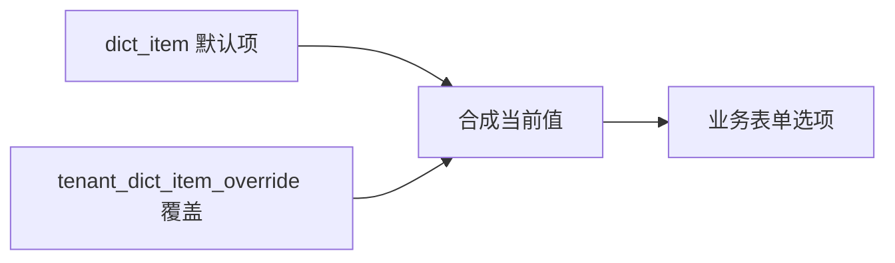

# 09-数据字典-数据库设计

## 1. 模块范围

数据字典采用默认定义加租户覆盖模式。平台维护 `dict_type`、`dict_item` 默认定义，租户通过 `tenant_dict_item_override` 保存差异。

## 2. 关联表清单

| 表名 | 说明 |
|---|---|
| `dict_type` | 字典类型 |
| `dict_item` | 字典项 |
| `tenant_dict_item_override` | 租户字典项覆盖 |

## 3. 表结构

### 3.1 `dict_type`

| 字段 | 类型 | 约束 | 说明 |
|---|---|---|---|
| `id` | Integer | PK, index | 字典类型 ID |
| `tenant_id` | Integer | FK tenant.id, not null, index | 主体 ID |
| `code` | String(64) | not null | 类型编码 |
| `name` | String(200) | not null | 类型名称 |
| `remark` | String(500) | nullable | 备注 |
| `scope` | String(32) | default HYBRID | 作用域 |
| `tenant_editable` | Boolean | default true | 租户可编辑 |
| `is_platform_only` | Boolean | default false | 平台专属 |
| `deleted_at` | DateTime | nullable | 逻辑删除 |

唯一约束：`(tenant_id, code)`。

### 3.2 `dict_item`

| 字段 | 类型 | 约束 | 说明 |
|---|---|---|---|
| `id` | Integer | PK, index | 字典项 ID |
| `tenant_id` | Integer | FK tenant.id, not null, index | 主体 ID |
| `dict_type_id` | Integer | FK dict_type.id, not null, index | 字典类型 |
| `label` | String(200) | not null | 显示值 |
| `value` | String(200) | not null | 选项值 |
| `sort_order` | Integer | default 0 | 排序 |
| `enabled` | Boolean | default true | 是否启用 |
| `deleted_at` | DateTime | nullable | 逻辑删除 |

### 3.3 `tenant_dict_item_override`

| 字段 | 类型 | 约束 | 说明 |
|---|---|---|---|
| `id` | Integer | PK, index | 主键 |
| `tenant_id` | Integer | FK tenant.id, not null, index | 主体 ID |
| `dict_item_id` | Integer | FK dict_item.id, not null, index | 字典项 |
| `custom_label` | String(200) | nullable | 覆盖显示值 |
| `custom_value` | String(200) | nullable | 覆盖选项值 |
| `enabled` | Boolean | nullable | 覆盖启用 |
| `sort_order` | Integer | nullable | 覆盖排序 |
| `created_at` | DateTime | default now | 创建时间 |
| `updated_at` | DateTime | default now | 更新时间 |

唯一约束：`(tenant_id, dict_item_id)`。

## 4. 覆盖读取规则

如果覆盖表中字段为 NULL，则使用默认项对应字段。

## 5. 逻辑删除

`dict_type` 和 `dict_item` 使用 `deleted_at` 逻辑删除。租户恢复默认时删除 `tenant_dict_item_override` 行，属于覆盖关系解除。

## 6. 风险与后续增强

| 类型 | 内容 |
|---|---|
| 字典项唯一 | 当前 ORM 未见 `(tenant_id, dict_type_id, value)` 唯一约束 |
| 引用检查 | 被业务数据引用的字典项是否允许归档需确认 |
| 覆盖字段 | 租户可覆盖字段范围需保持前后端一致 |
