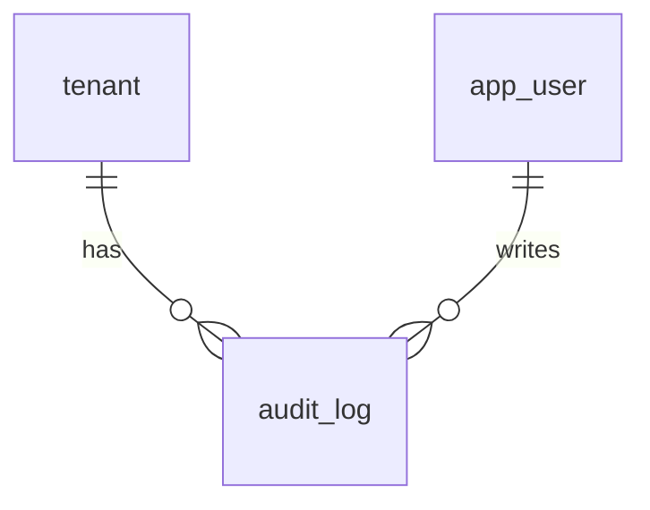

# 11-操作日志-数据库设计

## 1. 模块范围

操作日志记录系统关键业务写操作，用于审计、追踪和问题排查。该模块主要使用 `audit_log` 表。

## 2. 关联表清单

| 表名 | 说明 |
|---|---|
| `audit_log` | 操作审计日志 |
| `tenant` | 主体筛选和展示 |
| `app_user` | 操作用户 |

## 3. 表结构

### 3.1 `audit_log`

| 字段 | 类型 | 约束 | 说明 |
|---|---|---|---|
| `id` | Integer | PK, index | 日志 ID |
| `tenant_id` | Integer | FK tenant.id, nullable, index | 主体 ID |
| `user_id` | Integer | nullable, index | 操作用户 ID |
| `module` | String(64) | not null, index | 模块 |
| `action` | String(32) | not null | 操作动作 |
| `summary` | String(500) | not null | 摘要 |
| `detail` | Text | nullable | 详情 |
| `ip` | String(64) | nullable | IP |
| `created_at` | DateTime | default now, index | 创建时间 |

## 4. 索引设计

| 字段 | 说明 |
|---|---|
| `tenant_id` | 租户隔离和平台筛选 |
| `user_id` | 按用户追踪操作 |
| `module` | 按模块筛选 |
| `created_at` | 按时间范围查询 |

## 5. 数据关系

日志与主体、用户为弱关联。主体或用户归档后，日志仍应保留历史 ID 和摘要。

## 6. 删除策略

操作日志不应由业务页面删除。日志保留周期、归档和冷热分层策略（当前实现未覆盖，按后续增强处理）。

## 7. 风险与后续增强

| 类型 | 内容 |
|---|---|
| 写入覆盖 | 审计写入点分散在各 service，新业务可能漏记 |
| 敏感信息 | `detail` 字段必须避免记录密码、token、密钥 |
| 保留周期 | 日志保留时间和归档策略需明确 |
