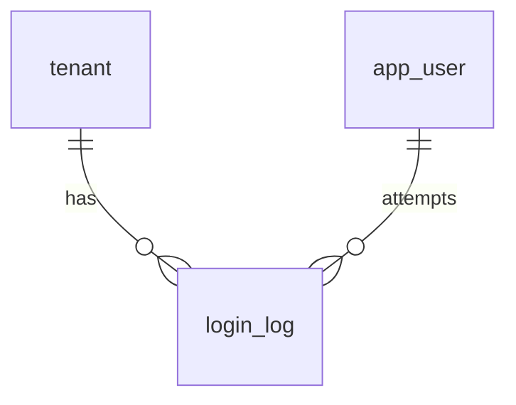

# 12-登录日志-数据库设计

## 1. 模块范围

登录日志记录用户登录成功和失败行为，用于安全审计、账号问题排查和异常登录分析。该模块主要使用 `login_log` 表。

## 2. 关联表清单

| 表名 | 说明 |
|---|---|
| `login_log` | 登录日志 |
| `tenant` | 主体筛选和展示 |
| `app_user` | 登录用户 |

## 3. 表结构

### 3.1 `login_log`

| 字段 | 类型 | 约束 | 说明 |
|---|---|---|---|
| `id` | Integer | PK, index | 日志 ID |
| `tenant_id` | Integer | FK tenant.id, nullable, index | 主体 ID |
| `user_id` | Integer | nullable, index | 用户 ID |
| `account` | String(128) | not null | 登录账号 |
| `success` | Boolean | default false | 是否成功 |
| `message` | String(500) | nullable | 说明 |
| `ip` | String(64) | nullable | IP |
| `user_agent` | String(500) | nullable | User-Agent |
| `created_at` | DateTime | default now, index | 登录时间 |

## 4. 索引设计

| 字段 | 说明 |
|---|---|
| `tenant_id` | 租户隔离和平台筛选 |
| `user_id` | 按用户筛选登录 |
| `created_at` | 日期范围查询 |

`account`、`ip` 当前 ORM 未显示索引，如登录日志量大，可考虑补普通索引【待确认】。

## 5. 数据关系

登录失败时可能不存在有效 `tenant_id` 或 `user_id`，但仍记录 `account`、`success=false`、`message`、`ip`。

## 6. 删除策略

登录日志不应由业务页面删除。日志保留周期、归档策略和安全审计导出策略【待确认】。

## 7. 风险与待确认

| 类型 | 内容 |
|---|---|
| 多主体账号 | 同一手机号多主体登录失败时主体归属需明确 |
| 查询性能 | `account`、`ip` 如高频查询建议补索引 |
| 安全信息 | 失败原因不能泄露过多账号枚举信息 |
