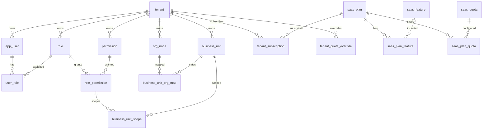
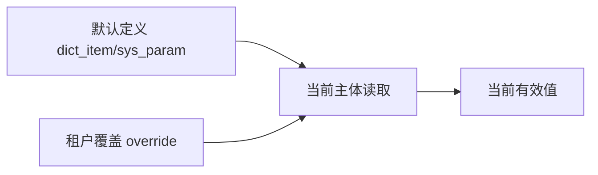

# 系统管理模块 SQL / 数据库设计文档

## 1. 文档说明

本文档基于当前项目实际 ORM、SQL 脚本、后端接口和系统管理模块整理数据库设计。重点覆盖系统管理下主体管理、套餐中心、组织架构、岗位管理、业务单元、用户管理、角色权限、菜单管理、数据字典、参数管理、操作日志、登录日志相关数据表。

分析来源：

- `internal/infrastructure/persistence/postgres/models`
- `internal/interfaces/http/dto/*.go`
- `internal/infrastructure/persistence/postgres/repositories/*.go`
- `internal/application/*.go`
- `internal/infrastructure/persistence/postgres/migrations/*.sql`
- `docs/tech_design/总体技术方案.md`
- `internal/infrastructure/persistence/postgres/migrations/*.sql`

可信度说明：字段、类型、约束以 GORM 和当前生产初始化 SQL 为主。当前项目已提供 `internal/infrastructure/persistence/postgres/migrations/` 作为生产/开发数据库初始化入口，但未发现 golang-migrate 迁移目录；启动期 `GORM AutoMigrate（仅开发兜底）和版本化 migration` 和 `ensure_*` 脚本仍作为开发兜底存在。

## 2. 数据库总体设计

数据库：PostgreSQL 16。Docker 配置位于 `docker-compose.yml`：

- 数据库名：`saas_baseon`
- 开发账号：`saas/saas`
- 容器内端口：`5432`
- 本机映射端口：`5432`

数据库设计原则：

- 系统内业务数据以 `tenant_id` 做租户隔离。
- 主数据删除使用 `deleted_at` 逻辑删除，不做物理删除。
- 关系解除、缓存、会话、覆盖值恢复默认等无业务历史意义数据可物理删除。
- 唯一键在逻辑删除后应通过墓碑值释放，避免归档后无法重建同编码数据。
- 平台全局定义和租户覆盖分层存储，避免复制全量菜单、字典、参数。
- 套餐功能与配额独立于角色权限，运行时叠加判断。

## 3. 表分组总览

| 分组 | 表名 | 说明 |
|---|---|---|
| 主体 | `tenant` | SaaS 主体/租户 |
| 组织 | `org_node` | 公司、部门、门店等组织树 |
| 岗位 | `position_type`、`position` | 岗位类型与岗位 |
| 业务单元 | `business_unit`、`business_unit_org_map`、`business_unit_scope` | 业务归属和数据权限范围 |
| 用户 | `app_user`、`app_user_department`、`app_user_position`、`user_preference` | 用户账号、任职和偏好 |
| 角色权限 | `role`、`user_role`、`permission`、`role_permission`、`permission_custom_department`、`permission_custom_user`、`tenant_menu_override` | RBAC + 数据权限 + 租户菜单覆盖 |
| 字典参数 | `dict_type`、`dict_item`、`tenant_dict_item_override`、`sys_param`、`tenant_param_value` | 默认定义 + 租户覆盖 |
| 日志 | `login_log`、`audit_log` | 登录与操作审计 |
| 套餐 | `saas_plan`、`saas_feature`、`saas_plan_feature`、`saas_quota`、`saas_plan_quota`、`tenant_subscription`、`tenant_feature_override`、`tenant_quota_override`、`tenant_quota_usage` | SaaS 商业化 |

## 4. 核心 ER 关系



## 5. 主体与品牌表

### 5.1 表：`tenant`

说明：主体/租户基础表，承载主体编码、名称、状态、品牌信息和平台主体标记。

| 字段名 | 类型 | 是否必填 | 默认值 | 索引/约束 | 说明 |
|---|---|---|---|---|---|
| `id` | Integer | 是 | 自增 | PK, index | 主键 |
| `code` | String(64) | 是 | 无 | unique, index | 主体编码 |
| `name` | String(200) | 是 | 无 |  | 主体名称 |
| `status` | Integer | 是 | 1 |  | 1 启用，0 停用 |
| `start_date` | Date | 否 | NULL |  | 历史兼容字段，运行时以订阅为准 |
| `expire_date` | Date | 否 | NULL |  | 历史兼容字段，运行时以订阅为准 |
| `max_companies` | Integer | 是 | 0 |  | 历史兼容字段，运行时以配额为准 |
| `max_users` | Integer | 是 | 0 |  | 历史兼容字段，运行时以配额为准 |
| `contact_name` | String(100) | 否 | NULL |  | 联系人 |
| `contact_phone` | String(32) | 否 | NULL |  | 联系电话 |
| `created_at` | DateTime | 否 | now |  | 创建时间 |
| `deleted_at` | DateTime | 否 | NULL |  | 逻辑删除时间 |
| `brand_display_name` | String(128) | 否 | NULL |  | 品牌展示名 |
| `brand_logo_data` | MEDIUMTEXT | 否 | NULL |  | 品牌 Logo Data URL |
| `brand_footer_text` | String(256) | 否 | NULL |  | 页脚文案 |
| `is_platform_tenant` | Boolean | 是 | False |  | 是否平台主体 |

设计说明：

- `code` 全局唯一，逻辑删除后需释放唯一值。
- `tenant` 表中的 `max_*` 和 `expire_date` 已作为兼容展示字段存在，新的业务判断应读取 `tenant_subscription` 和 `tenant_quota_override > saas_plan_quota`。

## 6. 组织架构表

### 6.1 表：`org_node`

说明：组织架构统一单表，使用 `node_type` 区分公司、部门、门店等节点。

| 字段名 | 类型 | 是否必填 | 默认值 | 索引/约束 | 说明 |
|---|---|---|---|---|---|
| `id` | Integer | 是 | 自增 | PK, index | 主键 |
| `tenant_id` | Integer | 是 | 无 | FK tenant.id, index | 主体 ID |
| `node_type` | String(32) | 是 | 无 | index | 节点类型，如 company/department/store |
| `parent_id` | Integer | 否 | NULL | FK org_node.id, index | 父节点 |
| `company_id` | Integer | 否 | NULL | FK org_node.id, index | 所属公司 |
| `name` | String(200) | 是 | 无 |  | 节点名称 |
| `code` | String(64) | 否 | NULL |  | 节点编码 |
| `company_type` | String(32) | 否 | NULL |  | 公司类型 |
| `status` | Integer | 是 | 1 |  | 启用状态 |
| `created_at` | DateTime | 否 | now |  | 创建时间 |
| `deleted_at` | DateTime | 否 | NULL |  | 逻辑删除时间 |

SQL 脚本：

- `internal/infrastructure/persistence/postgres/migrations/org_node_postgres.sql` 提供与 ORM 对齐的 PostgreSQL 建表示例。
- `internal/infrastructure/persistence/postgres/migrations/add_company_parent_department_id.sql` 是旧三表组织模型遗留迁移脚本，当前主模型已转为 `org_node` 单表。

设计风险：

- 当前 ORM 未定义 `tenant_id + code` 唯一约束，编码唯一性如需强约束应补迁移（当前实现未覆盖，按后续增强处理）。

## 7. 岗位表

### 7.1 表：`position_type`

| 字段名 | 类型 | 是否必填 | 默认值 | 索引/约束 | 说明 |
|---|---|---|---|---|---|
| `id` | Integer | 是 | 自增 | PK, index | 主键 |
| `tenant_id` | Integer | 是 | 无 | FK tenant.id, index, unique(tenant_id, code) | 主体 ID |
| `name` | String(200) | 是 | 无 |  | 类型名称 |
| `code` | String(64) | 是 | 无 | unique(tenant_id, code) | 类型编码 |
| `created_at` | DateTime | 否 | now |  | 创建时间 |
| `deleted_at` | DateTime | 否 | NULL |  | 逻辑删除 |

### 7.2 表：`position`

| 字段名 | 类型 | 是否必填 | 默认值 | 索引/约束 | 说明 |
|---|---|---|---|---|---|
| `id` | Integer | 是 | 自增 | PK, index | 主键 |
| `tenant_id` | Integer | 是 | 无 | FK tenant.id, index, unique(tenant_id, code) | 主体 ID |
| `position_type_id` | Integer | 是 | 无 | FK position_type.id, index | 岗位类型 |
| `name` | String(200) | 是 | 无 |  | 岗位名称 |
| `code` | String(64) | 是 | 无 | unique(tenant_id, code) | 岗位编码 |
| `created_at` | DateTime | 否 | now |  | 创建时间 |
| `deleted_at` | DateTime | 否 | NULL |  | 逻辑删除 |

说明：当前岗位表未发现 `status` 字段，启停能力如需实现需新增字段和迁移。

## 8. 业务单元表

### 8.1 表：`business_unit`

| 字段名 | 类型 | 是否必填 | 默认值 | 索引/约束 | 说明 |
|---|---|---|---|---|---|
| `id` | Integer | 是 | 自增 | PK, index | 主键 |
| `tenant_id` | Integer | 是 | 无 | FK tenant.id, index, unique(tenant_id, code) | 主体 ID |
| `name` | String(200) | 是 | 无 |  | 名称 |
| `code` | String(64) | 是 | 无 | unique(tenant_id, code) | 编码 |
| `bu_type` | String(32) | 否 | NULL |  | 类型，来自字典 |
| `status` | Integer | 是 | 1 |  | 状态 |
| `billing_enabled` | Boolean | 是 | False |  | 是否计费 |
| `statistic_enabled` | Boolean | 是 | True |  | 是否统计 |
| `remark` | Text | 否 | NULL |  | 备注 |
| `created_at` | DateTime | 否 | now |  | 创建时间 |
| `updated_at` | DateTime | 否 | now |  | 更新时间 |
| `deleted_at` | DateTime | 否 | NULL |  | 逻辑删除 |

### 8.2 表：`business_unit_org_map`

| 字段名 | 类型 | 是否必填 | 默认值 | 索引/约束 | 说明 |
|---|---|---|---|---|---|
| `id` | Integer | 是 | 自增 | PK, index | 主键 |
| `tenant_id` | Integer | 是 | 无 | FK tenant.id, index | 主体 ID |
| `business_unit_id` | Integer | 是 | 无 | FK business_unit.id, index | 业务单元 |
| `org_id` | Integer | 是 | 无 | FK org_node.id, index | 组织节点 |
| `org_type` | String(32) | 是 | 无 |  | 组织类型 |
| `scope_type` | String(32) | 是 | PRIMARY | unique 组成 | 范围类型 |
| `priority` | Integer | 是 | 0 |  | 优先级 |
| `effective_start` | DateTime | 否 | NULL |  | 生效开始 |
| `effective_end` | DateTime | 否 | NULL |  | 生效结束 |
| `status` | Integer | 是 | 1 |  | 状态 |
| `created_at` | DateTime | 否 | now |  | 创建时间 |

唯一约束：`(tenant_id, business_unit_id, org_id, scope_type)`。

### 8.3 表：`business_unit_scope`

| 字段名 | 类型 | 是否必填 | 默认值 | 索引/约束 | 说明 |
|---|---|---|---|---|---|
| `id` | Integer | 是 | 自增 | PK, index | 主键 |
| `role_permission_id` | Integer | 是 | 无 | FK role_permission.id, index | 角色权限 |
| `business_unit_id` | Integer | 是 | 无 | FK business_unit.id, index | 业务单元 |

唯一约束：`(role_permission_id, business_unit_id)`。

## 9. 用户与人员关系表

### 9.1 表：`app_user`

| 字段名 | 类型 | 是否必填 | 默认值 | 索引/约束 | 说明 |
|---|---|---|---|---|---|
| `id` | Integer | 是 | 自增 | PK, index | 主键 |
| `tenant_id` | Integer | 是 | 无 | FK tenant.id, index, unique 组成 | 主体 ID |
| `company_id` | Integer | 否 | NULL | FK org_node.id, index | 所属公司 |
| `department_id` | Integer | 否 | NULL | FK org_node.id, index | 主部门 |
| `employee_no` | String(64) | 是 | 无 | index, unique(tenant_id, employee_no) | 工号/登录账号 |
| `phone` | String(32) | 否 | NULL | index, unique(tenant_id, phone) | 手机号 |
| `password_hash` | String(200) | 是 | 无 |  | 密码哈希 |
| `name` | String(100) | 是 | 无 |  | 姓名 |
| `email` | String(200) | 否 | NULL |  | 邮箱 |
| `avatar_url` | Text | 否 | NULL |  | 头像 |
| `status` | Integer | 是 | 1 |  | 账号状态 |
| `is_platform_admin` | Boolean | 是 | False |  | 是否平台管理员 |
| `created_at` | DateTime | 否 | now |  | 创建时间 |
| `deleted_at` | DateTime | 否 | NULL |  | 逻辑删除 |

### 9.2 表：`app_user_department`

| 字段名 | 类型 | 是否必填 | 默认值 | 索引/约束 | 说明 |
|---|---|---|---|---|---|
| `id` | Integer | 是 | 自增 | PK | 主键 |
| `user_id` | Integer | 是 | 无 | FK app_user.id, index, unique 组成 | 用户 |
| `department_id` | Integer | 是 | 无 | FK org_node.id, unique 组成 | 部门 |

唯一约束：`(user_id, department_id)`。

### 9.3 表：`app_user_position`

| 字段名 | 类型 | 是否必填 | 默认值 | 索引/约束 | 说明 |
|---|---|---|---|---|---|
| `id` | Integer | 是 | 自增 | PK | 主键 |
| `user_id` | Integer | 是 | 无 | FK app_user.id, index, unique 组成 | 用户 |
| `position_id` | Integer | 是 | 无 | FK position.id, index, unique 组成 | 岗位 |

唯一约束：`(user_id, position_id)`。

### 9.4 表：`user_preference`

| 字段名 | 类型 | 是否必填 | 默认值 | 索引/约束 | 说明 |
|---|---|---|---|---|---|
| `id` | Integer | 是 | 自增 | PK, index | 主键 |
| `user_id` | Integer | 是 | 无 | FK app_user.id, index, unique 组成 | 用户 |
| `pref_key` | String(64) | 是 | 无 | index, unique 组成 | 偏好键 |
| `pref_value` | Text | 否 | NULL |  | 偏好值 |
| `updated_at` | DateTime | 否 | now |  | 更新时间 |

唯一约束：`(user_id, pref_key)`。

## 10. 角色与权限表

### 10.1 表：`role`

| 字段名 | 类型 | 是否必填 | 默认值 | 索引/约束 | 说明 |
|---|---|---|---|---|---|
| `id` | Integer | 是 | 自增 | PK, index | 主键 |
| `tenant_id` | Integer | 是 | 无 | FK tenant.id, index, unique 组成 | 主体 ID |
| `code` | String(64) | 是 | 无 | unique(tenant_id, code) | 角色编码 |
| `name` | String(200) | 是 | 无 |  | 角色名称 |
| `description` | String(500) | 否 | NULL |  | 描述 |
| `created_at` | DateTime | 否 | now |  | 创建时间 |
| `deleted_at` | DateTime | 否 | NULL |  | 逻辑删除 |

当前 `role` 未发现 `status` 字段。

### 10.2 表：`user_role`

| 字段名 | 类型 | 是否必填 | 默认值 | 索引/约束 | 说明 |
|---|---|---|---|---|---|
| `id` | Integer | 是 | 自增 | PK, index | 主键 |
| `user_id` | Integer | 是 | 无 | FK app_user.id, index, unique 组成 | 用户 |
| `role_id` | Integer | 是 | 无 | FK role.id, index, unique 组成 | 角色 |

唯一约束：`(user_id, role_id)`。

### 10.3 表：`permission`

| 字段名 | 类型 | 是否必填 | 默认值 | 索引/约束 | 说明 |
|---|---|---|---|---|---|
| `id` | Integer | 是 | 自增 | PK, index | 主键 |
| `tenant_id` | Integer | 是 | 无 | FK tenant.id, index | 主体 ID |
| `parent_id` | Integer | 否 | NULL | FK permission.id, index | 父权限 |
| `name` | String(200) | 是 | 无 |  | 名称 |
| `path` | String(500) | 否 | NULL |  | 路由或权限码 |
| `perm_type` | Integer | 是 | 无 |  | 1目录/2操作/3菜单/4数据/5按钮 |
| `data_scope` | String(32) | 否 | NULL |  | 数据范围 |
| `sort_order` | Integer | 是 | 0 |  | 排序 |
| `enabled` | Boolean | 是 | True |  | 启用 |
| `is_platform_only` | Boolean | 是 | False |  | 平台专属 |
| `is_package_feature` | Boolean | 是 | True |  | 可套餐化 |
| `feature_code` | String(100) | 否 | NULL | index | 功能点编码 |
| `feature_type` | String(32) | 否 | NULL |  | 功能类型 |
| `tenant_visible` | Boolean | 是 | True |  | 租户可见 |
| `tenant_editable` | Boolean | 是 | False |  | 租户可编辑 |
| `tenant_edit_scope` | String(100) | 否 | NULL |  | 租户编辑范围 |
| `data_perm_mode` | String(16) | 是 | ORG |  | 菜单数据权限模式 |
| `deleted_at` | DateTime | 否 | NULL |  | 逻辑删除 |

### 10.4 表：`role_permission`

| 字段名 | 类型 | 是否必填 | 默认值 | 索引/约束 | 说明 |
|---|---|---|---|---|---|
| `id` | Integer | 是 | 自增 | PK, index | 主键 |
| `role_id` | Integer | 是 | 无 | FK role.id, index, unique 组成 | 角色 |
| `permission_id` | Integer | 是 | 无 | FK permission.id, index, unique 组成 | 权限 |
| `data_scope_override` | String(32) | 否 | NULL |  | 数据范围覆盖 |
| `custom_company_ids_json` | Text | 否 | NULL |  | 自定义公司 |
| `custom_department_ids_json` | Text | 否 | NULL |  | 自定义部门 |
| `custom_user_ids_json` | Text | 否 | NULL |  | 自定义用户 |
| `custom_business_unit_ids_json` | Text | 否 | NULL |  | 自定义业务单元 |
| `bu_data_access_mode` | String(32) | 否 | NULL |  | 业务单元访问模式 |

唯一约束：`(role_id, permission_id)`。

### 10.5 表：`tenant_menu_override`

| 字段名 | 类型 | 是否必填 | 默认值 | 索引/约束 | 说明 |
|---|---|---|---|---|---|
| `id` | Integer | 是 | 自增 | PK, index | 主键 |
| `tenant_id` | Integer | 是 | 无 | FK tenant.id, index, unique 组成 | 主体 ID |
| `permission_id` | Integer | 是 | 无 | FK permission.id, index, unique 组成 | 菜单权限 |
| `custom_name` | String(200) | 否 | NULL |  | 自定义名称 |
| `custom_icon` | String(100) | 否 | NULL |  | 自定义图标 |
| `enabled` | Boolean | 否 | NULL |  | 覆盖启停 |
| `visible` | Boolean | 否 | NULL |  | 覆盖显示 |
| `sort_order` | Integer | 否 | NULL |  | 覆盖排序 |
| `created_at` | DateTime | 否 | now |  | 创建时间 |
| `updated_at` | DateTime | 否 | now |  | 更新时间 |

唯一约束：`(tenant_id, permission_id)`。

### 10.6 表：`permission_custom_department`、`permission_custom_user`

说明：权限级自定义部门/用户范围表。

| 表名 | 关键字段 | 说明 |
|---|---|---|
| `permission_custom_department` | `permission_id`、`department_id` | 权限自定义部门 |
| `permission_custom_user` | `permission_id`、`user_id` | 权限自定义用户 |

## 11. 字典与参数表

### 11.1 表：`dict_type`

| 字段名 | 类型 | 是否必填 | 默认值 | 索引/约束 | 说明 |
|---|---|---|---|---|---|
| `id` | Integer | 是 | 自增 | PK, index | 主键 |
| `tenant_id` | Integer | 是 | 无 | FK tenant.id, index, unique 组成 | 主体 ID |
| `code` | String(64) | 是 | 无 | unique(tenant_id, code) | 字典编码 |
| `name` | String(200) | 是 | 无 |  | 字典名称 |
| `remark` | String(500) | 否 | NULL |  | 备注 |
| `scope` | String(32) | 是 | HYBRID |  | 作用域 |
| `tenant_editable` | Boolean | 是 | True |  | 租户可编辑 |
| `is_platform_only` | Boolean | 是 | False |  | 平台专属 |
| `deleted_at` | DateTime | 否 | NULL |  | 逻辑删除 |

### 11.2 表：`dict_item`

| 字段名 | 类型 | 是否必填 | 默认值 | 索引/约束 | 说明 |
|---|---|---|---|---|---|
| `id` | Integer | 是 | 自增 | PK, index | 主键 |
| `tenant_id` | Integer | 是 | 无 | FK tenant.id, index | 主体 ID |
| `dict_type_id` | Integer | 是 | 无 | FK dict_type.id, index | 字典类型 |
| `label` | String(200) | 是 | 无 |  | 显示值 |
| `value` | String(200) | 是 | 无 |  | 选项值 |
| `sort_order` | Integer | 是 | 0 |  | 排序 |
| `enabled` | Boolean | 是 | True |  | 是否启用 |
| `deleted_at` | DateTime | 否 | NULL |  | 逻辑删除 |

当前 ORM 未见 `(dict_type_id, value)` 唯一约束（当前实现未覆盖，按后续增强处理）。

### 11.3 表：`tenant_dict_item_override`

| 字段名 | 类型 | 是否必填 | 默认值 | 索引/约束 | 说明 |
|---|---|---|---|---|---|
| `id` | Integer | 是 | 自增 | PK, index | 主键 |
| `tenant_id` | Integer | 是 | 无 | FK tenant.id, index, unique 组成 | 主体 ID |
| `dict_item_id` | Integer | 是 | 无 | FK dict_item.id, index, unique 组成 | 字典项 |
| `custom_label` | String(200) | 否 | NULL |  | 覆盖显示值 |
| `custom_value` | String(200) | 否 | NULL |  | 覆盖选项值 |
| `enabled` | Boolean | 否 | NULL |  | 覆盖启用 |
| `sort_order` | Integer | 否 | NULL |  | 覆盖排序 |
| `created_at` | DateTime | 否 | now |  | 创建时间 |
| `updated_at` | DateTime | 否 | now |  | 更新时间 |

唯一约束：`(tenant_id, dict_item_id)`。

### 11.4 表：`sys_param`

| 字段名 | 类型 | 是否必填 | 默认值 | 索引/约束 | 说明 |
|---|---|---|---|---|---|
| `id` | Integer | 是 | 自增 | PK, index | 主键 |
| `tenant_id` | Integer | 是 | 无 | FK tenant.id, index, unique 组成 | 主体 ID |
| `param_key` | String(128) | 是 | 无 | unique(tenant_id, param_key) | 参数键 |
| `param_value` | Text | 否 | NULL |  | 默认值 |
| `remark` | String(500) | 否 | NULL |  | 备注 |
| `value_type` | String(32) | 是 | STRING |  | STRING/NUMBER/BOOLEAN/JSON |
| `tenant_editable` | Boolean | 是 | True |  | 租户可编辑 |
| `is_platform_only` | Boolean | 是 | False |  | 平台专属 |
| `deleted_at` | DateTime | 否 | NULL |  | 逻辑删除 |

### 11.5 表：`tenant_param_value`

| 字段名 | 类型 | 是否必填 | 默认值 | 索引/约束 | 说明 |
|---|---|---|---|---|---|
| `id` | Integer | 是 | 自增 | PK, index | 主键 |
| `tenant_id` | Integer | 是 | 无 | FK tenant.id, index, unique 组成 | 主体 ID |
| `param_id` | Integer | 是 | 无 | FK sys_param.id, index, unique 组成 | 参数 |
| `param_value` | Text | 否 | NULL |  | 覆盖值 |
| `created_at` | DateTime | 否 | now |  | 创建时间 |
| `updated_at` | DateTime | 否 | now |  | 更新时间 |

唯一约束：`(tenant_id, param_id)`。

## 12. 日志表

### 12.1 表：`login_log`

| 字段名 | 类型 | 是否必填 | 默认值 | 索引/约束 | 说明 |
|---|---|---|---|---|---|
| `id` | Integer | 是 | 自增 | PK, index | 主键 |
| `tenant_id` | Integer | 否 | NULL | FK tenant.id, index | 主体 ID |
| `user_id` | Integer | 否 | NULL | index | 用户 ID |
| `account` | String(128) | 是 | 无 |  | 登录账号 |
| `success` | Boolean | 是 | False |  | 登录结果 |
| `message` | String(500) | 否 | NULL |  | 说明 |
| `ip` | String(64) | 否 | NULL |  | IP |
| `user_agent` | String(500) | 否 | NULL |  | User-Agent |
| `created_at` | DateTime | 否 | now | index | 创建时间 |

### 12.2 表：`audit_log`

| 字段名 | 类型 | 是否必填 | 默认值 | 索引/约束 | 说明 |
|---|---|---|---|---|---|
| `id` | Integer | 是 | 自增 | PK, index | 主键 |
| `tenant_id` | Integer | 否 | NULL | FK tenant.id, index | 主体 ID |
| `user_id` | Integer | 否 | NULL | index | 用户 ID |
| `module` | String(64) | 是 | 无 | index | 模块 |
| `action` | String(32) | 是 | 无 |  | 动作 |
| `summary` | String(500) | 是 | 无 |  | 摘要 |
| `detail` | Text | 否 | NULL |  | 详情 |
| `ip` | String(64) | 否 | NULL |  | IP |
| `created_at` | DateTime | 否 | now | index | 创建时间 |

日志表无 `deleted_at`，属于审计记录，不应由业务页面删除。

## 13. SaaS 套餐商业化表

### 13.1 表：`saas_plan`

| 字段名 | 类型 | 是否必填 | 默认值 | 索引/约束 | 说明 |
|---|---|---|---|---|---|
| `id` | Integer | 是 | 自增 | PK, index | 套餐 ID |
| `plan_code` | String(64) | 是 | 无 | unique, index | 套餐编码 |
| `plan_name` | String(100) | 是 | 无 |  | 套餐名称 |
| `plan_type` | String(32) | 是 | 无 |  | 套餐类型 |
| `billing_cycle` | String(32) | 是 | MONTH |  | 计费周期 |
| `price` | Numeric(12,2) | 是 | 0 |  | 价格 |
| `status` | Integer | 是 | 1 |  | 启用状态 |
| `is_default` | Boolean | 是 | False |  | 默认套餐 |
| `sort_order` | Integer | 是 | 0 |  | 排序 |
| `description` | String(500) | 否 | NULL |  | 描述 |
| `created_at` | DateTime | 否 | now |  | 创建时间 |
| `updated_at` | DateTime | 否 | now |  | 更新时间 |
| `deleted_at` | DateTime | 否 | NULL |  | 逻辑删除 |

### 13.2 表：`saas_feature`

| 字段名 | 类型 | 是否必填 | 默认值 | 索引/约束 | 说明 |
|---|---|---|---|---|---|
| `id` | Integer | 是 | 自增 | PK, index | 功能 ID |
| `feature_code` | String(100) | 是 | 无 | unique, index | 功能编码 |
| `feature_name` | String(100) | 是 | 无 |  | 功能名称 |
| `feature_type` | String(32) | 是 | 无 |  | MENU/BUTTON/API/SERVICE/CONFIG |
| `parent_id` | Integer | 是 | 0 | index | 父功能 |
| `menu_id` | Integer | 否 | NULL | index | 菜单 ID |
| `api_method` | String(20) | 否 | NULL |  | API 方法 |
| `api_path` | String(255) | 否 | NULL |  | API 路径 |
| `service_key` | String(100) | 否 | NULL |  | 服务能力 |
| `status` | Integer | 是 | 1 |  | 状态 |
| `description` | String(500) | 否 | NULL |  | 描述 |
| `created_at` | DateTime | 否 | now |  | 创建时间 |
| `updated_at` | DateTime | 否 | now |  | 更新时间 |

### 13.3 关系与覆盖表

| 表名 | 关键字段 | 唯一约束 | 说明 |
|---|---|---|---|
| `saas_plan_feature` | `plan_id`、`feature_id`、`enabled` | `(plan_id, feature_id)` | 套餐功能关系 |
| `saas_quota` | `quota_code`、`quota_name`、`quota_type`、`period_type`、`unit` | `quota_code` unique | 配额定义 |
| `saas_plan_quota` | `plan_id`、`quota_id`、`quota_value` | `(plan_id, quota_id)` | 套餐配额 |
| `tenant_subscription` | `tenant_id`、`plan_id`、`subscription_status`、`start_time`、`end_time` | （当前实现未覆盖，按后续增强处理） | 租户订阅 |
| `tenant_feature_override` | `tenant_id`、`feature_id`、`enabled` | `(tenant_id, feature_id)` | 租户功能覆盖 |
| `tenant_quota_override` | `tenant_id`、`quota_id`、`quota_value` | `(tenant_id, quota_id)` | 租户配额覆盖 |
| `tenant_quota_usage` | `tenant_id`、`quota_code`、`period_key`、`used_value`、`limit_value` | `(tenant_id, quota_code, period_key)` | 周期配额用量 |

风险：`tenant_subscription` 当前 ORM 未见 `(tenant_id)` 当前订阅唯一约束，当前有效订阅唯一性依赖 service 逻辑（当前实现未覆盖，按后续增强处理）。

## 14. 初始化与迁移机制

当前数据库初始化机制：

1. 后端启动调用 `GORM AutoMigrate（仅开发兜底）和版本化 migration` 创建缺失表。
2. 启动时调用 `scripts.ensure_role_permission_columns` 中的 `ensure_columns()`、`ensure_business_unit_DTO()` 等函数补列或补表。
3. `_seed_if_empty()` 初始化演示租户、组织、用户、角色和岗位。
4. `ensure_default_plans()` 初始化默认套餐。
5. `ensure_default_tenant_subscriptions()` 初始化默认订阅。
6. `ensure_operation_permissions()` 为租户初始化菜单、操作、数据权限。

已存在 SQL 脚本：

| 文件 | 说明 |
|---|---|
| `internal/infrastructure/persistence/postgres/migrations/org_node_postgres.sql` | `org_node` 单表组织模型建表示例 |
| `internal/infrastructure/persistence/postgres/migrations/add_company_parent_department_id.sql` | 旧公司/部门模型迁移补列脚本 |

上线建议：

- 引入 golang-migrate 或等价版本化迁移。
- 为每次结构变化补充升级 SQL、回滚 SQL、验证 SQL。
- 禁止生产环境依赖启动期自动补结构。
- 为逻辑删除唯一键释放策略补统一 DDL 和迁移说明。

## 15. 索引与约束汇总

| 表 | 约束/索引 | 说明 |
|---|---|---|
| `tenant` | `code` unique | 主体编码全局唯一 |
| `app_user` | `(tenant_id, employee_no)` unique | 工号租户内唯一 |
| `app_user` | `(tenant_id, phone)` unique | 手机号租户内唯一 |
| `role` | `(tenant_id, code)` unique | 角色编码租户内唯一 |
| `position_type` | `(tenant_id, code)` unique | 岗位类型编码租户内唯一 |
| `position` | `(tenant_id, code)` unique | 岗位编码租户内唯一 |
| `business_unit` | `(tenant_id, code)` unique | 业务单元编码租户内唯一 |
| `business_unit_org_map` | `(tenant_id, business_unit_id, org_id, scope_type)` unique | 组织映射唯一 |
| `dict_type` | `(tenant_id, code)` unique | 字典类型编码租户内唯一 |
| `sys_param` | `(tenant_id, param_key)` unique | 参数键租户内唯一 |
| `tenant_menu_override` | `(tenant_id, permission_id)` unique | 菜单覆盖唯一 |
| `tenant_dict_item_override` | `(tenant_id, dict_item_id)` unique | 字典覆盖唯一 |
| `tenant_param_value` | `(tenant_id, param_id)` unique | 参数覆盖唯一 |
| `saas_plan_feature` | `(plan_id, feature_id)` unique | 套餐功能唯一 |
| `saas_plan_quota` | `(plan_id, quota_id)` unique | 套餐配额唯一 |
| `tenant_feature_override` | `(tenant_id, feature_id)` unique | 租户功能覆盖唯一 |
| `tenant_quota_override` | `(tenant_id, quota_id)` unique | 租户配额覆盖唯一 |
| `tenant_quota_usage` | `(tenant_id, quota_code, period_key)` unique | 周期用量唯一 |

## 16. 逻辑删除设计

具备 `deleted_at` 的主数据表包括：

- `tenant`
- `org_node`
- `business_unit`
- `app_user`
- `role`
- `permission`
- `position_type`
- `position`
- `dict_type`
- `dict_item`
- `sys_param`
- `saas_plan`

删除语义：

- 前端应提示“归档”。
- 后端应设置 `deleted_at`。
- 列表默认过滤 `deleted_at IS NULL`。
- 被历史记录引用的数据不得物理删除。
- 唯一字段应墓碑化释放，具体覆盖情况需结合各 Repository 逐项确认（当前实现未覆盖，按后续增强处理）。

## 17. 数据权限字段设计

数据权限主要字段位于 `role_permission`：

| 字段 | 说明 |
|---|---|
| `data_scope_override` | 数据范围：ALL/ORG/ORG_SUB/SELF/CUSTOM |
| `custom_company_ids_json` | 自定义公司 |
| `custom_department_ids_json` | 自定义部门 |
| `custom_user_ids_json` | 自定义用户 |
| `custom_business_unit_ids_json` | 自定义业务单元 |
| `bu_data_access_mode` | 业务单元模式 |

扩展表：

- `business_unit_scope`：角色权限和业务单元的规范关系表。
- `permission_custom_department`、`permission_custom_user`：权限级自定义范围遗留/扩展表。

## 18. 字典参数覆盖设计

读取规则：



实现规则：

- 平台管理员修改默认定义。
- 租户管理员修改覆盖表。
- 覆盖表为空时自动跟随默认定义。
- 恢复默认删除覆盖行。
- `tenant_editable=false` 或 `is_platform_only=true` 时租户不可覆盖。

## 19. 套餐配额数据设计

运行时配额来源优先级：

```text
tenant_quota_override > saas_plan_quota
```

订阅来源：

```text
tenant_subscription -> saas_plan -> saas_plan_feature / saas_plan_quota
```

功能点来源：

```text
permission(is_package_feature=true, is_platform_only=false) -> saas_feature
```

注意：`tenant.max_users`、`tenant.max_companies`、`tenant.expire_date` 是兼容字段，不应作为运行时判断来源。

## 20. 当前数据库风险与优化建议

| 类型 | 内容 | 影响 | 建议 |
|---|---|---|---|
| 迁移风险 | 未发现完整版本化迁移目录 | 生产结构变更不可追踪 | 引入 golang-migrate，补齐历史 baseline |
| 唯一键风险 | 部分表逻辑删除后唯一键释放需逐表确认 | 归档后重建可能失败 | 统一使用墓碑值策略并补测试 |
| 组织编码 | `org_node` 未见租户内编码唯一约束 | 组织编码可能重复 | 如业务要求唯一，新增 `(tenant_id, code)` 约束 |
| 字典项唯一 | `dict_item` 未见同类型 value 唯一约束 | 字典选项可能重复 | 新增 `(tenant_id, dict_type_id, value)` 逻辑或数据库约束 |
| 订阅唯一 | `tenant_subscription` 未见当前订阅唯一约束 | 一个租户多订阅需要 service 保证 | 明确是否允许历史多订阅；若只允许当前一条，增加约束或状态约束 |
| 角色状态 | `role` 未见 `status` 字段 | 需求中的禁用角色未落库 | 如需启停，新增状态字段 |
| 岗位状态 | `position` 未见 `status` 字段 | 岗位启停未落库 | 如需启停，新增状态字段 |
| 审计完整性 | 日志写入点分散 | 新业务可能漏日志 | 增加审计事件规范和测试 |
