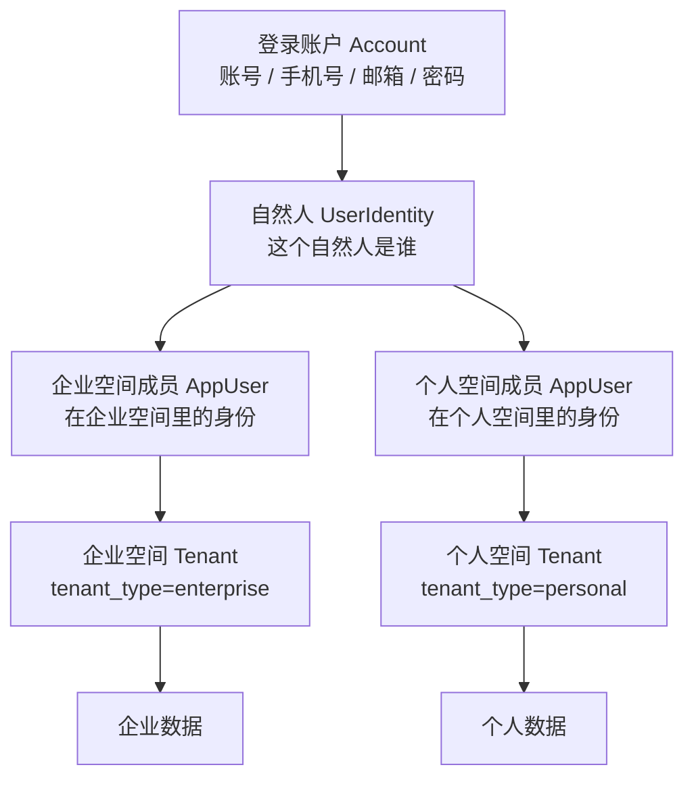

# C 端个人空间与账号体系技术方案

## 1. 背景与目标

本次改造在现有企业 SaaS 底座上补齐 C 端个人用户能力，核心目标是：同一套业务功能可以同时服务企业空间和个人空间，但数据、菜单、权限、套餐和身份上下文必须按空间类型隔离。

改造后的核心结构为：

## 2. 设计原则

- `Account` 负责登录凭证，不直接表达业务身份。
- `UserIdentity` 负责自然人资料，可被多个空间成员复用。
- `AppUser` 仍是业务侧授权、审计、菜单和数据访问的执行身份。
- `Tenant` 从单一企业主体扩展为空间容器，通过 `tenant_type` 区分平台、企业、个人。
- 企业空间和个人空间复用同一套路由、权限、菜单和业务 API，靠 `tenant_scope` 和 `tenant_id` 做准入和数据隔离。
- 平台管理员具备治理视角，不因菜单所属空间类型被过滤；普通用户严格按所在空间类型过滤。

## 3. 核心对象

| 对象 | 表 | 职责 | 关键字段 |
|---|---|---|---|
| 登录账户 | `account` | 登录凭证、手机号/邮箱唯一性、密码版本 | `login_account`、`phone`、`email`、`password_hash`、`session_version` |
| 自然人身份 | `user_identity` | 用户资料主档 | `account_id`、`display_name`、`avatar_url`、`phone`、`email` |
| 空间成员 | `app_user` | 在某个空间内的业务身份 | `tenant_id`、`account_id`、`identity_user_id`、`member_type` |
| 空间 | `tenant` | 平台、企业、个人空间容器 | `tenant_type`、`owner_user_id`、`is_platform_tenant` |
| 菜单/权限 | `permission` | 菜单、按钮、操作、路由权限 | `tenant_scope`、`is_platform_only` |
| 应用菜单 | `sys_app_entry` | Manifest 应用菜单 | `tenant_scope` |
| 应用权限 | `sys_app_permission` | Manifest API/操作权限 | `tenant_scope` |

## 4. 空间类型

| 类型 | 值 | 说明 |
|---|---|---|
| 平台空间 | `platform` | 平台治理后台，承载系统管理、应用装载、主体治理等能力 |
| 企业空间 | `enterprise` | B 端企业/租户空间，承载组织、用户、角色、业务数据 |
| 个人空间 | `personal` | C 端个人空间，承载个人数据和可个人使用的业务能力 |

`tenant_type` 是后续所有菜单、权限、套餐、应用入口判断的基础字段。历史主体默认按 `enterprise` 处理，平台主体按 `platform` 处理。

## 5. 菜单与权限范围

菜单和权限新增 `tenant_scope`，用于声明资源适用于哪些空间。

| 范围 | 值 | 可见空间 |
|---|---|---|
| 仅平台 | `platform_only` | 平台 |
| 仅租户/企业 | `enterprise_only` | 企业 |
| 仅个人 | `personal_only` | 个人 |
| 不限 | `all` | 平台、企业、个人 |
| 平台和租户 | `platform_enterprise` | 平台、企业 |
| 租户和个人 | `enterprise_personal` | 企业、个人 |
| 平台和个人 | `platform_personal` | 平台、个人 |

实现位置：

- 后端范围矩阵：`internal/interfaces/http/handlers/tenant_type_scope.go`
- 菜单包返回：`internal/interfaces/http/handlers/menu_handler.go`
- 权限编辑：`internal/interfaces/http/handlers/permission_command_handler.go`
- 套餐功能候选：`internal/interfaces/http/handlers/plan_feature_support.go`
- 前端菜单维护：`frontend/src/views/MenuView.vue`
- 前端运行时菜单：`frontend/src/stores/sidebarMenu.ts`

平台管理员不被 `tenant_scope` 过滤，便于治理全局菜单和应用资源。非平台管理员按当前 `tenant_id` 对应的 `tenant_type` 过滤。

## 6. C 端注册与登录链路

### 6.1 注册

接口：`POST /api/auth/register`

注册成功后在同一事务内完成：

1. 创建 `account`。
2. 创建 `user_identity`。
3. 创建 `tenant_type=personal` 的个人空间。
4. 创建个人空间根组织节点。
5. 创建 `member_type=personal_owner` 的 `app_user`。
6. 为个人空间创建默认角色，并授予个人空间可用权限。
7. 绑定个人免费套餐与订阅。
8. 直接签发登录结果，进入个人空间。

### 6.2 登录

登录优先使用 `account` 表查找账号、手机号或邮箱。若命中多个空间身份：

- 传入 `tenant_id` 或 `tenant_code` 时登录指定空间。
- 未指定时使用查询结果中的第一个可用空间身份。

历史 `app_user` 仍兼容登录。登录成功后会补齐 `account_id` 与 `identity_user_id`，减少一次性迁移风险。

## 7. 菜单运行时策略

前端运行时菜单遵循以下策略：

- 平台管理员、平台空间、个人空间不加载企业租户菜单覆盖。
- 企业空间继续加载租户菜单覆盖，沿用原有平台配置和租户可开关能力。
- 应用中心菜单按 `app_code` 归组，避免系统管理、应用中心、AI 能力中心、第三方集成中心、Ai 经营决策中心混在同一个二级菜单里。
- `/data-center` 系列和 `/integration-center/my-connections` 当前声明为 `enterprise_personal`，企业和个人均可使用。

## 8. 数据隔离与审计

- 后端业务数据仍以 `tenant_id` 作为硬隔离条件。
- Token 中携带当前 `tenant_id`，业务接口不信任前端传入的租户参数。
- 审计日志优先记录 `app_user`，并补充 `account_id`、`identity_user_id`，方便追溯“谁登录”和“以哪个空间身份操作”。
- 个人空间和企业空间共用业务 API 时，业务表不新增个人专属表，继续依靠 `tenant_id` 隔离。

## 9. 当前已完成范围

- Account/UserIdentity/AppUser 分离模型。
- 个人空间注册与登录。
- 个人空间默认套餐、角色、权限初始化。
- 菜单、权限、应用入口新增 7 种 `tenant_scope`。
- 平台、企业、个人三类空间菜单隔离。
- 数据中心个人可用，系统管理企业/平台能力不对个人开放。
- 深色/浅色主题下平台、企业、个人关键页面浏览器巡检。

## 10. 暂不覆盖的增强

以下事项已记录到后续 TODO，不在本次合并范围：

- 手机号变更流程。
- Account 绑定/解绑。
- 第三方登录。
- 微信 `unionid/openid`。
- 个人空间升级企业空间。
- 个人数据迁移到企业空间。
- 个人空间成员协作。
