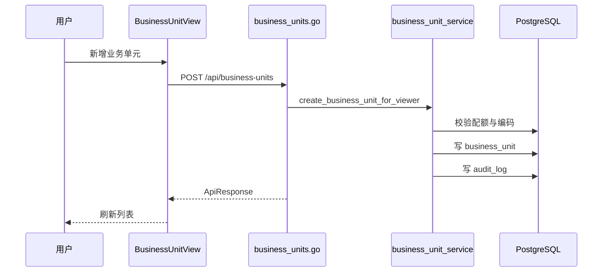

# 业务单元 - 技术实现文档

## 1. 功能概述

业务单元由 `BusinessUnitView.vue` 实现列表、类型字典加载、新增、编辑、归档和组织映射能力。后端由 `business_units.go`、`business_unit_service.go`、`business_unit.go` 实现业务单元 Repository、树形扁平列表、组织映射维护和配额校验。数据模型包括 `business_unit`、`business_unit_org_map`、`business_unit_scope`。权限为 `/business-units` 与 `business_unit:*`。

## 2. 技术实现总览

| 实现层 | 内容 | 关键文件 |
|---|---|---|
| 前端页面 | 业务单元列表、表单、组织映射 | `frontend/src/views/BusinessUnitView.vue` |
| 前端接口 | 业务单元分页、树、组织映射 Repository | `frontend/src/api/businessUnit.ts` |
| 后端路由 | `/api/business-units` 系列接口 | `internal/interfaces/http/handlers/business_units.go` |
| Gin Handler | Gin router 函数 | `internal/interfaces/http/handlers/business_units.go` |
| Application Service | 业务单元和映射业务逻辑 | `internal/application/business_unit_service.go` |
| 数据访问 | 业务单元 Repository、映射 Repository | `internal/infrastructure/persistence/postgres/repositories/business_unit.go` |
| 数据模型 | `BusinessUnit`、`BusinessUnitOrgMap`、`BusinessUnitScope` | `internal/infrastructure/persistence/postgres/models`, `internal/interfaces/http/dto/business_unit.go` |
| 权限控制 | 菜单或任一操作权限、按钮操作权限 | `internal/interfaces/http/middleware`, `internal/domain/permission` |
| 日志记录 | 业务单元新增、编辑、归档、映射变更 | `internal/application/business_unit_service.go` |

## 3. 前端实现说明

### 3.1 页面入口与路由

路由 `/business-units`；名称 `BusinessUnitView`；组件 `frontend/src/views/BusinessUnitView.vue`；菜单路径 `/business-units`；懒加载。

### 3.2 页面结构

页面包含查询区、业务单元列表、分页、新增/编辑弹窗、归档确认、组织映射维护区【具体交互以页面实现为准】。

### 3.3 查询实现

调用 `fetchBusinessUnitPage({ skip, limit, keyword, status, bu_type })`。业务单元类型通过 `fetchDictItemsByCode('business_unit_type')` 加载；缺失时页面提示维护字典。重置逻辑清空关键字和筛选项。

### 3.4 列表实现

字段包括名称、编码、类型、备注、状态、操作。状态 `1/0` 显示启用/停用。类型显示通过字典项翻译。

### 3.5 新增实现

新增入口为新增按钮。表单字段包括名称、编码、类型、状态、备注。调用 `createBusinessUnit(body)`。成功后刷新列表。

### 3.6 编辑实现

编辑入口在操作列。回显行数据，调用 `updateBusinessUnit(id, body)`。成功后刷新。

### 3.7 删除实现

删除入口为归档按钮。二次确认后调用 `deleteBusinessUnit(id)`。后端逻辑删除。未发现批量删除。

### 3.8 状态变更实现

状态字段为 `business_unit.status`，取值 `1/0`。当前通过新增/编辑表单维护，未发现独立启停接口。

### 3.9 前端权限控制

菜单权限 `/business-units`；按钮权限 `business_unit:create`、`business_unit:edit`、`business_unit:delete`。前端使用权限 store 或页面 action 控制。

### 3.10 前端关键文件

| 类型 | 文件路径 | 说明 |
|---|---|---|
| 页面 | `frontend/src/views/BusinessUnitView.vue` | 业务单元页面 |
| API | `frontend/src/api/businessUnit.ts` | 业务单元 API |
| 字典 API | `frontend/src/api/dict.ts` | 类型字典加载 |

## 4. 后端实现说明

### 4.1 接口路由

| 接口名称 | 请求方法 | 接口路径 | 说明 | 权限标识 |
|---|---|---|---|---|
| 业务单元树 | GET | `/api/business-units/tree` | 扁平/树形业务单元 | `/business-units` 或相关操作 |
| 业务单元列表 | GET | `/api/business-units` | 分页查询 | `/business-units` 或相关操作 |
| 组织映射列表 | GET | `/api/business-units/{bu_id}/org-mappings` | 查询映射 | `/business-units` 或相关操作 |
| 新增组织映射 | POST | `/api/business-units/{bu_id}/org-mappings` | 绑定组织 | `business_unit:edit` |
| 删除组织映射 | DELETE | `/api/business-units/org-mappings/{map_id}` | 解除映射 | `business_unit:edit` |
| 新增业务单元 | POST | `/api/business-units` | 创建 | `business_unit:create` |
| 编辑业务单元 | PUT | `/api/business-units/{bu_id}` | 更新 | `business_unit:edit` |
| 删除业务单元 | DELETE | `/api/business-units/{bu_id}` | 归档 | `business_unit:delete` |

### 4.2 Gin Handler 实现

`internal/interfaces/http/handlers/business_units.go` 使用 `_require_menu_path_or_any_operation()` 允许拥有菜单或相关操作权限的用户读取，写操作使用 `_require_operation()`。

### 4.3 Application Service 实现

主要方法：`list_business_unit_flat_for_viewer()`、`list_business_unit_page_for_viewer()`、`create_business_unit_for_viewer()`、`update_business_unit_for_viewer()`、`delete_business_unit_for_viewer()`、`list_org_mappings_for_viewer()`、`delete_org_mapping_for_viewer()`。Application Service 处理配额、租户隔离、唯一性、映射引用和审计日志。

### 4.4 数据访问实现

`internal/infrastructure/persistence/postgres/repositories/business_unit.go` 提供 `create_business_unit_with_org_maps()`、`update_business_unit()`、`delete_business_unit()`、`list_business_units_paged()`、`list_org_maps_for_bu()`、`delete_org_map()` 等。

### 4.5 参数校验

DTO：`BusinessUnitCreate`、`BusinessUnitUpdate`、`BusinessUnitOrgMapCreate`。校验名称、编码、状态、类型、组织 ID。Application Service 校验编码唯一、配额、组织节点归属、映射重复。

### 4.6 异常处理

编码重复、配额不足、业务单元不存在、组织映射不存在、跨租户访问、被引用无法归档等返回业务异常。

### 4.7 后端关键文件

| 类型 | 文件路径 | 说明 |
|---|---|---|
| Handler | `internal/interfaces/http/handlers/business_units.go` | 业务单元接口 |
| Application Service | `internal/application/business_unit_service.go` | 业务逻辑 |
| Repository | `internal/infrastructure/persistence/postgres/repositories/business_unit.go` | 数据访问 |
| DTO | `internal/interfaces/http/dto/business_unit.go` | 请求响应 |
| Model | `internal/infrastructure/persistence/postgres/models` | 业务单元模型 |

## 5. 数据模型说明

### 5.1 数据表清单

| 表名 | 说明 | 对应模型 | 备注 |
|---|---|---|---|
| `business_unit` | 业务单元主数据 | `BusinessUnit` | 一级业务单元 |
| `business_unit_org_map` | 组织映射 | `BusinessUnitOrgMap` | 组织节点与业务单元 |
| `business_unit_scope` | 角色权限业务单元范围 | `BusinessUnitScope` | 关联 `role_permission` |

### 5.2 表结构说明

#### 表：`business_unit`

| 字段名 | 类型 | 是否必填 | 默认值 | 说明 |
|---|---|---|---|---|
| `id` | Integer | 是 | 自增 | 主键 |
| `tenant_id` | Integer | 是 | 无 | 主体 ID |
| `name` | String(200) | 是 | 无 | 名称 |
| `code` | String(64) | 是 | 无 | 编码 |
| `bu_type` | String(32) | 否 | NULL | 类型 |
| `status` | Integer | 是 | 1 | 状态 |
| `billing_enabled` | Boolean | 是 | False | 是否计费 |
| `statistic_enabled` | Boolean | 是 | True | 是否统计 |
| `remark` | Text | 否 | NULL | 备注 |
| `created_at` | DateTime | 否 | now | 创建时间 |
| `updated_at` | DateTime | 否 | now | 更新时间 |
| `deleted_at` | DateTime | 否 | NULL | 逻辑删除 |

#### 表：`business_unit_org_map`

| 字段名 | 类型 | 是否必填 | 默认值 | 说明 |
|---|---|---|---|---|
| `id` | Integer | 是 | 自增 | 主键 |
| `tenant_id` | Integer | 是 | 无 | 主体 ID |
| `business_unit_id` | Integer | 是 | 无 | 业务单元 |
| `org_id` | Integer | 是 | 无 | 组织节点 |
| `org_type` | String(32) | 是 | 无 | 组织类型 |
| `scope_type` | String(32) | 是 | PRIMARY | 范围类型 |
| `priority` | Integer | 是 | 0 | 优先级 |
| `effective_start` | DateTime | 否 | NULL | 生效开始 |
| `effective_end` | DateTime | 否 | NULL | 生效结束 |
| `status` | Integer | 是 | 1 | 状态 |
| `created_at` | DateTime | 否 | now | 创建时间 |

### 5.3 关键字段说明

`tenant_id` 租户隔离；`code` 租户内唯一；`status` 启停；`deleted_at` 归档；`business_unit_org_map` 建立组织映射；`business_unit_scope` 支撑数据权限。

### 5.4 数据关系说明

一个主体有多个业务单元；业务单元可映射多个组织节点；角色权限可通过 `business_unit_scope` 引用业务单元作为数据范围。

### 5.5 索引与约束

`business_unit(tenant_id, code)` 唯一；`business_unit_org_map(tenant_id, business_unit_id, org_id, scope_type)` 唯一；`business_unit_scope(role_permission_id, business_unit_id)` 唯一。

## 6. 接口详细说明

## 6.1 业务单元列表

### 基本信息

| 项目 | 内容 |
|---|---|
| 请求方法 | GET |
| 接口路径 | `/api/business-units` |
| 权限标识 | `/business-units` 或相关操作 |
| 用途 | 分页查询业务单元 |

### 请求参数

| 参数名 | 类型 | 是否必填 | 说明 |
|---|---|---|---|
| `skip` | int | 否 | 偏移 |
| `limit` | int | 否 | 页大小 |
| `keyword` | string | 否 | 名称或编码 |
| `status` | int | 否 | 状态 |
| `bu_type` | string | 否 | 类型 |

### 返回结果

| 字段名 | 类型 | 说明 |
|---|---|---|
| `items` | array | 业务单元列表 |
| `total` | int | 总数 |

### 处理逻辑

1. 校验菜单或操作权限。
2. 按当前主体查询。
3. 应用筛选条件并排除已归档。
4. 返回分页结构。

### 异常情况

- 权限不足。
- 租户上下文缺失。

## 6.2 新增业务单元

### 基本信息

| 项目 | 内容 |
|---|---|
| 请求方法 | POST |
| 接口路径 | `/api/business-units` |
| 权限标识 | `business_unit:create` |
| 用途 | 创建业务单元 |

### 请求参数

| 参数名 | 类型 | 是否必填 | 说明 |
|---|---|---|---|
| `name` | string | 是 | 名称 |
| `code` | string | 是 | 编码 |
| `bu_type` | string | 否 | 类型 |
| `status` | int | 否 | 状态 |
| `remark` | string | 否 | 备注 |

### 返回结果

| 字段名 | 类型 | 说明 |
|---|---|---|
| `id` | int | 业务单元 ID |

### 处理逻辑

1. 校验创建权限。
2. 校验配额 `max_business_units`。
3. 校验编码唯一。
4. 写入业务单元。
5. 记录审计日志。

### 异常情况

- 编码重复。
- 配额不足。
- 参数错误。

## 7. 权限实现说明

### 7.1 菜单权限

菜单路径 `/business-units`。

### 7.2 按钮权限

`business_unit:create`、`business_unit:edit`、`business_unit:delete`。

### 7.3 API 权限

读接口支持菜单或相关操作权限；写接口要求具体操作权限。

### 7.4 数据权限

业务单元数据按 `tenant_id` 隔离。业务单元也作为角色数据权限的范围维度之一。

## 8. 日志实现说明

| 操作 | 是否记录 | 记录内容 | 实现位置 |
|---|---|---|---|
| 新增业务单元 | 是 | 名称、编码、操作者、IP | `business_unit_service.go` |
| 编辑业务单元 | 是 | 变更摘要 | `business_unit_service.go` |
| 归档业务单元 | 是 | 归档摘要 | `business_unit_service.go` |
| 组织映射变更 | 是 | 业务单元和组织 ID | `business_unit_service.go` |

## 9. 状态与枚举实现

| 字段/枚举 | 取值 | 说明 | 来源 |
|---|---|---|---|
| `status` | `1`/`0` | 启用/停用 | 数据库字段 |
| `bu_type` | 字典值 | 业务单元类型 | 数据字典 `business_unit_type` |
| `scope_type` | `PRIMARY` 等 | 映射范围类型 | 代码常量/默认值 |
| `deleted_at` | NULL/datetime | 未归档/已归档 | 数据库字段 |

## 10. 关键业务逻辑实现

### 逻辑：业务单元配额校验

- 触发入口：新增业务单元。
- 处理流程：统计当前主体业务单元数量，调用套餐配额校验。
- 涉及方法：`create_business_unit_for_viewer()`、`require_count_within_quota()`。
- 涉及数据：`business_unit`、`tenant_quota_override`、`saas_plan_quota`。
- 异常处理：超配额抛出错误。
- 注意事项：配额覆盖优先。

### 逻辑：组织映射维护

- 触发入口：新增或删除组织映射。
- 处理流程：校验业务单元和组织节点同租户，写入或删除映射。
- 涉及方法：`list_org_mappings_for_viewer()`、`delete_org_mapping_for_viewer()`。
- 涉及数据：`business_unit_org_map`。
- 异常处理：重复映射或跨租户拒绝。
- 注意事项：映射删除属于关系解除。

## 11. 前后端交互流程

## 12. 扩展点与技术风险

- 扩展点：业务单元负责人、组织映射详情页、引用统计。
- 风险：业务单元既是主数据又参与数据权限，归档前必须检查引用。
- 风险：配额与套餐功能联动必须保持一致，否则可能出现页面允许但后端拒绝。
