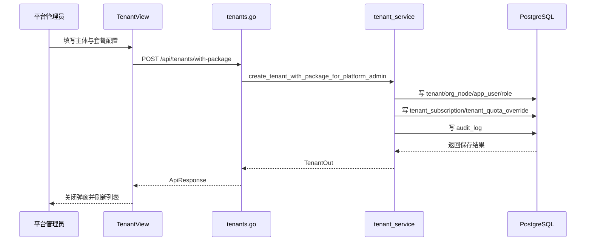

# 主体管理 - 技术实现文档

## 1. 功能概述

主体管理由前端 `TenantView.vue` 实现平台侧主体列表、详情、两步创建、套餐配额配置、启停、归档、主管理员密码重置等交互；后端由 `tenants.go`、`tenant_service.go`、`tenant.go`、`tenant_ops.go` 编排主体、默认公司、首个管理员、订阅和配额覆盖。数据模型主要涉及 `tenant`、`org_node`、`app_user`、`role`、`user_role`、`tenant_subscription`、`tenant_quota_override`。权限范围为平台专属菜单 `/tenants` 及 `tenant:*`、部分 `plan:config` / `tenant:quota_config` 操作。写操作通过审计日志记录，密码明文只在重置响应中一次性返回。

## 2. 技术实现总览

| 实现层 | 内容 | 关键文件 |
|---|---|---|
| 前端页面 | 主体卡片列表、详情抽屉、新增/编辑弹窗、套餐配额配置 | `frontend/src/views/TenantView.vue` |
| 前端接口 | 主体 Repository、启停、套餐配置、配额记录、主管理员密码 | `frontend/src/api/tenant.ts`, `frontend/src/api/plan.ts` |
| 后端路由 | `/api/tenants` 系列接口 | `internal/interfaces/http/handlers/tenants.go` |
| Gin Handler | Gin router 函数，统一 `ApiResponse` 包装 | `internal/interfaces/http/handlers/tenants.go` |
| Application Service | 主体创建、套餐配置、归档、密码重置、列表 DTO 组装 | `internal/application/tenant_service.go` |
| 数据访问 | 主体、组织、用户、归档操作 | `internal/infrastructure/persistence/postgres/repositories/tenant.go`, `internal/infrastructure/persistence/postgres/repositories/tenant_ops.go`, `internal/infrastructure/persistence/postgres/repositories/user.go` |
| 数据模型 | 租户、组织、用户、订阅、配额覆盖 | `internal/infrastructure/persistence/postgres/models`, `internal/interfaces/http/dto/tenant.go` |
| 权限控制 | 平台菜单和操作权限依赖 | `internal/interfaces/http/middleware`, `internal/domain/permission` |
| 日志记录 | 主体新增、编辑、启停、归档、配置、重置密码审计 | `internal/application/tenant_service.go`, `internal/application/log_service.go` |

## 3. 前端实现说明

### 3.1 页面入口与路由

- 菜单路径：系统管理 / 主体管理。
- 前端路由：`/tenants`。
- 路由名称：`TenantView`。
- 页面组件：`frontend/src/views/TenantView.vue`。
- 路由使用懒加载：是。
- 路由 meta：`requiresPlatformAdmin: true`，普通租户访问会被路由守卫重定向到 `/home`。

### 3.2 页面结构

页面包含搜索与状态筛选、卡片列表、分页、详情抽屉、新增主体两步弹窗、编辑弹窗、套餐详情弹窗、配额覆盖弹窗、主管理员密码重置结果弹窗。卡片通过 `CardListView` 展示套餐、公司、门店、业务单元、用户配额进度。

### 3.3 查询实现

- 前端调用 `fetchTenants(skip, limit)` 获取分页主体列表。
- 关键字和状态筛选在前端 `filteredTenants()` 中对当前页数据过滤。
- 分页参数由 `page`、`limit` 计算为 `skip`、`limit`。
- 重置逻辑清空 `searchKeyword`、`statusFilter` 后重新展示。

### 3.4 列表实现

列表卡片字段来自 `Tenant`：名称、编码、状态、套餐名称、套餐编码、创建时间、联系人、公司/门店/业务单元/用户配额。状态值 `1` 显示启用，`0` 显示停用。配额使用通过 `quotaUsageText()` 和 `quotaProgressPct()` 计算。加载态由 `loading` 控制。

### 3.5 新增实现

- 新增入口：页面新增按钮。
- 表单字段：主体编码、主体名称、状态、管理员姓名、管理员工号、手机号、初始密码。
- 默认值：状态启用，管理员姓名默认为“超级管理员”。
- 两步流程：`createStep=1` 创建主体，`createStep=2` 选择套餐、订阅周期和配额。
- 提交接口：当前页面使用 `createTenantWithPackage()`，同时也保留了 `saveTenantPackageConfig()` 对应的分步接口封装。
- 成功处理：关闭弹窗、刷新列表、展示成功提示。
- 失败处理：Element Plus 全局消息或 HTTP 封装错误提示。

### 3.6 编辑实现

编辑入口来自卡片或详情操作。编辑时将当前行数据回填到 `editForm`，调用 `updateTenant(id, body)` 保存。成功后刷新列表并关闭弹窗。

### 3.7 删除实现

删除入口为归档操作。前端通过 `confirmArchiveAction()` 二次确认，调用 `deleteTenant(id)`。成功后调用 `archiveSuccessMessage()` 并刷新列表。未发现批量删除。

### 3.8 状态变更实现

- 操作入口：启用/停用按钮。
- 状态字段：`status`。
- 状态值：`1` 启用，`0` 停用。
- 调用接口：`patchTenantStatus(id, status)` -> `PATCH /api/tenants/{tenant_id}/status`。
- 成功后刷新列表。
- 影响：后端主体状态会影响主体登录和套餐能力上下文。

### 3.9 前端权限控制

路由使用 `requiresPlatformAdmin`。按钮使用 `usePermissionStore().can()` 和 `usePageAction()` 判断，如 `tenant:quota_config`、`tenant:status`、`tenant:reset_primary_password`、`tenant:delete`。侧栏菜单由 `sidebarMenu.ts` 的平台完整树和后端权限包共同决定。

### 3.10 前端关键文件

| 类型 | 文件路径 | 说明 |
|---|---|---|
| 页面 | `frontend/src/views/TenantView.vue` | 主体管理主页面 |
| API | `frontend/src/api/tenant.ts` | 主体相关接口封装 |
| API | `frontend/src/api/plan.ts` | 套餐、配额、订阅接口封装 |
| 权限 | `frontend/src/stores/permission.ts` | 当前用户权限、套餐能力、菜单能力 |
| 菜单 | `frontend/src/stores/sidebarMenu.ts` | 主体管理菜单和按钮权限定义 |
| 归档确认 | `frontend/src/composables/useArchiveConfirm.ts` | 统一归档二次确认 |

## 4. 后端实现说明

### 4.1 接口路由

| 接口名称 | 请求方法 | 接口路径 | 说明 | 权限标识 |
|---|---|---|---|---|
| 创建主体 | POST | `/api/tenants` | 创建主体、默认公司、主管理员 | `tenant:create` |
| 创建主体并配置套餐 | POST | `/api/tenants/with-package` | 创建主体并保存订阅配额 | `tenant:create` + `plan:config` 或 `tenant:edit` |
| 主体列表 | GET | `/api/tenants` | 分页查询主体 | `/tenants` |
| 主体详情 | GET | `/api/tenants/{tenant_id}` | 查询主体详情 | `/tenants` |
| 编辑主体 | PUT | `/api/tenants/{tenant_id}` | 更新主体基础信息 | `tenant:edit` |
| 启停主体 | PATCH | `/api/tenants/{tenant_id}/status` | 修改主体状态 | `tenant:status` |
| 保存套餐配置 | PUT | `/api/tenants/{tenant_id}/package-config` | 保存订阅和配额覆盖 | `plan:config` / `tenant:edit` / `tenant:quota_config` |
| 归档主体 | DELETE | `/api/tenants/{tenant_id}` | 逻辑归档主体 | `tenant:delete` |
| 主体公司树 | GET | `/api/tenants/{tenant_id}/companies` | 查询主体公司树 | `/tenants` |
| 主体配额记录 | GET | `/api/tenants/{tenant_id}/quota-records` | 查询组织和业务单元配额记录 | `/tenants` |
| 主管理员 | GET | `/api/tenants/{tenant_id}/primary-admin` | 查询主管理员摘要 | `/tenants` |
| 重置主管理员密码 | PUT | `/api/tenants/{tenant_id}/primary-admin/password` | 生成临时密码 | `tenant:reset_primary_password` |

### 4.2 Gin Handler 实现

Gin Handler 位于 `internal/interfaces/http/handlers/tenants.go`。各函数只做依赖注入、参数接收、权限依赖、IP 提取和 `ApiResponse` 包装，核心逻辑下沉到 `tenant_service.go`。

入参对象包括 `TenantCreate`、`TenantCreateWithPackage`、`TenantUpdate`、`TenantStatusPatch`、`TenantPackageConfigPut`。出参对象包括 `TenantOut`、`TenantListData`、`TenantPackageConfigOut`、`TenantPrimaryAdminBrief`、`TenantPrimaryAdminPasswordResetOut`。

### 4.3 Application Service 实现

核心方法：

- `create_tenant_for_platform_admin()`：创建主体、默认公司、管理员角色、主管理员账号。
- `create_tenant_with_package_for_platform_admin()`：组合主体创建与套餐配置。
- `list_tenant_page()`：分页查询并补充套餐、配额使用。
- `get_tenant_out_or_404()`：主体详情。
- `update_tenant_for_platform_admin()`：主体基础信息更新。
- `delete_tenant_for_platform_admin()`：主体归档。
- `save_tenant_package_config_for_platform_admin()`【名称以当前实现为准】：保存订阅和配额覆盖。

Application Service 处理租户唯一性、手机号标准化、密码生成、审计日志、套餐订阅、配额覆盖、逻辑删除和唯一字段墓碑化。

### 4.4 数据访问实现

`internal/infrastructure/persistence/postgres/repositories/tenant.go` 提供主体查询、更新、组织树构建、组织节点 Repository；`internal/infrastructure/persistence/postgres/repositories/tenant_ops.go` 提供主体归档；`internal/infrastructure/persistence/postgres/repositories/user.go` 提供用户创建、查找和唯一性校验；套餐配置通过 `plan_service.go` 操作订阅和配额覆盖。

### 4.5 参数校验

Go DTO 负责基础必填、类型和长度校验。Application Service/Repository 负责主体编码唯一、手机号格式、管理员账号唯一、套餐存在、配额合法性和主体存在校验。

### 4.6 异常处理

常见异常通过业务错误和统一响应返回，包括主体不存在、编码重复、套餐不存在、配额不足、权限不足、数据已归档等。全局响应由 `internal/interfaces/http/response` 统一包装。

### 4.7 后端关键文件

| 类型 | 文件路径 | 说明 |
|---|---|---|
| Handler | `internal/interfaces/http/handlers/tenants.go` | 主体接口入口 |
| Application Service | `internal/application/tenant_service.go` | 主体业务编排 |
| Repository | `internal/infrastructure/persistence/postgres/repositories/tenant.go` | 主体与组织数据访问 |
| Repository | `internal/infrastructure/persistence/postgres/repositories/tenant_ops.go` | 主体归档 |
| DTO | `internal/interfaces/http/dto/tenant.go` | 主体请求和响应 |
| Model | `internal/infrastructure/persistence/postgres/models` | `Tenant` 等 ORM |
| 权限码 | `internal/domain/permission` | `MenuPath.TENANTS`、`OperationCode.TENANT_*` |

## 5. 数据模型说明

### 5.1 数据表清单

| 表名 | 说明 | 对应模型 | 备注 |
|---|---|---|---|
| `tenant` | 主体基础信息 | `Tenant` | 平台主体、租户状态、品牌信息 |
| `org_node` | 默认公司和组织节点 | `OrgNode` | 主体创建时初始化默认公司 |
| `app_user` | 主管理员账号 | `AppUser` | 首个用户为主体管理员 |
| `role` | 管理员角色 | `Role` | 主体初始化角色 |
| `user_role` | 用户角色关系 | `UserRole` | 绑定主管理员角色 |
| `tenant_subscription` | 主体订阅 | `TenantSubscription` | 套餐周期和状态 |
| `tenant_quota_override` | 主体配额覆盖 | `TenantQuotaOverride` | 覆盖套餐默认配额 |
| `audit_log` | 操作审计 | `AuditLog` | 写操作记录 |

### 5.2 表结构说明

#### 表：`tenant`

| 字段名 | 类型 | 是否必填 | 默认值 | 说明 |
|---|---|---|---|---|
| `id` | Integer | 是 | 自增 | 主键 |
| `code` | String(64) | 是 | 无 | 主体编码，唯一 |
| `name` | String(200) | 是 | 无 | 主体名称 |
| `status` | Integer | 是 | 1 | 1 启用，0 停用 |
| `start_date` | Date | 否 | NULL | 历史字段，订阅起始以 `tenant_subscription` 为准 |
| `expire_date` | Date | 否 | NULL | 历史字段，订阅结束以 `tenant_subscription` 为准 |
| `max_companies` | Integer | 是 | 0 | 历史字段，运行时以配额覆盖/套餐为准 |
| `max_users` | Integer | 是 | 0 | 历史字段，运行时以配额覆盖/套餐为准 |
| `contact_name` | String(100) | 否 | NULL | 联系人 |
| `contact_phone` | String(32) | 否 | NULL | 联系电话 |
| `created_at` | DateTime | 否 | now | 创建时间 |
| `deleted_at` | DateTime | 否 | NULL | 逻辑删除时间 |
| `brand_display_name` | String(128) | 否 | NULL | 品牌展示名称 |
| `brand_logo_data` | MEDIUMTEXT | 否 | NULL | 品牌 Logo Data URL |
| `brand_footer_text` | String(256) | 否 | NULL | 页脚文案 |
| `is_platform_tenant` | Boolean | 是 | False | 是否平台主体 |

#### 表：`tenant_subscription`

| 字段名 | 类型 | 是否必填 | 默认值 | 说明 |
|---|---|---|---|---|
| `id` | Integer | 是 | 自增 | 主键 |
| `tenant_id` | Integer | 是 | 无 | 主体 ID |
| `plan_id` | Integer | 是 | 无 | 套餐 ID |
| `subscription_status` | String(32) | 是 | 无 | 订阅状态 |
| `start_time` | DateTime | 是 | 无 | 开始时间 |
| `end_time` | DateTime | 否 | NULL | 结束时间 |
| `trial_end_time` | DateTime | 否 | NULL | 试用结束 |
| `auto_renew` | Boolean | 是 | False | 自动续费 |
| `frozen_reason` | String(500) | 否 | NULL | 冻结原因 |
| `created_at` | DateTime | 否 | now | 创建时间 |
| `updated_at` | DateTime | 否 | now | 更新时间 |

#### 表：`tenant_quota_override`

| 字段名 | 类型 | 是否必填 | 默认值 | 说明 |
|---|---|---|---|---|
| `id` | Integer | 是 | 自增 | 主键 |
| `tenant_id` | Integer | 是 | 无 | 主体 ID |
| `quota_id` | Integer | 是 | 无 | 配额 ID |
| `quota_value` | Integer | 是 | 无 | 覆盖值，-1 不限 |
| `reason` | String(500) | 否 | NULL | 覆盖原因 |
| `start_time` | DateTime | 否 | NULL | 生效时间 |
| `end_time` | DateTime | 否 | NULL | 失效时间 |
| `created_at` | DateTime | 否 | now | 创建时间 |
| `updated_at` | DateTime | 否 | now | 更新时间 |

### 5.3 关键字段说明

主键为 `tenant.id`；租户字段为各业务表 `tenant_id`；状态字段为 `tenant.status`；逻辑删除字段为 `deleted_at`；订阅周期在 `tenant_subscription.start_time/end_time`；配额覆盖在 `tenant_quota_override.quota_value`。

### 5.4 数据关系说明

一个主体有多个组织、用户、角色、菜单覆盖、字典覆盖和参数覆盖。一个主体当前订阅一个套餐，并可配置多条配额覆盖。主管理员是 `app_user` 中的普通用户记录，通过 `user_role` 绑定管理员角色。

### 5.5 索引与约束

`tenant.code` 唯一；`tenant_quota_override` 对 `(tenant_id, quota_id)` 唯一；`tenant_subscription` 当前未见唯一约束，当前订阅唯一性由 service 逻辑保证（当前实现未覆盖，按后续增强处理）。

## 6. 接口详细说明

## 6.1 主体列表

### 基本信息

| 项目 | 内容 |
|---|---|
| 请求方法 | GET |
| 接口路径 | `/api/tenants` |
| 权限标识 | `/tenants` |
| 用途 | 分页查询平台主体 |

### 请求参数

| 参数名 | 类型 | 是否必填 | 说明 |
|---|---|---|---|
| `skip` | int | 否 | 起始偏移 |
| `limit` | int | 否 | 页大小 |

### 返回结果

| 字段名 | 类型 | 说明 |
|---|---|---|
| `items` | array | 主体列表 |
| `total` | int | 总数 |

### 处理逻辑

1. 校验登录和菜单权限。
2. 调用 `list_tenant_page()`。
3. 查询未归档主体并补充套餐、配额使用。
4. 返回分页结构。

### 异常情况

- 权限不足。
- 数据库查询异常。

## 6.2 创建主体并配置套餐

### 基本信息

| 项目 | 内容 |
|---|---|
| 请求方法 | POST |
| 接口路径 | `/api/tenants/with-package` |
| 权限标识 | `tenant:create` + `plan:config` 或 `tenant:edit` |
| 用途 | 创建主体并完成套餐配额配置 |

### 请求参数

| 参数名 | 类型 | 是否必填 | 说明 |
|---|---|---|---|
| `tenant` | object | 是 | 主体创建参数 |
| `package_config` | object | 是 | 套餐订阅和配额覆盖 |

### 返回结果

| 字段名 | 类型 | 说明 |
|---|---|---|
| `id` | int | 主体 ID |
| `code` | string | 主体编码 |
| `name` | string | 主体名称 |

### 处理逻辑

1. 校验创建主体和套餐配置权限。
2. 创建主体、默认公司、主管理员和角色。
3. 保存 `tenant_subscription`。
4. 保存 `tenant_quota_override`。
5. 记录审计日志。
6. 返回主体信息。

### 异常情况

- 主体编码重复。
- 管理员账号重复。
- 套餐不存在或停用。
- 配额值非法。

## 6.3 保存套餐配置

### 基本信息

| 项目 | 内容 |
|---|---|
| 请求方法 | PUT |
| 接口路径 | `/api/tenants/{tenant_id}/package-config` |
| 权限标识 | `plan:config` / `tenant:edit` / `tenant:quota_config` |
| 用途 | 修改主体订阅和配额覆盖 |

### 请求参数

| 参数名 | 类型 | 是否必填 | 说明 |
|---|---|---|---|
| `tenant_id` | int | 是 | 主体 ID |
| `plan_id` | int | 是 | 套餐 ID |
| `subscription_status` | string | 是 | 订阅状态 |
| `start_time` | datetime | 是 | 开始时间 |
| `end_time` | datetime | 否 | 结束时间 |
| `quotas` | array | 否 | 配额覆盖数组 |

### 返回结果

| 字段名 | 类型 | 说明 |
|---|---|---|
| `tenant_id` | int | 主体 ID |
| `subscription` | object | 订阅结果 |
| `quota_overrides` | array | 配额覆盖结果 |

### 处理逻辑

1. 校验主体存在。
2. 校验套餐存在。
3. 写入或更新订阅。
4. 替换有效配额覆盖。
5. 刷新主体列表展示数据。

### 异常情况

- 主体不存在。
- 套餐不存在。
- 权限不足。
- 配额不在当前能力矩阵内。

## 6.4 重置主管理员密码

### 基本信息

| 项目 | 内容 |
|---|---|
| 请求方法 | PUT |
| 接口路径 | `/api/tenants/{tenant_id}/primary-admin/password` |
| 权限标识 | `tenant:reset_primary_password` |
| 用途 | 为主体主管理员生成临时密码 |

### 请求参数

| 参数名 | 类型 | 是否必填 | 说明 |
|---|---|---|---|
| `tenant_id` | int | 是 | 主体 ID |

### 返回结果

| 字段名 | 类型 | 说明 |
|---|---|---|
| `employee_no` | string | 管理员账号 |
| `new_password` | string | 一次性临时密码 |

### 处理逻辑

1. 校验操作权限。
2. 查找主体主管理员。
3. 生成随机密码并更新密码哈希。
4. 记录审计日志但不记录明文。
5. 返回临时密码。

### 异常情况

- 主体不存在。
- 未找到主管理员。
- 权限不足。

## 7. 权限实现说明

### 7.1 菜单权限

菜单路径为 `/tenants`，在 `MenuPath.TENANTS` 和侧栏 `sidebarMenu.ts` 中定义。路由还额外要求平台管理员。

### 7.2 按钮权限

按钮权限包括 `tenant:create`、`tenant:edit`、`tenant:status`、`tenant:reset_primary_password`、`tenant:delete`，以及配额配置相关 `tenant:quota_config`。

### 7.3 API 权限

后端通过 `_require_menu_path()`、`_require_operation()`、`_require_any_operation()` 校验；前后端权限标识基本一致。

### 7.4 数据权限

主体管理为平台专属，平台管理员可跨主体查询。普通租户路由守卫和后端平台专属权限应共同阻断。主体内部数据由各表 `tenant_id` 实现隔离。

## 8. 日志实现说明

| 操作 | 是否记录 | 记录内容 | 实现位置 |
|---|---|---|---|
| 创建主体 | 是 | 主体编码、名称、操作者、IP | `tenant_service.go` |
| 编辑主体 | 是 | 主体变更摘要 | `tenant_service.go` |
| 启停主体 | 是 | 主体状态变更 | `tenant_service.go` |
| 套餐配置 | 是 | 套餐和配额配置摘要 | `tenant_service.go` / `plan_service.go` |
| 归档主体 | 是 | 主体归档摘要 | `tenant_service.go` |
| 重置密码 | 是 | 管理员账号摘要，不含明文密码 | `tenant_service.go` |

## 9. 状态与枚举实现

| 字段/枚举 | 取值 | 说明 | 来源 |
|---|---|---|---|
| `tenant.status` | `1` / `0` | 启用 / 停用 | 数据库字段、前端静态映射 |
| `deleted_at` | NULL / datetime | 未归档 / 已归档 | 数据库字段 |
| `subscription_status` | `TRIAL` / `ACTIVE` / `OVERDUE` / `FROZEN` / `EXPIRED` / `CANCELLED` | 订阅状态 | DTO/业务约定 |
| `quota_value` | `-1` / `0` / 正数 | 不限 / 不可用 / 具体额度 | 业务约定 |

## 10. 关键业务逻辑实现

### 逻辑：两步主体创建

- 触发入口：前端新增主体弹窗。
- 处理流程：前端收集主体和套餐配置，调用创建接口；后端创建主体基础数据，再写订阅和配额覆盖。
- 涉及方法：`create_tenant_with_package_for_platform_admin()`、`create_tenant_for_platform_admin()`。
- 涉及数据：`tenant`、`org_node`、`app_user`、`role`、`tenant_subscription`、`tenant_quota_override`。
- 异常处理：主体编码重复、账号重复、套餐无效时回滚并返回错误。
- 注意事项：业务判断不应再依赖 `tenant.max_users`、`tenant.expire_date` 等历史字段。

### 逻辑：主体归档

- 触发入口：前端归档按钮。
- 处理流程：前端二次确认，后端将主体标记 `deleted_at` 并释放唯一编码。
- 涉及方法：`delete_tenant_for_platform_admin()`、`tenant_ops.delete_tenant()`。
- 涉及数据：`tenant.deleted_at`。
- 异常处理：主体不存在或已归档返回错误。
- 注意事项：不得物理删除主体及其历史数据。

### 逻辑：主管理员密码重置

- 触发入口：重置主管理员密码按钮。
- 处理流程：后端查找主管理员，生成随机密码，更新哈希，一次性返回明文。
- 涉及方法：`resetTenantPrimaryAdminPassword()`、对应 tenant service 方法。
- 涉及数据：`app_user.password_hash`。
- 异常处理：未找到管理员或权限不足。
- 注意事项：审计日志禁止记录明文密码。

## 11. 前后端交互流程

## 12. 扩展点与技术风险

- 扩展点：主体生命周期、订阅变更记录、配额变更记录、主管理员交接。
- 风险：前端当前关键字和状态筛选主要作用于当前页数据，后端未提供完整搜索参数，数据量大时会造成查询体验偏差。
- 风险：`tenant` 中存在历史配额和到期字段，后续开发容易误用，应统一以订阅和配额覆盖为运行时来源。
- 风险：主体创建和套餐配置涉及多表写入，必须保持事务一致性。
