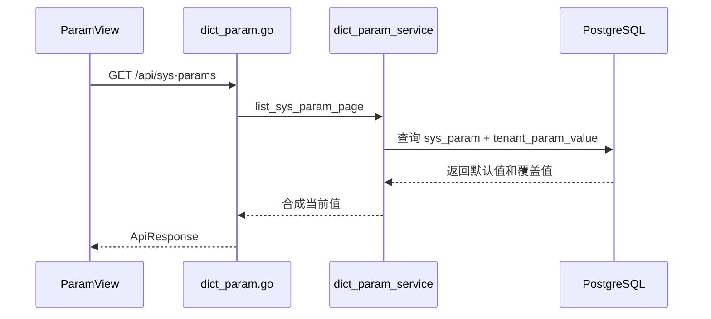

# 参数管理 - 技术实现文档

## 1. 功能概述

参数管理由 `ParamView.vue` 实现系统参数默认定义、租户覆盖和恢复默认。后端与数据字典共用 `dict_param.go`、`dict_param_service.go`、`repositories/dict_param.go`。数据模型包括 `sys_param`、`tenant_param_value`。权限为 `/params` 和 `param:create`、`param:edit`、`param:delete`。

## 2. 技术实现总览

| 实现层 | 内容 | 关键文件 |
|---|---|---|
| 前端页面 | 参数列表、编辑、覆盖、恢复默认 | `frontend/src/views/ParamView.vue` |
| 前端接口 | 参数 Repository、批量读取、恢复默认 | `frontend/src/api/param.ts` |
| 后端路由 | `/api/sys-params` | `internal/interfaces/http/handlers/dict_param.go` |
| Gin Handler | Gin router 函数 | `internal/interfaces/http/handlers/dict_param.go` |
| Application Service | 参数平台/租户视角处理 | `internal/application/dict_param_service.go` |
| 数据访问 | 参数 Repository、覆盖合成、默认初始化 | `internal/infrastructure/persistence/postgres/repositories/dict_param.go` |
| 数据模型 | 参数定义和租户覆盖 | `internal/infrastructure/persistence/postgres/models`, `internal/interfaces/http/dto/dict_param.go` |
| 权限控制 | 菜单和操作权限 | `internal/interfaces/http/middleware`, `internal/domain/permission` |
| 日志记录 | 参数维护审计 | `dict_param_service.go` |

## 3. 前端实现说明

### 3.1 页面入口与路由

路由 `/params`；路由名 `ParamView`；页面组件 `frontend/src/views/ParamView.vue`；路由 meta title 为“系统参数”，侧栏菜单显示“参数管理”。

### 3.2 页面结构

页面包含查询区、参数列表、分页、新增/编辑弹窗、恢复默认操作、覆盖状态展示。

### 3.3 查询实现

参数列表调用 `fetchSysParams(skip, limit, { keyword })`。业务场景可调用 `fetchSysParamBatch(keys)` 批量读取参数值。重置时清空关键字并刷新。

### 3.4 列表实现

字段包括参数键、参数值、当前值、备注、值类型、租户可编辑、平台专属、覆盖状态。当前值由后端合成默认值和租户覆盖。

### 3.5 新增实现

新增调用 `createSysParam()`，字段包括 `param_key`、`param_value`、`remark`、`value_type`、`tenant_editable`、`is_platform_only`。平台视角创建默认参数。

### 3.6 编辑实现

编辑调用 `updateSysParam(id, body)`。平台管理员更新默认参数；租户管理员在允许时写 `tenant_param_value` 覆盖。

### 3.7 删除实现

删除参数调用 `deleteSysParam(id)`，逻辑删除默认定义。恢复默认调用 `restoreSysParamDefault(id)`，删除租户覆盖行。未发现批量删除。

### 3.8 状态变更实现

当前模型无 `status` 字段，参数可用性由 `deleted_at`、`tenant_editable`、`is_platform_only` 控制。

### 3.9 前端权限控制

菜单 `/params`；按钮权限 `param:create`、`param:edit`、`param:delete`。租户编辑还受参数字段限制。

### 3.10 前端关键文件

| 类型 | 文件路径 | 说明 |
|---|---|---|
| 页面 | `frontend/src/views/ParamView.vue` | 参数管理页面 |
| API | `frontend/src/api/param.ts` | 参数接口 |
| 菜单 | `frontend/src/stores/sidebarMenu.ts` | 参数权限定义 |

## 4. 后端实现说明

### 4.1 接口路由

| 接口名称 | 请求方法 | 接口路径 | 说明 | 权限标识 |
|---|---|---|---|---|
| 批量读取参数 | GET | `/api/sys-params/batch` | 按 key 读取当前值 | 登录【待确认】 |
| 参数列表 | GET | `/api/sys-params` | 分页查询参数 | `/params` |
| 新增参数 | POST | `/api/sys-params` | 创建参数 | `param:create` |
| 编辑参数 | PUT | `/api/sys-params/{param_id}` | 更新默认或覆盖 | `param:edit` |
| 恢复默认 | DELETE | `/api/sys-params/{param_id}/override` | 删除覆盖值 | `param:edit` |
| 删除参数 | DELETE | `/api/sys-params/{param_id}` | 逻辑删除参数 | `param:delete` |

### 4.2 Gin Handler 实现

`internal/interfaces/http/handlers/dict_param.go` 的参数接口使用 `SysParamCreate`、`SysParamUpdate`、`SysParamOut`、`SysParamListData`、`SysParamBatchData`。

### 4.3 Application Service 实现

`dict_param_service.go` 方法：`list_sys_param_page()`、`create_sys_param_for_viewer()`、`update_sys_param_for_viewer()`、`delete_sys_param_for_viewer()`。Application Service 处理平台/租户视角、平台专属、租户可编辑、审计日志。

### 4.4 数据访问实现

`repositories/dict_param.go` 方法：`list_sys_params_paged()`、`create_sys_param()`、`update_sys_param()`、`delete_sys_param()`、`get_sys_param_values_by_keys()`、`delete_tenant_param_value()`。

### 4.5 参数校验

校验 `param_key` 唯一、`value_type` 合法、平台专属和租户可编辑约束。具体类型值格式校验强度【待确认】。

### 4.6 异常处理

参数不存在、key 重复、租户不可编辑、平台专属、覆盖不存在、参数被业务引用【待确认】等返回业务异常。

### 4.7 后端关键文件

| 类型 | 文件路径 | 说明 |
|---|---|---|
| Handler | `internal/interfaces/http/handlers/dict_param.go` | 参数接口 |
| Application Service | `internal/application/dict_param_service.go` | 参数业务 |
| Repository | `internal/infrastructure/persistence/postgres/repositories/dict_param.go` | 参数数据访问 |
| DTO | `internal/interfaces/http/dto/dict_param.go` | 参数 DTO |
| Model | `internal/infrastructure/persistence/postgres/models` | `SysParam`、`TenantParamValue` |

## 5. 数据模型说明

### 5.1 数据表清单

| 表名 | 说明 | 对应模型 | 备注 |
|---|---|---|---|
| `sys_param` | 参数默认定义 | `SysParam` | 平台默认 |
| `tenant_param_value` | 租户参数覆盖 | `TenantParamValue` | 差异值 |

### 5.2 表结构说明

#### 表：`sys_param`

| 字段名 | 类型 | 是否必填 | 默认值 | 说明 |
|---|---|---|---|---|
| `id` | Integer | 是 | 自增 | 主键 |
| `tenant_id` | Integer | 是 | 无 | 主体 ID |
| `param_key` | String(128) | 是 | 无 | 参数键 |
| `param_value` | Text | 否 | NULL | 默认值 |
| `remark` | String(500) | 否 | NULL | 备注 |
| `value_type` | String(32) | 是 | STRING | 值类型 |
| `tenant_editable` | Boolean | 是 | True | 租户可编辑 |
| `is_platform_only` | Boolean | 是 | False | 平台专属 |
| `deleted_at` | DateTime | 否 | NULL | 逻辑删除 |

#### 表：`tenant_param_value`

| 字段名 | 类型 | 是否必填 | 默认值 | 说明 |
|---|---|---|---|---|
| `id` | Integer | 是 | 自增 | 主键 |
| `tenant_id` | Integer | 是 | 无 | 主体 ID |
| `param_id` | Integer | 是 | 无 | 参数 ID |
| `param_value` | Text | 否 | NULL | 覆盖值 |
| `created_at` | DateTime | 否 | now | 创建时间 |
| `updated_at` | DateTime | 否 | now | 更新时间 |

### 5.3 关键字段说明

`param_key` 是业务读取标识；`tenant_editable` 和 `is_platform_only` 控制租户覆盖；`tenant_param_value` 覆盖默认值；`deleted_at` 逻辑删除。

### 5.4 数据关系说明

一个参数定义可被多个租户覆盖。读取参数时先取 `sys_param.param_value`，再叠加当前租户 `tenant_param_value.param_value`。

### 5.5 索引与约束

`sys_param(tenant_id, param_key)` 唯一；`tenant_param_value(tenant_id, param_id)` 唯一。

## 6. 接口详细说明

## 6.1 参数列表

### 基本信息

| 项目 | 内容 |
|---|---|
| 请求方法 | GET |
| 接口路径 | `/api/sys-params` |
| 权限标识 | `/params` |
| 用途 | 分页查询系统参数 |

### 请求参数

| 参数名 | 类型 | 是否必填 | 说明 |
|---|---|---|---|
| `skip` | int | 否 | 偏移 |
| `limit` | int | 否 | 页大小 |
| `keyword` | string | 否 | 参数键或备注 |

### 返回结果

| 字段名 | 类型 | 说明 |
|---|---|---|
| `items` | array | 参数列表 |
| `total` | int | 总数 |

### 处理逻辑

1. 校验菜单权限。
2. 查询默认参数。
3. 合成当前租户覆盖值。
4. 返回分页。

### 异常情况

- 权限不足。

## 6.2 编辑参数

### 基本信息

| 项目 | 内容 |
|---|---|
| 请求方法 | PUT |
| 接口路径 | `/api/sys-params/{param_id}` |
| 权限标识 | `param:edit` |
| 用途 | 更新平台默认参数或租户覆盖值 |

### 请求参数

| 参数名 | 类型 | 是否必填 | 说明 |
|---|---|---|---|
| `param_value` | string | 否 | 参数值 |
| `remark` | string | 否 | 备注 |
| `value_type` | string | 否 | 值类型 |
| `tenant_editable` | bool | 否 | 租户可编辑 |
| `is_platform_only` | bool | 否 | 平台专属 |

### 返回结果

| 字段名 | 类型 | 说明 |
|---|---|---|
| `id` | int | 参数 ID |
| `param_key` | string | 参数键 |
| `param_value` | string | 当前值 |

### 处理逻辑

1. 校验编辑权限。
2. 判断平台或租户视角。
3. 平台更新默认定义；租户写覆盖值。
4. 返回合成结果。

### 异常情况

- 参数不存在。
- 租户不可编辑。
- 平台专属。

## 7. 权限实现说明

### 7.1 菜单权限

菜单路径 `/params`，路由标题为系统参数。

### 7.2 按钮权限

`param:create`、`param:edit`、`param:delete`。

### 7.3 API 权限

管理接口校验菜单和操作权限；批量读取接口权限范围【待确认】。

### 7.4 数据权限

参数默认定义和覆盖按主体隔离。租户只能写本主体可编辑覆盖值。

## 8. 日志实现说明

| 操作 | 是否记录 | 记录内容 | 实现位置 |
|---|---|---|---|
| 新增参数 | 是 | 参数键 | `dict_param_service.go` |
| 编辑参数 | 是 | 参数键和变更摘要 | `dict_param_service.go` |
| 删除参数 | 是 | 参数归档摘要 | `dict_param_service.go` |
| 恢复默认 | 是【待确认】 | 覆盖删除摘要 | `dict_param_service.go` |

## 9. 状态与枚举实现

| 字段/枚举 | 取值 | 说明 | 来源 |
|---|---|---|---|
| `value_type` | `STRING`/`NUMBER`/`BOOLEAN`/`JSON` | 参数类型 | 数据库字段/前端静态 |
| `tenant_editable` | true/false | 租户可编辑 | 数据库字段 |
| `is_platform_only` | true/false | 平台专属 | 数据库字段 |
| `deleted_at` | NULL/datetime | 逻辑删除 | 数据库字段 |

## 10. 关键业务逻辑实现

### 逻辑：参数覆盖读取

- 触发入口：参数列表或批量读取。
- 处理流程：查询默认参数，按当前租户查覆盖，有覆盖时替换值。
- 涉及方法：`get_sys_param_values_by_keys()`、`list_sys_param_page()`。
- 涉及数据：`sys_param`、`tenant_param_value`。
- 异常处理：key 不存在时返回 null【待确认】。
- 注意事项：业务功能应通过服务读取当前值，避免直接读默认表。

## 11. 前后端交互流程

## 12. 扩展点与技术风险

- 扩展点：参数引用清单、变更历史、JSON 编辑器、敏感参数掩码。
- 风险：参数值类型校验强度需确认，JSON/BOOLEAN 类型错误可能影响运行。
- 风险：业务代码直接读默认表会绕过租户覆盖。
