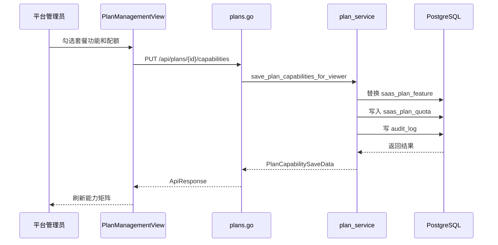

# 套餐中心 - 技术实现文档

## 1. 功能概述

套餐中心由 `PlanManagementView.vue` 实现套餐列表、套餐 Repository、复制、功能点、配额项、能力矩阵、租户订阅、功能覆盖、配额覆盖和配额使用查看。后端由 `plans.go`、`plan_service.go`、`plan.go` 实现套餐商业化能力，数据模型包括 `saas_plan`、`saas_feature`、`saas_plan_feature`、`saas_quota`、`saas_plan_quota`、`tenant_subscription`、`tenant_feature_override`、`tenant_quota_override`、`tenant_quota_usage`。权限为平台专属 `/plans` 与 `plan:*`。

## 2. 技术实现总览

| 实现层 | 内容 | 关键文件 |
|---|---|---|
| 前端页面 | 套餐卡片、能力矩阵、功能/配额/租户 Tab、多个配置弹窗 | `frontend/src/views/PlanManagementView.vue` |
| 前端接口 | 套餐、功能点、配额、订阅、覆盖、使用量 | `frontend/src/api/plan.ts` |
| 后端路由 | `/api/plans`、`/api/tenants/{id}/subscription` 等 | `internal/interfaces/http/handlers/plans.go` |
| Gin Handler | Gin router 函数 | `internal/interfaces/http/handlers/plans.go` |
| Application Service | 套餐 Repository、矩阵生成、运行时校验 | `internal/application/plan_service.go` |
| 数据访问 | 套餐、功能、配额基础 Repository | `internal/infrastructure/persistence/postgres/repositories/plan.go` |
| 数据模型 | SaaS 套餐、功能、配额、订阅、覆盖 | `internal/infrastructure/persistence/postgres/models`, `internal/interfaces/http/dto/plan.go` |
| 权限控制 | `/plans`、`plan:create`、`plan:edit`、`plan:config` | `internal/interfaces/http/middleware`, `internal/domain/permission` |
| 日志记录 | 套餐、功能、配额、订阅和覆盖变更 | `internal/application/plan_service.go` |

## 3. 前端实现说明

### 3.1 页面入口与路由

- 菜单路径：系统管理 / 套餐中心。
- 前端路由：`/plans`。
- 路由名称：`PlanManagementView`。
- 页面组件：`frontend/src/views/PlanManagementView.vue`。
- 懒加载：是。
- 权限控制：路由 `requiresPlatformAdmin: true`；按钮通过 `perm.can()` 控制。

### 3.2 页面结构

页面包含套餐概览、搜索区、套餐列表、工作区 Tab（功能矩阵、配额配置、租户绑定）、套餐弹窗、复制套餐弹窗、功能点弹窗、配额项弹窗、订阅弹窗、功能覆盖弹窗、配额覆盖弹窗、配额使用弹窗、能力抽屉。

### 3.3 查询实现

`fetchPlans(skip, limit, keyword)` 获取套餐列表；`fetchPlanMatrix()` 获取能力矩阵；`fetchFeatures()` 和 `fetchQuotas()` 获取功能点和配额。`keyword` 绑定搜索框，分页参数由页面状态计算。

### 3.4 列表实现

套餐列表字段包括套餐编码、名称、类型、计费周期、价格、状态、默认标记、排序、说明。状态 `1/0` 显示启用/停用。能力矩阵通过 `PlanCapabilityMatrix` 展示各套餐功能开关和关联配额值。

### 3.5 新增实现

新增套餐入口打开 `planDialog`，表单默认 `plan_type=BASIC`、`billing_cycle=MONTH`、`price=0`、`status=1`、`is_default=false`。提交调用 `createPlan(planForm)`，成功后刷新套餐和矩阵。

功能点新增调用 `createFeature()`，配额新增调用 `createQuota()`。

### 3.6 编辑实现

编辑套餐时将行数据回填到 `planForm`，调用 `updatePlan(id, body)`。功能点和配额项分别调用 `updateFeature()`、`updateQuota()`。保存成功后刷新对应列表和矩阵。

### 3.7 删除实现

套餐删除调用 `deletePlan(id)`，前端使用统一归档确认；后端为软删除。功能点和配额项当前未发现独立删除接口（当前实现未覆盖，按后续增强处理）。未发现批量删除。

### 3.8 状态变更实现

套餐状态通过编辑套餐表单中的 `status` 修改，字段为 `saas_plan.status`，取值 `1/0`。功能点、配额项同理通过编辑表单状态字段处理。当前未发现单独启停接口。

### 3.9 前端权限控制

页面访问由路由平台管理员限制。操作权限使用 `plan:create`、`plan:edit`、`plan:config`。侧栏定义位于 `sidebarMenu.ts`，后端菜单包同样定义 `/plans` 为平台专属。

### 3.10 前端关键文件

| 类型 | 文件路径 | 说明 |
|---|---|---|
| 页面 | `frontend/src/views/PlanManagementView.vue` | 套餐中心主页面 |
| API | `frontend/src/api/plan.ts` | 套餐全部 API |
| 组件 | `frontend/src/views/components/PlanCapabilityMatrix.vue` | 能力矩阵 |
| 组件 | `frontend/src/views/components/PlanCapabilityDrawer.vue` | 能力详情抽屉 |
| Composable | `frontend/src/composables/usePlanCapabilityMatrix.ts` | 矩阵选择和配额值收集 |
| 映射 | `frontend/src/utils/planFeatures.ts` | 前端功能映射辅助 |

## 4. 后端实现说明

### 4.1 接口路由

| 接口名称 | 请求方法 | 接口路径 | 说明 | 权限标识 |
|---|---|---|---|---|
| 套餐列表 | GET | `/api/plans` | 分页查询套餐 | `/plans` |
| 能力矩阵 | GET | `/api/plans/matrix` | 查询套餐能力矩阵 | `/plans` |
| 创建套餐 | POST | `/api/plans` | 新建套餐 | `plan:create` |
| 编辑套餐 | PUT | `/api/plans/{plan_id}` | 修改套餐 | `plan:edit` |
| 复制套餐 | POST | `/api/plans/{plan_id}/copy` | 复制套餐 | `plan:create` 或 `plan:edit` |
| 删除套餐 | DELETE | `/api/plans/{plan_id}` | 软删除套餐 | `plan:edit` |
| 功能点列表 | GET | `/api/plans/features` | 查询功能点 | `/plans` |
| 创建功能点 | POST | `/api/plans/features` | 新建功能点 | `plan:create` |
| 编辑功能点 | PUT | `/api/plans/features/{feature_id}` | 修改功能点 | `plan:edit` |
| 查询套餐功能 | GET | `/api/plans/{plan_id}/features` | 获取套餐功能 | `/plans` |
| 保存套餐功能 | PUT | `/api/plans/{plan_id}/features` | 替换功能点 | `plan:config` |
| 保存能力矩阵 | PUT | `/api/plans/{plan_id}/capabilities` | 保存功能和关联配额 | `plan:config` |
| 配额列表 | GET | `/api/plans/quotas` | 查询配额项 | `/plans` |
| 创建配额 | POST | `/api/plans/quotas` | 新建配额项 | `plan:create` |
| 编辑配额 | PUT | `/api/plans/quotas/{quota_id}` | 修改配额项 | `plan:edit` |
| 查询套餐配额 | GET | `/api/plans/{plan_id}/quotas` | 查询配额值 | `/plans` |
| 保存套餐配额 | PUT | `/api/plans/{plan_id}/quotas` | 保存配额值 | `plan:config` |
| 租户订阅 | GET/PUT | `/api/tenants/{tenant_id}/subscription` | 查询/保存订阅 | GET（当前实现未覆盖，按后续增强处理）、PUT `plan:config` |
| 功能覆盖 | GET/PUT | `/api/tenants/{tenant_id}/feature-overrides` | 租户功能覆盖 | `plan:config` |
| 配额覆盖 | GET/PUT | `/api/tenants/{tenant_id}/quota-overrides` | 租户配额覆盖 | `plan:config` / `tenant:quota_config` |
| 配额使用 | GET | `/api/tenants/{tenant_id}/quota-usage` | 查询使用量 | （当前实现未覆盖，按后续增强处理） |
| 功能校验 | GET | `/api/tenants/{tenant_id}/feature-access/{feature_code}` | 运行时校验 | （当前实现未覆盖，按后续增强处理） |
| 配额校验 | GET | `/api/tenants/{tenant_id}/quota-check/{quota_code}` | 运行时校验 | （当前实现未覆盖，按后续增强处理） |

### 4.2 Gin Handler 实现

Gin Handler 位于 `internal/interfaces/http/handlers/plans.go`。请求 DTO 包括 `PlanCreate`、`PlanUpdate`、`PlanCopyPayload`、`FeatureCreate`、`FeatureUpdate`、`QuotaCreate`、`QuotaUpdate`、`PlanFeatureSavePayload`、`PlanCapabilitySavePayload`、`PlanQuotaSavePayload`、`TenantSubscriptionPut`、`TenantFeatureOverrideSavePayload`、`TenantQuotaOverrideSavePayload`。

### 4.3 Application Service 实现

核心方法位于 `plan_service.go`：

- `list_plan_page()`、`create_plan_for_viewer()`、`update_plan_for_viewer()`、`delete_plan_for_viewer()`。
- `save_plan_features_for_viewer()`、`save_plan_capabilities_for_viewer()`、`save_plan_quotas_for_viewer()`。
- `get_tenant_subscription()`、`save_tenant_feature_overrides_for_viewer()`、`save_tenant_quota_overrides_for_viewer()`。
- `require_feature_access()`、`require_quota_available()`、`require_count_within_quota()`。
- `sync_feature_from_permission()`：菜单/操作权限同步功能点。

### 4.4 数据访问实现

`internal/infrastructure/persistence/postgres/repositories/plan.go` 提供套餐、功能点、配额基础 Repository 和软删除套餐。复杂矩阵、订阅、覆盖、运行时校验主要在 service 层直接用 ORM 编排。

### 4.5 参数校验

DTO 做类型和必填校验；service 处理套餐编码、功能编码、配额编码唯一性、套餐存在、功能存在、配额存在、配额值合法性、启用功能关联配额过滤、已订阅套餐删除限制（当前实现未覆盖，按后续增强处理）。

### 4.6 异常处理

常见异常：套餐不存在、编码重复、功能不存在、配额不存在、当前套餐不支持功能、配额超限、订阅不存在、套餐停用。运行时校验异常会阻断业务接口。

### 4.7 后端关键文件

| 类型 | 文件路径 | 说明 |
|---|---|---|
| Handler | `internal/interfaces/http/handlers/plans.go` | 套餐接口入口 |
| Application Service | `internal/application/plan_service.go` | 套餐核心逻辑 |
| Repository | `internal/infrastructure/persistence/postgres/repositories/plan.go` | 基础 Repository |
| DTO | `internal/interfaces/http/dto/plan.go` | 套餐请求响应 |
| Model | `internal/infrastructure/persistence/postgres/models` | SaaS 套餐相关 ORM |
| 权限 | `internal/domain/permission` | `MenuPath.PLANS`、`OperationCode.PLAN_*` |

## 5. 数据模型说明

### 5.1 数据表清单

| 表名 | 说明 | 对应模型 | 备注 |
|---|---|---|---|
| `saas_plan` | 套餐定义 | `SaasPlan` | 售卖包 |
| `saas_feature` | 功能点 | `SaasFeature` | 菜单/按钮/服务/配置 |
| `saas_plan_feature` | 套餐功能关系 | `SaasPlanFeature` | 多对多 |
| `saas_quota` | 配额定义 | `SaasQuota` | 静态/动态配额 |
| `saas_plan_quota` | 套餐配额值 | `SaasPlanQuota` | 多对多 |
| `tenant_subscription` | 租户订阅 | `TenantSubscription` | 当前套餐 |
| `tenant_feature_override` | 租户功能覆盖 | `TenantFeatureOverride` | 特例开关 |
| `tenant_quota_override` | 租户配额覆盖 | `TenantQuotaOverride` | 特例扩容 |
| `tenant_quota_usage` | 配额用量 | `TenantQuotaUsage` | 周期消耗 |

### 5.2 表结构说明

#### 表：`saas_plan`

| 字段名 | 类型 | 是否必填 | 默认值 | 说明 |
|---|---|---|---|---|
| `id` | Integer | 是 | 自增 | 套餐 ID |
| `plan_code` | String(64) | 是 | 无 | 套餐编码，唯一 |
| `plan_name` | String(100) | 是 | 无 | 套餐名称 |
| `plan_type` | String(32) | 是 | 无 | 套餐类型 |
| `billing_cycle` | String(32) | 是 | MONTH | 计费周期 |
| `price` | Numeric(12,2) | 是 | 0 | 价格 |
| `status` | Integer | 是 | 1 | 启用状态 |
| `is_default` | Boolean | 是 | False | 是否默认 |
| `sort_order` | Integer | 是 | 0 | 排序 |
| `description` | String(500) | 否 | NULL | 说明 |
| `created_at` | DateTime | 否 | now | 创建时间 |
| `updated_at` | DateTime | 否 | now | 更新时间 |
| `deleted_at` | DateTime | 否 | NULL | 逻辑删除 |

#### 表：`saas_feature`

| 字段名 | 类型 | 是否必填 | 默认值 | 说明 |
|---|---|---|---|---|
| `id` | Integer | 是 | 自增 | 功能 ID |
| `feature_code` | String(100) | 是 | 无 | 功能编码，唯一 |
| `feature_name` | String(100) | 是 | 无 | 功能名称 |
| `feature_type` | String(32) | 是 | 无 | MENU/BUTTON/API/SERVICE/CONFIG |
| `parent_id` | Integer | 是 | 0 | 父级功能 |
| `menu_id` | Integer | 否 | NULL | 绑定菜单权限 |
| `api_method` | String(20) | 否 | NULL | API 方法 |
| `api_path` | String(255) | 否 | NULL | API 路径 |
| `service_key` | String(100) | 否 | NULL | 服务能力标识 |
| `status` | Integer | 是 | 1 | 启用状态 |
| `description` | String(500) | 否 | NULL | 说明 |
| `created_at` | DateTime | 否 | now | 创建时间 |
| `updated_at` | DateTime | 否 | now | 更新时间 |

#### 表：`saas_quota`

| 字段名 | 类型 | 是否必填 | 默认值 | 说明 |
|---|---|---|---|---|
| `id` | Integer | 是 | 自增 | 配额 ID |
| `quota_code` | String(100) | 是 | 无 | 配额编码，唯一 |
| `quota_name` | String(100) | 是 | 无 | 配额名称 |
| `quota_type` | String(32) | 是 | 无 | STATIC/DYNAMIC |
| `period_type` | String(32) | 否 | NULL | NONE/DAY/MONTH/YEAR |
| `unit` | String(32) | 否 | NULL | 单位 |
| `status` | Integer | 是 | 1 | 启用状态 |
| `description` | String(500) | 否 | NULL | 说明 |
| `created_at` | DateTime | 否 | now | 创建时间 |
| `updated_at` | DateTime | 否 | now | 更新时间 |

#### 表：`saas_plan_feature` / `saas_plan_quota`

| 字段名 | 类型 | 是否必填 | 默认值 | 说明 |
|---|---|---|---|---|
| `id` | Integer | 是 | 自增 | 主键 |
| `plan_id` | Integer | 是 | 无 | 套餐 ID |
| `feature_id` / `quota_id` | Integer | 是 | 无 | 功能或配额 ID |
| `enabled` / `quota_value` | Boolean / Integer | 是 | true / 无 | 功能启用或配额值 |
| `created_at` | DateTime | 否 | now | 创建时间 |
| `updated_at` | DateTime | 否 | now | 更新时间 |

### 5.3 关键字段说明

套餐主键为 `saas_plan.id`；唯一编码为 `plan_code`、`feature_code`、`quota_code`；状态字段为 `status`；套餐删除字段为 `deleted_at`；租户覆盖由 `tenant_id` 标识；周期用量由 `period_type`、`period_key` 标识。

### 5.4 数据关系说明

套餐和功能点多对多，套餐和配额多对多。主体通过订阅绑定套餐，并可通过租户级功能覆盖和配额覆盖改变最终能力。配额用量按主体、配额编码、周期键累计。

### 5.5 索引与约束

`saas_plan.plan_code`、`saas_feature.feature_code`、`saas_quota.quota_code` 唯一；`saas_plan_feature(plan_id, feature_id)` 唯一；`saas_plan_quota(plan_id, quota_id)` 唯一；`tenant_feature_override(tenant_id, feature_id)` 唯一；`tenant_quota_override(tenant_id, quota_id)` 唯一；`tenant_quota_usage(tenant_id, quota_code, period_key)` 唯一。

## 6. 接口详细说明

## 6.1 查询套餐能力矩阵

### 基本信息

| 项目 | 内容 |
|---|---|
| 请求方法 | GET |
| 接口路径 | `/api/plans/matrix` |
| 权限标识 | `/plans` |
| 用途 | 获取套餐、能力树和配额关联矩阵 |

### 请求参数

无。

### 返回结果

| 字段名 | 类型 | 说明 |
|---|---|---|
| `plans` | array | 套餐列 |
| `nodes` | array | 能力树节点 |

### 处理逻辑

1. 校验套餐中心菜单权限。
2. 查询套餐、功能点、配额、套餐功能关系和配额关系。
3. 构造能力树和各套餐配置单元格。
4. 返回矩阵。

### 异常情况

- 权限不足。
- 矩阵数据不完整。

## 6.2 保存套餐能力矩阵

### 基本信息

| 项目 | 内容 |
|---|---|
| 请求方法 | PUT |
| 接口路径 | `/api/plans/{plan_id}/capabilities` |
| 权限标识 | `plan:config` |
| 用途 | 保存套餐功能和关联配额 |

### 请求参数

| 参数名 | 类型 | 是否必填 | 说明 |
|---|---|---|---|
| `plan_id` | int | 是 | 套餐 ID |
| `feature_ids` | array | 是 | 启用功能 ID |
| `quotas` | array | 否 | 配额值配置 |

### 返回结果

| 字段名 | 类型 | 说明 |
|---|---|---|
| `plan_id` | int | 套餐 ID |
| `feature_ids` | array | 已保存功能 |
| `quotas` | array | 已保存配额 |

### 处理逻辑

1. 校验 `plan:config`。
2. 校验套餐存在。
3. 替换套餐功能关系。
4. 过滤并保存当前功能关联配额。
5. 记录审计日志。

### 异常情况

- 套餐不存在。
- 功能或配额不存在。
- 配额未关联已启用功能。

## 6.3 运行时功能校验

### 基本信息

| 项目 | 内容 |
|---|---|
| 请求方法 | GET |
| 接口路径 | `/api/tenants/{tenant_id}/feature-access/{feature_code}` |
| 权限标识 | （当前实现未覆盖，按后续增强处理） |
| 用途 | 校验主体当前套餐是否允许功能 |

### 请求参数

| 参数名 | 类型 | 是否必填 | 说明 |
|---|---|---|---|
| `tenant_id` | int | 是 | 主体 ID |
| `feature_code` | string | 是 | 功能编码 |

### 返回结果

| 字段名 | 类型 | 说明 |
|---|---|---|
| `allowed` | boolean | 是否允许 |
| `message` | string | 校验说明 |

### 处理逻辑

1. 查询主体与订阅。
2. 校验主体状态、订阅状态、套餐状态。
3. 校验套餐功能。
4. 应用租户功能覆盖。
5. 返回允许或拒绝。

### 异常情况

- 订阅不存在。
- 套餐停用。
- 功能不允许。

## 7. 权限实现说明

### 7.1 菜单权限

菜单路径 `/plans`，平台专属，普通租户不进入菜单包和套餐功能池。

### 7.2 按钮权限

主要按钮权限：`plan:create`、`plan:edit`、`plan:config`。主体配额覆盖也可使用 `tenant:quota_config`。

### 7.3 API 权限

后端接口通过 `_require_menu_path()`、`_require_operation()`、`_require_any_operation()` 校验。运行时校验函数 `require_feature_access()` 被其他受控业务接口复用。

### 7.4 数据权限

套餐中心为平台级数据，未按租户隔离；租户订阅、覆盖和用量接口以 `tenant_id` 指定主体并需要平台或对应配置权限。

## 8. 日志实现说明

| 操作 | 是否记录 | 记录内容 | 实现位置 |
|---|---|---|---|
| 创建/编辑套餐 | 是 | 套餐编码、名称、操作者 | `plan_service.go` |
| 删除套餐 | 是 | 套餐归档摘要 | `plan_service.go` |
| 配置功能/配额 | 是 | 功能和配额变更摘要 | `plan_service.go` |
| 租户订阅/覆盖 | 是 | 主体、套餐、覆盖值摘要 | `plan_service.go` |

## 9. 状态与枚举实现

| 字段/枚举 | 取值 | 说明 | 来源 |
|---|---|---|---|
| `plan_type` | `TRIAL`/`BASIC`/`PRO`/`ENTERPRISE`/`CUSTOM` | 套餐类型 | 业务约定/前端静态 |
| `billing_cycle` | `MONTH`/`YEAR`/`CUSTOM` | 计费周期 | DTO/前端静态 |
| `feature_type` | `MENU`/`BUTTON`/`API`/`SERVICE`/`CONFIG` | 功能类型 | DTO/前端静态 |
| `quota_type` | `STATIC`/`DYNAMIC` | 配额类型 | DTO/前端静态 |
| `period_type` | `NONE`/`DAY`/`MONTH`/`YEAR` | 配额周期 | DTO/前端静态 |
| `status` | `1`/`0` | 启用/停用 | 数据库字段 |

## 10. 关键业务逻辑实现

### 逻辑：权限同步功能点

- 触发入口：权限创建、编辑、初始化。
- 处理流程：判断非平台专属且可套餐化，将菜单或按钮转换为功能点。
- 涉及方法：`sync_feature_from_permission()`、`sync_features_from_permissions()`。
- 涉及数据：`permission`、`saas_feature`。
- 异常处理：重复编码时更新已有功能点。
- 注意事项：平台专属能力不得同步到租户套餐池。

### 逻辑：套餐功能与配额联动

- 触发入口：保存能力矩阵。
- 处理流程：先保存功能点，再保存功能关联配额；未启用功能的配额被过滤。
- 涉及方法：`save_plan_capabilities_for_viewer()`。
- 涉及数据：`saas_plan_feature`、`saas_plan_quota`。
- 异常处理：功能或配额不存在时拒绝。
- 注意事项：配额应只对已启用能力生效。

### 逻辑：运行时配额校验

- 触发入口：创建用户、组织、业务单元等受配额控制动作。
- 处理流程：读取租户覆盖，否则读取套餐配额；判断 `used + increment <= limit`。
- 涉及方法：`require_count_within_quota()`、`require_quota_available()`。
- 涉及数据：`tenant_quota_override`、`saas_plan_quota`、`tenant_quota_usage`。
- 异常处理：超限抛出可读错误。
- 注意事项：`-1` 表示无限制。

## 11. 前后端交互流程

## 12. 扩展点与技术风险

- 扩展点：套餐版本、套餐差异对比、订阅变更记录、配额预警。
- 风险：套餐与权限链路复杂，新增功能若只加菜单或只加角色会导致租户不可用。
- 风险：运行时校验入口必须被所有受控业务动作调用，否则会出现套餐绕过。
- 风险：部分 GET 租户订阅/用量接口权限标识需进一步核对（当前实现未覆盖，按后续增强处理）。
