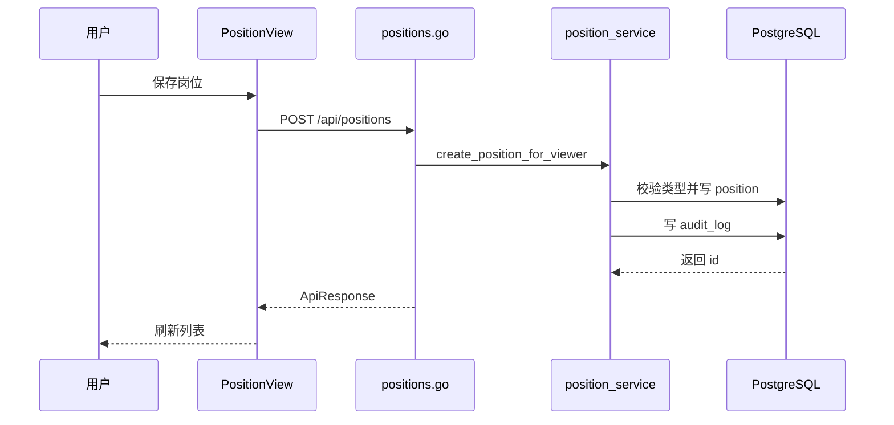

# 岗位管理 - 技术实现文档

## 1. 功能概述

岗位管理前端由 `PositionView.vue` 实现岗位类型和岗位列表维护。后端由 `positions.go`、`position_service.go`、`position.go` 实现岗位类型与岗位 Repository。数据模型为 `position_type`、`position`，用户岗位关系在 `app_user_position`。权限为 `/positions` 和 `pos:create`、`pos:edit`、`pos:delete`。删除均为逻辑删除。

## 2. 技术实现总览

| 实现层 | 内容 | 关键文件 |
|---|---|---|
| 前端页面 | 岗位类型、岗位列表和弹窗 | `frontend/src/views/PositionView.vue` |
| 前端接口 | 岗位类型和岗位 Repository | `frontend/src/api/position.ts` |
| 后端路由 | `/api/position-types`、`/api/positions` | `internal/interfaces/http/handlers/positions.go` |
| Gin Handler | Gin router 函数 | `internal/interfaces/http/handlers/positions.go` |
| Application Service | 岗位类型和岗位业务逻辑 | `internal/application/position_service.go` |
| 数据访问 | 岗位 Repository | `internal/infrastructure/persistence/postgres/repositories/position.go` |
| 数据模型 | `PositionType`、`Position`、`AppUserPosition` | `internal/infrastructure/persistence/postgres/models`, `internal/interfaces/http/dto/position.go` |
| 权限控制 | 菜单和按钮权限 | `internal/interfaces/http/middleware`, `internal/domain/permission` |
| 日志记录 | 岗位类型/岗位维护审计 | `internal/application/position_service.go` |

## 3. 前端实现说明

### 3.1 页面入口与路由

路由 `/positions`，名称 `PositionView`，组件 `frontend/src/views/PositionView.vue`，懒加载，菜单权限 `/positions`。

### 3.2 页面结构

页面包含岗位类型列表、岗位查询区、岗位列表、分页、新增/编辑弹窗、归档确认。

### 3.3 查询实现

岗位类型调用 `fetchPositionTypes(skip, limit, keyword)`；岗位列表调用 `fetchPositions({ skip, limit, keyword, position_type_id })`。重置时清空关键字、页码和类型筛选【待确认】。

### 3.4 列表实现

岗位类型字段：名称、编码、创建时间。岗位字段：名称、编码、岗位类型、创建时间。状态字段在当前模型中未发现，岗位启停逻辑【待确认】。

### 3.5 新增实现

岗位类型新增调用 `createPositionType({ name, code })`；岗位新增调用 `createPosition({ position_type_id, name, code })`。成功后刷新对应列表。

### 3.6 编辑实现

编辑时回显行数据，调用 `updatePositionType()` 或 `updatePosition()`。成功后刷新。

### 3.7 删除实现

删除入口使用归档确认，调用 `deletePositionType(id)` 或 `deletePosition(id)`。后端设置 `deleted_at`。未发现批量删除。

### 3.8 状态变更实现

当前实现中未发现明确状态变更逻辑；`position_type` 和 `position` 模型没有 `status` 字段。

### 3.9 前端权限控制

菜单由 `/positions` 控制。按钮权限包括 `pos:create`、`pos:edit`、`pos:delete`，由 `usePermissionStore` / `v-permission` 控制。

### 3.10 前端关键文件

| 类型 | 文件路径 | 说明 |
|---|---|---|
| 页面 | `frontend/src/views/PositionView.vue` | 岗位管理页面 |
| API | `frontend/src/api/position.ts` | 岗位接口封装 |
| 菜单 | `frontend/src/stores/sidebarMenu.ts` | 岗位菜单与按钮 |

## 4. 后端实现说明

### 4.1 接口路由

| 接口名称 | 请求方法 | 接口路径 | 说明 | 权限标识 |
|---|---|---|---|---|
| 岗位类型列表 | GET | `/api/position-types` | 分页查询岗位类型 | `/positions` |
| 新增岗位类型 | POST | `/api/position-types` | 创建岗位类型 | `pos:create` |
| 编辑岗位类型 | PUT | `/api/position-types/{type_id}` | 修改岗位类型 | `pos:edit` |
| 删除岗位类型 | DELETE | `/api/position-types/{type_id}` | 逻辑删除岗位类型 | `pos:delete` |
| 岗位列表 | GET | `/api/positions` | 分页查询岗位 | `/positions` |
| 新增岗位 | POST | `/api/positions` | 创建岗位 | `pos:create` |
| 编辑岗位 | PUT | `/api/positions/{position_id}` | 修改岗位 | `pos:edit` |
| 删除岗位 | DELETE | `/api/positions/{position_id}` | 逻辑删除岗位 | `pos:delete` |

### 4.2 Gin Handler 实现

`internal/interfaces/http/handlers/positions.go` 接收分页、关键字、类型 ID 和 DTO，调用 `position_service.go`，统一返回 `ApiResponse`。

### 4.3 Application Service 实现

主要方法：`list_position_type_page()`、`create_position_type_for_viewer()`、`update_position_type_for_viewer()`、`delete_position_type_for_viewer()`、`list_position_page()`、`create_position_for_viewer()`、`update_position_for_viewer()`、`delete_position_for_viewer()`。处理租户隔离、唯一性、类型存在性、归档和审计日志。

### 4.4 数据访问实现

`internal/infrastructure/persistence/postgres/repositories/position.go` 提供岗位类型和岗位的查询、创建、更新、逻辑删除。列表默认过滤 `deleted_at`。

### 4.5 参数校验

DTO：`PositionTypeCreate`、`PositionTypeUpdate`、`PositionCreate`、`PositionUpdate`。校验名称、编码、岗位类型 ID。唯一性由数据库约束和 service/repository 处理。

### 4.6 异常处理

类型或岗位不存在、编码重复、类型被岗位引用无法删除等返回业务异常。引用限制是否完整覆盖用户岗位关系【待确认】。

### 4.7 后端关键文件

| 类型 | 文件路径 | 说明 |
|---|---|---|
| Handler | `internal/interfaces/http/handlers/positions.go` | 岗位接口 |
| Application Service | `internal/application/position_service.go` | 岗位业务 |
| Repository | `internal/infrastructure/persistence/postgres/repositories/position.go` | 数据访问 |
| DTO | `internal/interfaces/http/dto/position.go` | 请求响应 |
| Model | `internal/infrastructure/persistence/postgres/models` | `PositionType`、`Position` |

## 5. 数据模型说明

### 5.1 数据表清单

| 表名 | 说明 | 对应模型 | 备注 |
|---|---|---|---|
| `position_type` | 岗位类型 | `PositionType` | 租户内唯一编码 |
| `position` | 岗位 | `Position` | 归属岗位类型 |
| `app_user_position` | 用户岗位关系 | `AppUserPosition` | 多岗位任职 |

### 5.2 表结构说明

#### 表：`position_type`

| 字段名 | 类型 | 是否必填 | 默认值 | 说明 |
|---|---|---|---|---|
| `id` | Integer | 是 | 自增 | 主键 |
| `tenant_id` | Integer | 是 | 无 | 主体 ID |
| `name` | String(200) | 是 | 无 | 类型名称 |
| `code` | String(64) | 是 | 无 | 类型编码 |
| `created_at` | DateTime | 否 | now | 创建时间 |
| `deleted_at` | DateTime | 否 | NULL | 逻辑删除 |

#### 表：`position`

| 字段名 | 类型 | 是否必填 | 默认值 | 说明 |
|---|---|---|---|---|
| `id` | Integer | 是 | 自增 | 主键 |
| `tenant_id` | Integer | 是 | 无 | 主体 ID |
| `position_type_id` | Integer | 是 | 无 | 岗位类型 ID |
| `name` | String(200) | 是 | 无 | 岗位名称 |
| `code` | String(64) | 是 | 无 | 岗位编码 |
| `created_at` | DateTime | 否 | now | 创建时间 |
| `deleted_at` | DateTime | 否 | NULL | 逻辑删除 |

### 5.3 关键字段说明

`tenant_id` 租户隔离；`position_type_id` 关联类型；`deleted_at` 逻辑删除；当前无 `status` 字段。

### 5.4 数据关系说明

一个主体有多个岗位类型；一个岗位类型下有多个岗位；一个用户可通过 `app_user_position` 关联多个岗位。

### 5.5 索引与约束

`position_type(tenant_id, code)` 唯一；`position(tenant_id, code)` 唯一；`app_user_position(user_id, position_id)` 唯一。

## 6. 接口详细说明

## 6.1 岗位列表

### 基本信息

| 项目 | 内容 |
|---|---|
| 请求方法 | GET |
| 接口路径 | `/api/positions` |
| 权限标识 | `/positions` |
| 用途 | 分页查询岗位 |

### 请求参数

| 参数名 | 类型 | 是否必填 | 说明 |
|---|---|---|---|
| `skip` | int | 否 | 偏移 |
| `limit` | int | 否 | 页大小 |
| `keyword` | string | 否 | 名称或编码 |
| `position_type_id` | int | 否 | 岗位类型 |

### 返回结果

| 字段名 | 类型 | 说明 |
|---|---|---|
| `items` | array | 岗位列表 |
| `total` | int | 总数 |

### 处理逻辑

1. 校验菜单权限。
2. 按当前主体、关键字、类型过滤。
3. 排除已删除记录。
4. 返回分页。

### 异常情况

- 权限不足。

## 6.2 创建岗位

### 基本信息

| 项目 | 内容 |
|---|---|
| 请求方法 | POST |
| 接口路径 | `/api/positions` |
| 权限标识 | `pos:create` |
| 用途 | 新建岗位 |

### 请求参数

| 参数名 | 类型 | 是否必填 | 说明 |
|---|---|---|---|
| `position_type_id` | int | 是 | 岗位类型 |
| `name` | string | 是 | 名称 |
| `code` | string | 是 | 编码 |

### 返回结果

| 字段名 | 类型 | 说明 |
|---|---|---|
| `id` | int | 岗位 ID |

### 处理逻辑

1. 校验操作权限。
2. 校验岗位类型属于当前主体。
3. 校验编码唯一。
4. 写入岗位。
5. 记录审计日志。

### 异常情况

- 类型不存在。
- 编码重复。
- 权限不足。

## 7. 权限实现说明

### 7.1 菜单权限

菜单路径 `/positions`，由后端 permission 数据和前端侧栏动态加载。

### 7.2 按钮权限

`pos:create`、`pos:edit`、`pos:delete`。

### 7.3 API 权限

读接口 `_require_menu_path(MenuPath.POSITIONS)`；写接口 `_require_operation(OperationCode.POSITION_*)`。

### 7.4 数据权限

岗位数据按 `tenant_id` 隔离。未发现按组织或业务单元过滤岗位的实现。

## 8. 日志实现说明

| 操作 | 是否记录 | 记录内容 | 实现位置 |
|---|---|---|---|
| 新增岗位/类型 | 是 | 名称、编码、操作者、IP | `position_service.go` |
| 编辑岗位/类型 | 是 | 变更摘要 | `position_service.go` |
| 归档岗位/类型 | 是 | 归档摘要 | `position_service.go` |

## 9. 状态与枚举实现

| 字段/枚举 | 取值 | 说明 | 来源 |
|---|---|---|---|
| `deleted_at` | NULL/datetime | 未归档/已归档 | 数据库字段 |
| `position_type_id` | int | 岗位类型 | 数据库关系 |

## 10. 关键业务逻辑实现

### 逻辑：岗位类型删除

- 触发入口：删除岗位类型按钮。
- 处理流程：检查类型存在和是否被岗位引用，设置 `deleted_at`。
- 涉及方法：`delete_position_type_for_viewer()`、`repository.position.delete_position_type()`。
- 涉及数据：`position_type`、`position`。
- 异常处理：存在岗位时返回失败。
- 注意事项：不得物理删除。

### 逻辑：岗位创建

- 触发入口：新增岗位弹窗保存。
- 处理流程：校验岗位类型，写入岗位，记录日志。
- 涉及方法：`create_position_for_viewer()`。
- 涉及数据：`position`。
- 异常处理：编码重复、类型不存在。
- 注意事项：唯一键逻辑删除释放需关注。

## 11. 前后端交互流程

## 12. 扩展点与技术风险

- 扩展点：岗位状态、岗位职级、岗位适用组织。
- 风险：模型无状态字段，需求文档中的启停能力当前未落地。
- 风险：岗位类型如果来源后续改为字典，需要迁移现有 `position_type`。
