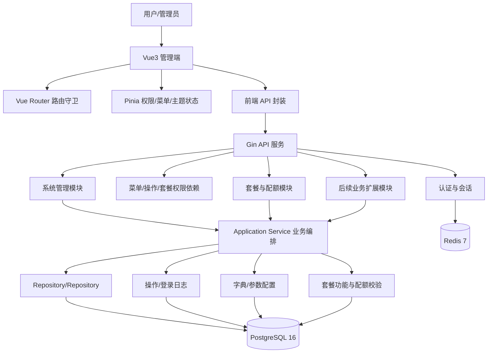
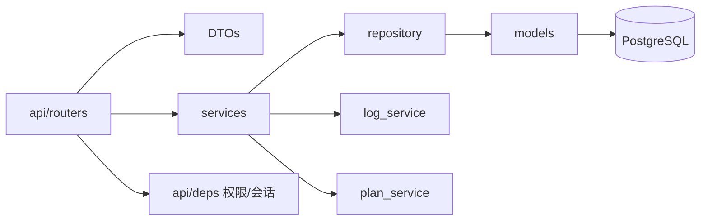
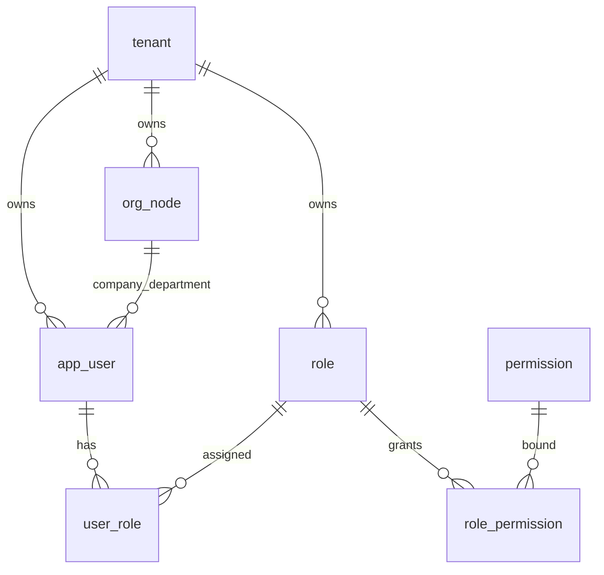
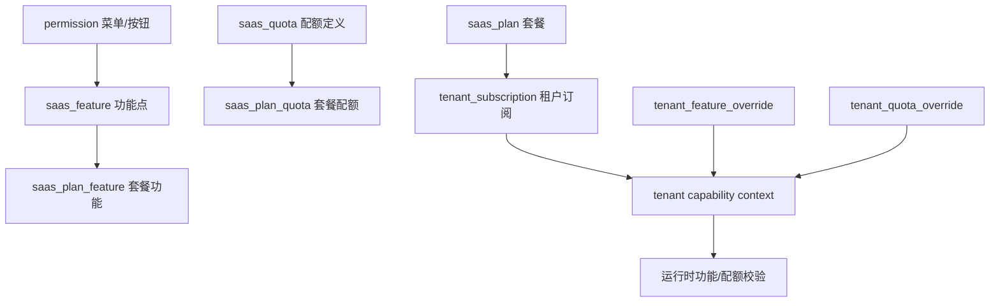
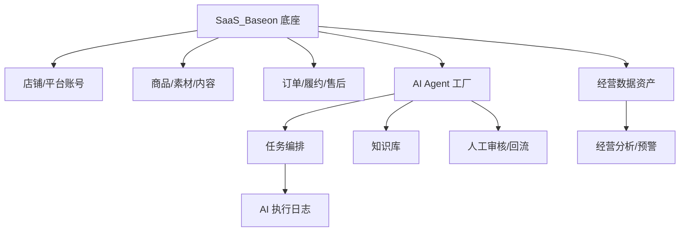

# 总体技术方案

## 1. 文档说明

本文档用于说明 `SaaS_Baseon` 当前项目的总体技术方案，面向后续研发、测试、架构评审、数据库设计、AI 编程助手和业务模块扩展使用。

适用范围包括当前已实现的管理端前端、Gin 后端、PostgreSQL 数据模型、Redis 会话缓存、系统管理模块、套餐商业化能力、权限与数据权限体系、字典参数体系、日志审计能力，以及后续承载电商 AI 运营 OS 的扩展方式。

分析来源包括当前代码目录：

- 前端：`frontend/src/router`、`frontend/src/views`、`frontend/src/api`、`frontend/src/stores`、`frontend/src/directives`、`frontend/src/utils`。
- 后端：`cmd/api/main.go`、`internal/infrastructure/persistence/postgres/models`、`internal/interfaces/http/handlers`、`internal/application`、`internal/infrastructure/persistence/postgres/repositories`、`internal/interfaces/http/dto`、`internal/interfaces/http/middleware`。
- 数据与部署：`internal/infrastructure/persistence/postgres/migrations`、`docker-compose.yml`、`README.md`、`AGENTS.md`、`CLAUDE.md`。

可信度说明：本文档基于当前仓库实际实现反向整理。已在代码中确认的内容按确定性描述；无法从代码或脚本中完全确认的内容统一标记为（当前实现未覆盖，按后续增强处理）。当前项目已提供 `internal/infrastructure/persistence/postgres/migrations/` 作为生产/开发数据库初始化 SQL 入口，但未发现 golang-migrate 版本化迁移目录。

## 2. 项目技术定位

当前项目定位为企业级 SaaS 能力底座。技术上不是单一后台 Repository，而是一套可支撑多租户、多主体、多组织、多用户、多角色、多权限、多配置、多审计和可商业化套餐控制的基础平台。

项目已经具备以下底座特征：

- 多租户：核心业务表通过 `tenant_id` 隔离，平台管理员和平台主体用户具备受控跨主体能力。
- 多主体：`tenant` 表承载主体，主体可绑定套餐、订阅周期、配额覆盖和品牌配置。
- 多组织：`org_node` 单表组织树表达公司、部门、门店等组织节点。
- 多角色：`role`、`user_role`、`role_permission` 支撑用户多角色和角色多权限。
- 多权限：`permission` 统一承载目录、菜单、按钮、操作、数据权限。
- 数据权限：角色权限支持组织、用户、业务单元等数据范围扩展。
- 可扩展业务模块：业务新增时按 `handler -> dto -> application -> repository -> 模型` 接入。
- 可支撑 AI 业务扩展：后续 AI Agent、知识库、任务编排、业务数据资产、AI 调用额度等可作为业务模块挂载，并纳入菜单、权限、套餐、配额、日志、参数体系。

## 3. 技术架构总览



| 层级 | 当前技术 | 关键实现 |
|---|---|---|
| 前端 | Vue 3 + TypeScript + Element Plus + Pinia + Vue Router + Vite | `frontend/src` |
| 后端 | Go 1.22+ + Gin + GORM + Go DTO + validator | `internal` |
| 数据库 | PostgreSQL 16 | `internal/infrastructure/persistence/postgres/models` |
| 缓存 | Redis 7 | 会话、验证码、登录失败计数、限流 |
| 部署 | Docker Compose | `postgres`、`redis`、`api`、`web` |
| 认证 | bcrypt 密码哈希、验证码、登录失败计数、Bearer token | `internal/interfaces/http/handlers/auth_security.go`, `identity_handler.go` |
| 权限 | 菜单路径、操作码、角色权限、套餐功能 | `internal/interfaces/http/handlers/auth_policy.go`, `quota_service.go` |

### 3.1 工程目录结构

当前工程目录按“前端、后端、脚本、文档、数据库初始化”分层。后续新增能力应优先落在既有目录中，避免新建平行结构造成维护分散。

```text
saas_baseon_go/
├── README.md                         # 开发启动、Docker、端口、演示账号、故障排查
├── docker-compose.yml                # PostgreSQL、Redis、Gin API、Web 四服务编排
├── .env.example                      # 本地与 Docker 环境变量模板
├── scripts/                          # 本地开发、服务启动、服务检查脚本
│
├── cmd/api/                          # Gin API 入口
├── internal/
│   ├── bootstrap/                    # 配置、数据库、Redis、路由、种子数据、OpenAPI
│   ├── domain/                       # 领域分包与领域接口
│   ├── application/                  # 已下沉的应用服务，后续继续承接 handler 业务逻辑
│   ├── interfaces/http/
│   │   ├── handlers/                 # 当前主要 HTTP 入口，含认证、权限、配额和业务接口
│   │   ├── middleware/               # Request ID 等通用中间件
│   │   ├── response/                 # 统一响应
│   │   └── dto/                      # HTTP DTO
│   └── infrastructure/persistence/postgres/
│       ├── models/                   # GORM 数据模型
│       ├── repositories/             # 已下沉的仓储实现
│       ├── migrations/               # 版本化 SQL migration
│       └── schema/current_schema.sql # 当前 schema 基线
│
├── frontend/                         # Vue 3 管理端工程
│   ├── Dockerfile                    # Web 容器构建文件
│   ├── nginx.conf                    # 静态资源与 API 反向代理配置
│   ├── vite.config.ts                # Vite 构建与开发代理配置
│   ├── e2e/                          # 前端端到端测试
│   ├── public/                       # 静态资源
│   └── src/
│       ├── api/                      # 前端 API 封装和接口类型
│       ├── assets/                   # 前端资源
│       ├── components/               # 通用组件
│       ├── composables/              # 可复用组合式逻辑
│       ├── constants/                # 前端常量
│       ├── directives/               # 权限等自定义指令
│       ├── router/                   # Vue Router 路由和守卫
│       ├── stores/                   # Pinia 状态，含权限、菜单、主题等
│       ├── styles/                   # 全局样式和主题变量
│       ├── types/                    # TypeScript 类型
│       ├── utils/                    # 工具函数
│       └── views/                    # 页面视图
│
└── docs/                             # 当前有效交付文档
    ├── README.md                     # 文档索引
    ├── 项目总体介绍.md                # 项目定位、能力范围、面向业务方的总体说明
    ├── req_design/                   # 系统管理各菜单需求设计文档
    ├── tech_design/                  # 总体技术方案和各菜单技术实现文档
    └── sql_design/                   # 系统管理数据库设计文档
```

`docs/` 目录只保留当前有效文档，不再保留历史聊天、阶段报告或临时设计稿。当前后端仍处于“产品接口优先完整、DDD 边界逐步下沉”的阶段：主体、套餐、组织、用户、权限等主业务入口集中在 `identity_handler.go`，认证策略与配额逻辑已拆到独立文件，系统参数已具备 application/repository 示例。后续新增和重构应继续把稳定业务规则下沉到 `internal/application` 与 `internal/infrastructure/persistence/postgres/repositories`。

数据库初始化脚本不放在 `docs/`，而是放在 `internal/infrastructure/persistence/postgres/migrations/` 和 `schema/current_schema.sql`，方便开发者、AI 工具和部署流程直接按脚本建库或核对基线。

## 4. 前端架构

前端采用 Vue 3 Composition API 和 `<script setup>`，页面集中在 `frontend/src/views`，接口集中在 `frontend/src/api`，全局状态使用 Pinia。

### 4.1 路由与页面

路由定义在 `frontend/src/router/index.ts`。系统管理主菜单下当前路由包括：

| 路由 | 组件 | 说明 |
---|---|---|
| `/tenants` | `TenantView.vue` | 主体管理，平台专属 |
| `/plans` | `PlanManagementView.vue` | 套餐中心，平台专属 |
| `/organization` | `OrganizationView.vue` | 组织架构 |
| `/business-units` | `BusinessUnitView.vue` | 业务单元 |
| `/positions` | `PositionView.vue` | 岗位管理 |
| `/users` | `UserView.vue` | 用户管理 |
| `/roles` | `RoleView.vue` | 角色权限 |
| `/roles/:roleId/permission-config` | `RolePermissionConfigView.vue` | 角色权限配置 |
| `/menus` | `MenuView.vue` | 菜单管理 |
| `/dict` | `DictView.vue` | 数据字典 |
| `/params` | `ParamView.vue` | 参数管理，路由标题为系统参数 |
| `/audit-logs` | `AuditLogsView.vue` | 操作日志 |
| `/login-logs` | `LoginLogsView.vue` | 登录日志 |

路由守卫负责：

- 未登录跳转 `/login`。
- 加载 `/api/users/me` 权限上下文。
- 加载租户菜单运行时数据。
- 拦截普通租户访问平台专属路由。
- 拦截普通租户访问已被套餐、角色或租户覆盖关闭的菜单。

### 4.2 API 封装

前端 API 按领域拆分在 `frontend/src/api`：

- `tenant.ts`：主体管理。
- `plan.ts`：套餐、功能点、配额、订阅、覆盖。
- `organization.ts`：组织架构。
- `businessUnit.ts`：业务单元。
- `user.ts`：用户管理。
- `role.ts`：角色。
- `permission.ts`：菜单包、租户菜单覆盖、权限更新。
- `dict.ts`：数据字典。
- `param.ts`：系统参数。
- `logs.ts`：操作日志、登录日志。

所有 API 通过统一 `http` 封装返回 `ApiResponse`，业务层使用 `unwrap` 取得 `data`。

### 4.3 权限与菜单状态

前端权限核心在：

- `frontend/src/stores/permission.ts`：用户信息、权限码、套餐功能、配额上下文。
- `frontend/src/stores/sidebarMenu.ts`：默认侧栏树、菜单包加载、租户覆盖合成。
- `frontend/src/directives/permission.ts`：按钮级权限指令。
- `frontend/src/composables/usePageAction.ts`：页面操作权限判断。

前端只负责体验控制，后端仍通过 `_require_menu_path`、`_require_operation` 和套餐校验二次拦截。

## 5. 后端架构

后端采用薄 router、厚 service、可复用 repository、明确 DTO 的分层方式。



| 层 | 责任 | 示例 |
|---|---|---|
| `api/routers` | HTTP 边界、依赖注入、权限依赖、响应包装 | `users.go`、`plans.go` |
| `DTOs` | 请求、响应、分页契约 | `dto/user.go`、`dto/plan.go` |
| `services` | 业务流程、权限编排、审计日志、套餐校验 | `user_service.go`、`plan_service.go` |
| `repository` | 数据访问、持久化、逻辑删除 | `repositories/user.go`、`repositories/permission.go` |
| `models` | GORM 映射 | `Tenant`、`AppUser`、`Permission` |

后端启动入口 `cmd/api/main.go` 注册全部路由，并在启动时执行：

- `GORM AutoMigrate（仅开发兜底）和版本化 migration`。
- 若干 `ensure_*` 数据库补列/补表脚本。
- 默认主体、默认权限、默认套餐、默认订阅初始化。
- 平台管理员兜底检查。

该方式适合当前开发阶段，进入预生产后应引入版本化迁移流程。

## 6. 数据库架构

数据库使用 PostgreSQL 16。ORM 统一定义在 `internal/infrastructure/persistence/postgres/models`。

核心表分组如下：

| 分组 | 主要表 |
|---|---|
| 主体与品牌 | `tenant` |
| 组织与人员 | `org_node`、`app_user`、`app_user_department`、`app_user_position`、`position_type`、`position` |
| 权限 | `role`、`user_role`、`permission`、`role_permission`、`tenant_menu_override` |
| 数据权限扩展 | `permission_custom_department`、`permission_custom_user`、`business_unit`、`business_unit_org_map`、`business_unit_scope` |
| 配置 | `dict_type`、`dict_item`、`tenant_dict_item_override`、`sys_param`、`tenant_param_value` |
| 日志 | `login_log`、`audit_log` |
| 商业化 | `saas_plan`、`saas_feature`、`saas_plan_feature`、`saas_quota`、`saas_plan_quota`、`tenant_subscription`、`tenant_feature_override`、`tenant_quota_override`、`tenant_quota_usage` |
| 个性化 | `user_preference` |

全站业务数据原则上不做物理删除。主数据通过 `deleted_at` 逻辑删除，唯一字段通过墓碑值释放。例外包括会话、缓存、覆盖值恢复默认等无业务历史意义的数据。

## 7. 多租户设计

租户隔离以 `tenant_id` 为核心。普通用户的当前主体来自认证会话中的用户记录；平台管理员或平台主体用户可在受控权限下跨主体访问。

关键实现：

- `_auth_dep()`：解析 Bearer token，加载 Redis session，校验用户未删除且状态启用。
- `assert_tenant_access()`：平台管理员可跨主体；普通用户只能访问当前主体；平台主体用户具备特定权限码时可访问其他主体订阅类数据。
- `_tenant_query_dep()`：统一解析并校验接口中的 `tenant_id`。
- Repository 层要求租户内数据查询、更新、删除必须带 `tenant_id`。

平台专属能力通过 `permission.is_platform_only` 和前后端平台路由限制过滤，主体管理、套餐中心、系统监控等不应进入普通租户菜单和套餐功能池。

## 8. 主体 / 组织 / 用户 / 权限模型



主体 `tenant` 是租户边界；组织 `org_node` 是公司、部门、门店统一单表；用户 `app_user` 是登录身份；角色 `role` 是权限组合；权限 `permission` 是菜单、操作、按钮、数据权限源。

当前实现中：

- 用户可通过 `user_role` 拥有多个角色。
- 用户可通过 `app_user_department` 拥有多个部门，通过 `app_user_position` 拥有多个岗位。
- 角色通过 `role_permission` 绑定菜单、按钮、数据权限。
- 角色数据权限可通过自定义组织、用户、业务单元扩展。

## 9. 菜单与权限体系

权限源为 `permission` 表，字段 `perm_type` 表示权限类型：

- `1`：目录。
- `2`：操作。
- `3`：菜单。
- `4`：数据权限。
- `5`：按钮。

菜单和操作码定义在 `internal/domain/permission`，前端侧栏默认树在 `frontend/src/stores/sidebarMenu.ts`。运行时菜单加载流程：

1. 后端权限源生成菜单包。
2. 过滤平台专属。
3. 套餐功能过滤。
4. 角色权限过滤。
5. 合并 `tenant_menu_override` 租户覆盖。
6. 前端侧栏、快捷入口、路由守卫使用最终树。

后端权限依赖：

- `_require_menu_path(menu_path)`：校验菜单路径，并映射套餐功能。
- `_require_operation(operation_code)`：校验操作码，并映射套餐功能。
- `_require_any_operation()`：多个操作码满足其一。
- `_require_menu_path_or_any_operation()`：菜单或操作码满足其一。

## 10. 数据权限体系

数据权限核心存储在 `role_permission`：

- `data_scope_override`：覆盖数据范围。
- `custom_company_ids_json`、`custom_department_ids_json`、`custom_user_ids_json`：自定义组织和用户范围。
- `custom_business_unit_ids_json`、`bu_data_access_mode`：业务单元范围扩展。

数据范围枚举见 `CLAUDE.md` 和当前实现约定：`ALL`、`ORG`、`ORG_SUB`、`SELF`、`CUSTOM`。

`business_unit`、`business_unit_org_map`、`business_unit_scope` 将组织之外的业务维度纳入数据权限。当前项目已具备基础数据结构和角色权限配置支撑；各业务查询是否全部接入数据权限过滤，需要在新增业务模块时逐项实现和测试。

## 11. 套餐与配额扩展设计

套餐商业化能力由 `plan_service.go` 统一实现。核心链路：



关键规则：

- 套餐控制租户买了什么。
- 角色权限控制用户能做什么。
- 数据权限控制用户能看什么。
- 租户配额覆盖优先于套餐默认配额。
- `-1` 表示无限制，`0` 表示不可用。
- 功能关闭后，其关联配额不应继续开放给租户配置。

运行时入口：

- `require_feature_access()`：功能校验。
- `require_quota_available()`：动态配额校验。
- `require_count_within_quota()`：静态资源配额校验。
- `consume_quota()`【存在性以当前 service 为准】：动态消耗计数。

## 12. 字典与参数配置体系

字典和参数采用“默认定义 + 租户覆盖”模型：

| 能力 | 默认定义表 | 覆盖表 |
|---|---|---|
| 数据字典 | `dict_type`、`dict_item` | `tenant_dict_item_override` |
| 系统参数 | `sys_param` | `tenant_param_value` |

平台管理员维护默认定义；租户管理员只能维护非平台专属且允许覆盖的当前值。读取时必须走 service/repository 合成逻辑，不能直接读取默认表作为最终值。

恢复默认的实现是删除覆盖行，这属于关系解除，不属于业务数据物理删除例外之外的问题。

## 13. 日志审计体系

系统日志分为：

- `login_log`：登录成功/失败、账号、主体、IP、User-Agent、时间。
- `audit_log`：业务写操作审计，包括模块、动作、摘要、详情、IP、用户、主体、时间。

登录日志由认证流程写入；操作日志由各业务 service 在关键写操作完成后记录。日志查询接口在 `logs.go`，分页查询在 `repositories/log.go`。平台管理员可跨主体筛选，租户用户只能看本主体日志。

技术风险：审计日志写入点分布在各 service，新增业务模块时必须同步接入，否则会出现审计缺口。

## 14. 接口规范

后端统一响应结构：

```json
{
  "code": 0,
  "message": "ok",
  "data": {}
}
```

分页响应统一使用：

```json
{
  "items": [],
  "total": 0
}
```

当前接口约定：

- 列表参数使用 `skip`、`limit`。
- 认证使用 `Authorization: Bearer <token>`。
- Go DTO + validator DTO 使用 `ConfigDict(from_attributes=True)`。
- router 不直接写复杂业务逻辑，调用 service 返回 DTO 或领域结果。

## 15. 异常处理

异常处理在 `internal/interfaces/http/response` 注册：

- `HTTPException`：转换为统一 `ApiResponse`，保留业务错误码和可读 message。
- `RequestValidationError`：返回 `100422` 和“请求参数错误”。
- 未处理异常：服务端记录堆栈，客户端返回 `100500` 和“服务器内部错误”，避免泄露 SQL、堆栈和连接信息。

错误码在 `internal/interfaces/http/response`，包含通用错误和 SaaS 套餐相关错误：

- `TENANT_NOT_ACTIVE`
- `PLAN_DISABLED`
- `FEATURE_NOT_ALLOWED`
- `QUOTA_EXCEEDED`
- `SUBSCRIPTION_NOT_FOUND`
- `SUBSCRIPTION_EXPIRED`

## 16. 安全设计

当前安全设计包括：

- 生产环境启动前校验 `JWT_SECRET`、`CORS_ORIGINS`、默认数据库账号。
- Redis session 校验用户登录态。
- 用户状态和逻辑删除校验。
- 路由和操作依赖统一校验权限。
- 套餐功能在后端二次校验。
- 租户访问通过 `tenant_id` 和 `assert_tenant_access()` 控制。
- 密码只保存 hash，重置密码明文仅一次性返回。
- 审计日志不得记录密码、token 等敏感明文。
- CSV、文件、Redis 等安全边界在 `CLAUDE.md` 中已有约定，具体实现见对应 service。

待加强项：

- 版本化数据库迁移。
- 更完整的强制下线和账号锁定策略。
- 更细的审计事件清单。
- 生产级日志脱敏检查。

## 17. 可扩展性设计

新增业务模块建议遵循以下链路：

1. 定义菜单、按钮、操作和必要的数据权限。
2. 标记是否平台专属、是否可套餐化、租户是否可见/可编辑。
3. 同步到 `saas_feature` 并加入套餐矩阵。
4. 编写后端 `handler -> dto -> application -> repository -> 模型`。
5. 在 service 层接入套餐功能和配额校验。
6. 在查询层接入租户隔离和数据权限过滤。
7. 接入操作日志。
8. 前端新增 `api`、`view`、路由和菜单。
9. 补 service 单测、tenant 隔离测试、套餐拒绝分支测试。

这种扩展方式可以让业务模块自然继承主体、套餐、权限、数据权限、字典参数、审计日志等底座能力。

## 18. 支撑电商 AI 运营 OS 的技术路径

当前底座可以支撑电商 AI 运营 OS 的基础层，建议按以下技术路径扩展：



底座能力对应关系：

- 主体：品牌、集团、代运营公司、客户租户。
- 组织：部门、门店、团队。
- 业务单元：店铺、品牌、平台账号、项目组、商品组。
- 用户/角色：运营、客服、财务、管理层、AI 管理员。
- 菜单权限：商品中心、内容中心、AI Agent、经营看板等模块入口。
- 套餐配额：店铺数量、AI 调用次数、任务数、存储空间、数据同步频次。
- 字典参数：平台类型、商品状态、AI 模型、审核阈值、任务重试次数。
- 日志审计：人工操作、AI 执行、策略发布、结果确认。

## 19. 当前技术缺口与建议

| 类型 | 内容 | 影响 | 建议 |
|---|---|---|---|
| 数据库迁移 | 当前已有 `internal/infrastructure/persistence/postgres/migrations/` 初始化 SQL，但未发现 golang-migrate 迁移目录 | 后续结构演进仍需严格管理版本、回滚和验证 | 继续维护生产 SQL，并逐步引入版本化迁移流程 |
| 权限一致性 | 前端菜单存在 `menu:*`，后端历史也存在 `perm:*` | 菜单管理/权限管理边界可能混淆 | 统一菜单管理和权限管理权限码说明 |
| 数据权限落地 | 底座具备数据权限结构，但业务查询需逐模块接入 | 后续业务容易漏过滤 | 新增业务必须写数据权限测试 |
| 审计清单 | 审计写入点分散 | 新模块可能漏审计 | 建立审计事件清单和 service 模板 |
| 配额一致性 | 配额与功能矩阵联动复杂 | 可能出现前端展示与后端拒绝不一致 | 保持统一从 `plan_service` 读取上下文 |
