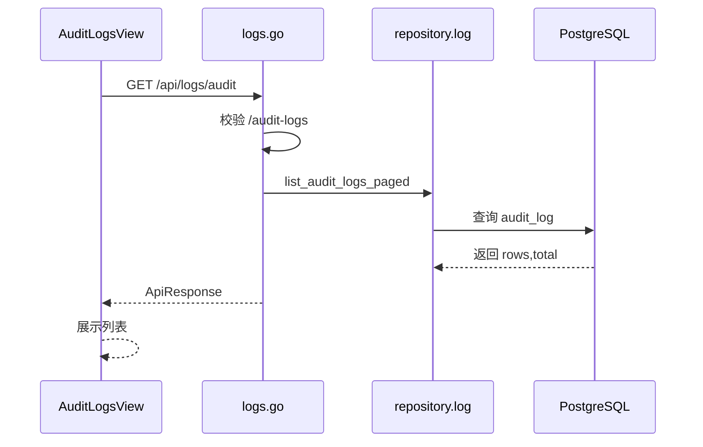

# 操作日志 - 技术实现文档

## 1. 功能概述

操作日志由 `AuditLogsView.vue` 实现只读分页查询。后端由 `logs.go`、`log_service.go`、`repositories/log.go` 查询 `audit_log` 表；写入审计日志由各业务 service 调用日志服务完成。权限为 `/audit-logs` 和 `audit:view`。平台管理员可跨主体筛选，普通租户按当前主体隔离。

## 2. 技术实现总览

| 实现层 | 内容 | 关键文件 |
|---|---|---|
| 前端页面 | 操作日志查询、筛选、分页 | `frontend/src/views/AuditLogsView.vue` |
| 前端接口 | 操作日志查询封装 | `frontend/src/api/logs.ts` |
| 后端路由 | `/api/logs/audit` | `internal/interfaces/http/handlers/logs.go` |
| Gin Handler | Gin router 函数 | `internal/interfaces/http/handlers/logs.go` |
| Application Service | 日志查询与主体范围处理 | `internal/application/log_service.go` |
| 数据访问 | 操作日志分页查询 | `internal/infrastructure/persistence/postgres/repositories/log.go` |
| 数据模型 | `AuditLog`、日志 DTO | `internal/infrastructure/persistence/postgres/models`, `internal/interfaces/http/dto/log.go` |
| 权限控制 | 菜单查看权限 | `internal/interfaces/http/middleware`, `internal/domain/permission` |
| 日志记录 | 各业务 service 写入 `audit_log` | `internal/application/log_service.go` |

## 3. 前端实现说明

### 3.1 页面入口与路由

路由 `/audit-logs`；路由名 `AuditLogsView`；组件 `frontend/src/views/AuditLogsView.vue`；懒加载；菜单权限 `/audit-logs`。

### 3.2 页面结构

页面使用 `NeuroAgentListPage`，包含筛选区、日志列表、分页。无新增、编辑、删除表单。

### 3.3 查询实现

调用 `fetchAuditLogs(skip, limit, filters)`。筛选条件包括账号/关键字、IP、主体名称、日期范围等【以页面实现为准】。平台管理员或平台主体用户显示主体筛选。

### 3.4 列表实现

字段包括 ID、账号/用户、模块、操作、摘要、详情、IP、主体、创建时间。时间使用 `formatDateTimeChina()` 格式化。加载态由 `loading` 控制。

### 3.5 新增实现

当前页面无新增逻辑；日志由后端业务操作自动写入。

### 3.6 编辑实现

当前实现中未发现编辑逻辑。

### 3.7 删除实现

当前实现中未发现删除逻辑和批量删除。

### 3.8 状态变更实现

当前实现中未发现明确状态变更逻辑。操作日志为只读记录。

### 3.9 前端权限控制

页面加载前调用 `pageAction('audit:view')` 或等价权限判断【以页面实现为准】；无权限时显示空态。菜单由后端权限包和侧栏动态加载控制。

### 3.10 前端关键文件

| 类型 | 文件路径 | 说明 |
|---|---|---|
| 页面 | `frontend/src/views/AuditLogsView.vue` | 操作日志页面 |
| API | `frontend/src/api/logs.ts` | 日志查询接口 |
| 组件 | `frontend/src/views/components/NeuroAgentListPage.vue` | 列表分页 |
| 工具 | `frontend/src/utils/datetime.ts` | 时间格式化 |

## 4. 后端实现说明

### 4.1 接口路由

| 接口名称 | 请求方法 | 接口路径 | 说明 | 权限标识 |
|---|---|---|---|---|
| 操作日志列表 | GET | `/api/logs/audit` | 分页查询操作日志 | `/audit-logs` |

### 4.2 Gin Handler 实现

`internal/interfaces/http/handlers/logs.go` 接收分页、账号、IP、主体名称、日期范围等查询参数，注入 `_auth_dep` 和 `_require_menu_path("/audit-logs")`，调用日志 service 或 repository 返回 `AuditLogListData`。

### 4.3 Application Service 实现

`internal/application/log_service.go` 负责审计日志记录和查询范围控制【具体查询是否经过 service 以当前实现为准】。各业务 service 在写操作完成后调用日志记录函数。

### 4.4 数据访问实现

`internal/infrastructure/persistence/postgres/repositories/log.go` 的 `list_audit_logs_paged()` 按租户、关键字、IP、日期范围等条件分页查询 `audit_log`。

### 4.5 参数校验

分页参数 `skip`、`limit`；筛选参数包括账号/关键字、IP、主体名称、日期范围。日期格式和 limit 上限由 router 或 DTO 控制【待确认】。

### 4.6 异常处理

权限不足返回 403；未登录返回 401；查询异常由全局异常处理。日志详情缺失时应返回空字符串或 NULL。

### 4.7 后端关键文件

| 类型 | 文件路径 | 说明 |
|---|---|---|
| Handler | `internal/interfaces/http/handlers/logs.go` | 日志接口 |
| Application Service | `internal/application/log_service.go` | 日志记录 |
| Repository | `internal/infrastructure/persistence/postgres/repositories/log.go` | 日志查询 |
| DTO | `internal/interfaces/http/dto/log.go` | 日志响应 |
| Model | `internal/infrastructure/persistence/postgres/models` | `AuditLog` |

## 5. 数据模型说明

### 5.1 数据表清单

| 表名 | 说明 | 对应模型 | 备注 |
|---|---|---|---|
| `audit_log` | 业务操作审计 | `AuditLog` | 写接口关键动作 |
| `tenant` | 主体信息 | `Tenant` | 主体筛选和展示 |
| `app_user` | 操作人 | `AppUser` | 用户 ID 关联 |

### 5.2 表结构说明

#### 表：`audit_log`

| 字段名 | 类型 | 是否必填 | 默认值 | 说明 |
|---|---|---|---|---|
| `id` | Integer | 是 | 自增 | 主键 |
| `tenant_id` | Integer | 否 | NULL | 主体 ID |
| `user_id` | Integer | 否 | NULL | 操作用户 ID |
| `module` | String(64) | 是 | 无 | 模块 |
| `action` | String(32) | 是 | 无 | 操作动作 |
| `summary` | String(500) | 是 | 无 | 摘要 |
| `detail` | Text | 否 | NULL | 详情 |
| `ip` | String(64) | 否 | NULL | IP |
| `created_at` | DateTime | 否 | now | 创建时间 |

### 5.3 关键字段说明

`tenant_id` 用于租户隔离和平台跨主体查询；`user_id` 标识操作者；`module`、`action` 用于分类；`summary`、`detail` 用于审计说明；`created_at` 支持时间范围查询。

### 5.4 数据关系说明

操作日志弱关联主体和用户。主体或用户归档后日志仍保留 ID 与摘要，保证可追溯。

### 5.5 索引与约束

模型对 `tenant_id`、`user_id`、`module`、`created_at` 建索引。无唯一约束。

## 6. 接口详细说明

## 6.1 操作日志列表

### 基本信息

| 项目 | 内容 |
|---|---|
| 请求方法 | GET |
| 接口路径 | `/api/logs/audit` |
| 权限标识 | `/audit-logs` |
| 用途 | 分页查询操作日志 |

### 请求参数

| 参数名 | 类型 | 是否必填 | 说明 |
|---|---|---|---|
| `skip` | int | 否 | 偏移 |
| `limit` | int | 否 | 页大小 |
| `keyword` | string | 否 | 关键字 |
| `ip` | string | 否 | IP |
| `tenant_name_hint` | string | 否 | 主体名称或编码，平台可用 |
| `date_from` | string | 否 | 开始日期 |
| `date_to` | string | 否 | 结束日期 |

### 返回结果

| 字段名 | 类型 | 说明 |
|---|---|---|
| `items` | array | 日志列表 |
| `total` | int | 总数 |

### 处理逻辑

1. 校验登录和菜单权限。
2. 判断是否平台管理员，决定是否允许跨主体筛选。
3. 拼装查询条件。
4. 分页查询 `audit_log`。
5. 返回结果。

### 异常情况

- 权限不足。
- 日期格式非法。

## 7. 权限实现说明

### 7.1 菜单权限

菜单路径 `/audit-logs`，侧栏按钮为 `audit:view`。

### 7.2 按钮权限

当前仅查看权限 `audit:view`。无新增、编辑、删除。

### 7.3 API 权限

接口使用 `_require_menu_path("/audit-logs")`。前端使用 `audit:view` 判断页面可用性，前后端查看标识需保持一致。

### 7.4 数据权限

租户用户仅查询本主体日志；平台管理员或平台主体用户可按主体筛选。未发现按组织或业务单元过滤日志。

## 8. 日志实现说明

操作日志页面本身只读，不再记录查询行为【待确认】。业务日志写入由其他 service 调用。

| 操作 | 是否记录 | 记录内容 | 实现位置 |
|---|---|---|---|
| 查询操作日志 | 待确认 | 查询条件 | 【待确认】 |
| 业务写操作 | 是 | 模块、动作、摘要、IP、用户 | 各业务 service / `log_service.go` |

## 9. 状态与枚举实现

| 字段/枚举 | 取值 | 说明 | 来源 |
|---|---|---|---|
| `module` | 字符串 | 业务模块 | 业务 service |
| `action` | 字符串 | create/update/delete 等 | 业务 service |
| `created_at` | datetime | 日志时间 | 数据库字段 |

## 10. 关键业务逻辑实现

### 逻辑：租户范围查询

- 触发入口：打开操作日志页面。
- 处理流程：前端按权限决定是否展示主体筛选；后端按用户身份限制查询范围。
- 涉及方法：`list_audit_logs_paged()`。
- 涉及数据：`audit_log`、`tenant`。
- 异常处理：非平台用户传主体筛选应被忽略或拒绝【待确认】。
- 注意事项：不能仅依赖前端隐藏主体筛选。

## 11. 前后端交互流程

## 12. 扩展点与技术风险

- 扩展点：日志详情、导出、事件分类、敏感字段检测。
- 风险：前端用 `audit:view`，后端用菜单路径 `/audit-logs`，需保证 permission 数据同时存在。
- 风险：审计日志写入点分布在各 service，新增业务功能需同步接入。
