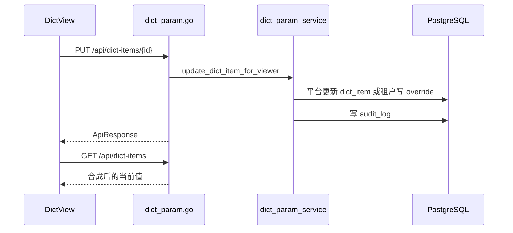

# 数据字典 - 技术实现文档

## 1. 功能概述

数据字典由 `DictView.vue` 实现字典类型、字典项和租户覆盖维护。后端由 `dict_param.go`、`dict_param_service.go`、`dict_param.go` Repository 实现平台默认定义和租户覆盖读取。数据模型包括 `dict_type`、`dict_item`、`tenant_dict_item_override`。权限为 `/dict` 和 `dict:create`、`dict:edit`、`dict:delete`。恢复默认通过删除覆盖行实现。

## 2. 技术实现总览

| 实现层 | 内容 | 关键文件 |
|---|---|---|
| 前端页面 | 字典类型和字典项列表、覆盖、恢复默认 | `frontend/src/views/DictView.vue` |
| 前端接口 | 字典类型/项 Repository、按编码取项、恢复默认 | `frontend/src/api/dict.ts` |
| 后端路由 | `/api/dict-types`、`/api/dict-items` | `internal/interfaces/http/handlers/dict_param.go` |
| Gin Handler | Gin router 函数 | `internal/interfaces/http/handlers/dict_param.go` |
| Application Service | 平台/租户视角编排、审计 | `internal/application/dict_param_service.go` |
| 数据访问 | 字典 Repository、覆盖合成、默认初始化 | `internal/infrastructure/persistence/postgres/repositories/dict_param.go` |
| 数据模型 | 字典类型、字典项、租户覆盖 | `internal/infrastructure/persistence/postgres/models`, `internal/interfaces/http/dto/dict_param.go` |
| 权限控制 | 菜单和操作权限 | `internal/interfaces/http/middleware`, `internal/domain/permission` |
| 日志记录 | 字典类型/项维护 | `dict_param_service.go` |

## 3. 前端实现说明

### 3.1 页面入口与路由

路由 `/dict`；名称 `DictView`；组件 `frontend/src/views/DictView.vue`；懒加载；菜单权限 `/dict`。

### 3.2 页面结构

页面包含字典类型列表、字典项列表、查询区、新增/编辑弹窗、租户覆盖提示、恢复默认按钮、分页。

### 3.3 查询实现

类型列表调用 `fetchDictTypes(skip, limit, opts)`；字典项调用 `fetchDictItems(dictTypeId, skip, limit)`；业务页面可调用 `fetchDictItemsByCode(code)` 读取字典项。重置清空关键字和分页。

### 3.4 列表实现

类型字段包括编码、名称、备注、scope、tenant_editable、is_platform_only。项字段包括 label、value、sort_order、enabled、默认值/当前值/覆盖状态【以页面实现为准】。

### 3.5 新增实现

新增类型调用 `createDictType()`；新增字典项调用 `createDictItem()`。平台管理员维护默认定义；租户管理员是否可新增默认类型（当前实现未覆盖，按后续增强处理）。

### 3.6 编辑实现

编辑类型调用 `updateDictType()`；编辑项调用 `updateDictItem()`。租户视角编辑不可直接改平台默认，而是写覆盖值。

### 3.7 删除实现

删除类型调用 `deleteDictType(id)`；删除项调用 `deleteDictItem(id)`；恢复默认调用 `restoreDictItemDefault(id)` 删除覆盖行。业务删除为逻辑删除，恢复默认为关系解除。

### 3.8 状态变更实现

字典项状态字段为 `dict_item.enabled` 或覆盖表 `enabled`；类型逻辑状态主要通过 `deleted_at`、`scope`、`tenant_editable` 控制，未发现 `status` 字段。

### 3.9 前端权限控制

菜单 `/dict`；按钮 `dict:create`、`dict:edit`、`dict:delete`。租户可编辑性还受 `tenant_editable` 和 `is_platform_only` 控制。

### 3.10 前端关键文件

| 类型 | 文件路径 | 说明 |
|---|---|---|
| 页面 | `frontend/src/views/DictView.vue` | 数据字典页面 |
| API | `frontend/src/api/dict.ts` | 字典接口 |
| 菜单 | `frontend/src/stores/sidebarMenu.ts` | 字典权限定义 |

## 4. 后端实现说明

### 4.1 接口路由

| 接口名称 | 请求方法 | 接口路径 | 说明 | 权限标识 |
|---|---|---|---|---|
| 按编码取字典项 | GET | `/api/dict-types/by-code/{code}/items` | 业务表单使用 | 登录（当前实现未覆盖，按后续增强处理） |
| 字典类型列表 | GET | `/api/dict-types` | 分页查询 | `/dict` |
| 新增类型 | POST | `/api/dict-types` | 创建类型 | `dict:create` |
| 编辑类型 | PUT | `/api/dict-types/{type_id}` | 更新类型 | `dict:edit` |
| 删除类型 | DELETE | `/api/dict-types/{type_id}` | 归档类型 | `dict:delete` |
| 字典项列表 | GET | `/api/dict-items` | 查询项 | `/dict` |
| 新增字典项 | POST | `/api/dict-items` | 创建项 | `dict:create` |
| 编辑字典项 | PUT | `/api/dict-items/{item_id}` | 更新项或覆盖 | `dict:edit` |
| 恢复默认 | DELETE | `/api/dict-items/{item_id}/override` | 删除租户覆盖 | `dict:edit` |
| 删除字典项 | DELETE | `/api/dict-items/{item_id}` | 归档项 | `dict:delete` |

### 4.2 Gin Handler 实现

`internal/interfaces/http/handlers/dict_param.go` 同时承载字典和参数接口。字典相关接口调用 `dict_param_service.go` 并使用 `DictTypeCreate`、`DictTypeUpdate`、`DictItemCreate`、`DictItemUpdate` 等 DTO。

### 4.3 Application Service 实现

`dict_param_service.go` 方法：`list_dict_type_page()`、`create_dict_type_for_viewer()`、`update_dict_type_for_viewer()`、`delete_dict_type_for_viewer()`、`list_dict_item_page()`、`create_dict_item_for_viewer()`、`update_dict_item_for_viewer()`、`delete_dict_item_for_viewer()`。处理平台/租户视角、覆盖、权限和审计。

### 4.4 数据访问实现

`repositories/dict_param.go` 提供字典分页、创建、更新、逻辑删除、按编码取项、删除覆盖、默认字典初始化。

### 4.5 参数校验

校验类型编码、名称、scope、tenant_editable、is_platform_only、字典项 label/value、sort_order、enabled。同类型下 value 唯一约束未在模型中确认（当前实现未覆盖，按后续增强处理）。

### 4.6 异常处理

字典类型不存在、编码重复、类型下有字典项不能删除、租户尝试编辑平台专属或不可编辑项、覆盖不存在等返回业务异常。

### 4.7 后端关键文件

| 类型 | 文件路径 | 说明 |
|---|---|---|
| Handler | `internal/interfaces/http/handlers/dict_param.go` | 字典接口 |
| Application Service | `internal/application/dict_param_service.go` | 字典业务 |
| Repository | `internal/infrastructure/persistence/postgres/repositories/dict_param.go` | 数据访问和覆盖合成 |
| DTO | `internal/interfaces/http/dto/dict_param.go` | 字典 DTO |
| Model | `internal/infrastructure/persistence/postgres/models` | `DictType`、`DictItem` |

## 5. 数据模型说明

### 5.1 数据表清单

| 表名 | 说明 | 对应模型 | 备注 |
|---|---|---|---|
| `dict_type` | 字典类型 | `DictType` | 默认定义 |
| `dict_item` | 字典项 | `DictItem` | 类型下选项 |
| `tenant_dict_item_override` | 租户字典项覆盖 | `TenantDictItemOverride` | 差异值 |

### 5.2 表结构说明

#### 表：`dict_type`

| 字段名 | 类型 | 是否必填 | 默认值 | 说明 |
|---|---|---|---|---|
| `id` | Integer | 是 | 自增 | 主键 |
| `tenant_id` | Integer | 是 | 无 | 主体 ID |
| `code` | String(64) | 是 | 无 | 类型编码 |
| `name` | String(200) | 是 | 无 | 类型名称 |
| `remark` | String(500) | 否 | NULL | 备注 |
| `scope` | String(32) | 是 | HYBRID | 作用域 |
| `tenant_editable` | Boolean | 是 | True | 租户可编辑 |
| `is_platform_only` | Boolean | 是 | False | 平台专属 |
| `deleted_at` | DateTime | 否 | NULL | 逻辑删除 |

#### 表：`dict_item`

| 字段名 | 类型 | 是否必填 | 默认值 | 说明 |
|---|---|---|---|---|
| `id` | Integer | 是 | 自增 | 主键 |
| `tenant_id` | Integer | 是 | 无 | 主体 ID |
| `dict_type_id` | Integer | 是 | 无 | 类型 ID |
| `label` | String(200) | 是 | 无 | 显示文本 |
| `value` | String(200) | 是 | 无 | 选项值 |
| `sort_order` | Integer | 是 | 0 | 排序 |
| `enabled` | Boolean | 是 | True | 启用 |
| `deleted_at` | DateTime | 否 | NULL | 逻辑删除 |

### 5.3 关键字段说明

`tenant_id` 支持平台默认和租户数据；`scope`、`tenant_editable`、`is_platform_only` 控制覆盖；`tenant_dict_item_override` 存差异；`deleted_at` 逻辑删除。

### 5.4 数据关系说明

一个字典类型包含多个字典项；租户覆盖通过 `dict_item_id` 指向默认项；读取时合成默认项和覆盖值。

### 5.5 索引与约束

`dict_type(tenant_id, code)` 唯一；`tenant_dict_item_override(tenant_id, dict_item_id)` 唯一。`dict_item` 未见 `(dict_type_id, value)` 唯一约束（当前实现未覆盖，按后续增强处理）。

## 6. 接口详细说明

## 6.1 按编码读取字典项

### 基本信息

| 项目 | 内容 |
|---|---|
| 请求方法 | GET |
| 接口路径 | `/api/dict-types/by-code/{code}/items` |
| 权限标识 | 登录（当前实现未覆盖，按后续增强处理） |
| 用途 | 业务表单读取字典选项 |

### 请求参数

| 参数名 | 类型 | 是否必填 | 说明 |
|---|---|---|---|
| `code` | string | 是 | 字典类型编码 |

### 返回结果

| 字段名 | 类型 | 说明 |
|---|---|---|
| `code` | string | 字典编码 |
| `items` | array | 字典项 |

### 处理逻辑

1. 按当前主体读取字典类型。
2. 查询默认项和租户覆盖。
3. 合成当前值。
4. 返回启用项。

### 异常情况

- 字典类型不存在。

## 6.2 编辑字典项

### 基本信息

| 项目 | 内容 |
|---|---|
| 请求方法 | PUT |
| 接口路径 | `/api/dict-items/{item_id}` |
| 权限标识 | `dict:edit` |
| 用途 | 平台编辑默认项或租户写覆盖 |

### 请求参数

| 参数名 | 类型 | 是否必填 | 说明 |
|---|---|---|---|
| `label` | string | 否 | 显示文本 |
| `value` | string | 否 | 值 |
| `sort_order` | int | 否 | 排序 |
| `enabled` | bool | 否 | 启用 |

### 返回结果

| 字段名 | 类型 | 说明 |
|---|---|---|
| `id` | int | 字典项 ID |
| `label` | string | 当前显示文本 |
| `value` | string | 当前值 |

### 处理逻辑

1. 校验编辑权限。
2. 判断平台或租户视角。
3. 平台更新默认项；租户写覆盖。
4. 记录审计日志。

### 异常情况

- 平台专属不可编辑。
- 字典项不存在。

## 7. 权限实现说明

### 7.1 菜单权限

菜单路径 `/dict`。

### 7.2 按钮权限

`dict:create`、`dict:edit`、`dict:delete`。

### 7.3 API 权限

管理接口使用菜单或操作权限；业务读取接口权限较宽，具体限制（当前实现未覆盖，按后续增强处理）。

### 7.4 数据权限

字典按主体隔离并支持租户覆盖。平台专属或不可编辑项禁止租户覆盖。

## 8. 日志实现说明

| 操作 | 是否记录 | 记录内容 | 实现位置 |
|---|---|---|---|
| 新增/编辑/删除类型 | 是 | 类型编码、名称 | `dict_param_service.go` |
| 新增/编辑/删除项 | 是 | 项 label/value | `dict_param_service.go` |
| 恢复默认 | 是（当前实现未覆盖，按后续增强处理） | 覆盖删除摘要 | `dict_param_service.go` |

## 9. 状态与枚举实现

| 字段/枚举 | 取值 | 说明 | 来源 |
|---|---|---|---|
| `scope` | `HYBRID`/`TENANT`/`PLATFORM` | 字典作用域 | 数据库字段/业务约定 |
| `enabled` | true/false | 字典项启用 | 数据库字段 |
| `tenant_editable` | true/false | 租户可编辑 | 数据库字段 |
| `is_platform_only` | true/false | 平台专属 | 数据库字段 |
| `deleted_at` | NULL/datetime | 逻辑删除 | 数据库字段 |

## 10. 关键业务逻辑实现

### 逻辑：默认值与租户覆盖合成

- 触发入口：列表和按编码读取。
- 处理流程：读取默认项，查询当前租户覆盖，覆盖 label/value/enabled/sort_order。
- 涉及方法：`list_dict_items_by_type_code()`、service 列表方法。
- 涉及数据：`dict_item`、`tenant_dict_item_override`。
- 异常处理：类型不存在返回空或错误（当前实现未覆盖，按后续增强处理）。
- 注意事项：恢复默认删除覆盖行。

## 11. 前后端交互流程

## 12. 扩展点与技术风险

- 扩展点：引用统计、导入导出、变更记录。
- 风险：字典项唯一约束未确认，可能出现同类型 value 重复。
- 风险：业务页面依赖字典编码，改编码会影响功能。
