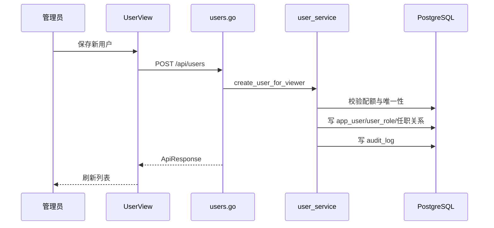

# 用户管理 - 技术实现文档

## 1. 功能概述

用户管理由 `UserView.vue` 实现用户分页列表、新增、编辑、归档、重置密码、角色选择、组织和岗位关联。后端由 `users.go`、`user_service.go`、`user.go` 实现用户 Repository、个人资料、偏好和管理员重置密码。数据模型包括 `app_user`、`user_role`、`app_user_department`、`app_user_position`、`role`、`org_node`、`position`。权限为 `/users` 和 `user:create`、`user:edit`、`user:reset_password`、`user:delete`。新增用户受套餐用户配额控制。

## 2. 技术实现总览

| 实现层 | 内容 | 关键文件 |
|---|---|---|
| 前端页面 | 用户列表、表单、重置密码、角色/组织/岗位选择 | `frontend/src/views/UserView.vue` |
| 前端接口 | 用户 Repository、角色选项、重置密码 | `frontend/src/api/user.ts` |
| 后端路由 | `/api/users` 系列接口 | `internal/interfaces/http/handlers/users.go` |
| Gin Handler | Gin router 函数 | `internal/interfaces/http/handlers/users.go` |
| Application Service | 用户列表、创建、更新、删除、重置密码 | `internal/application/user_service.go` |
| 数据访问 | 用户 Repository、用户部门/岗位同步 | `internal/infrastructure/persistence/postgres/repositories/user.go` |
| 数据模型 | 用户、用户角色、用户组织岗位关系 | `internal/infrastructure/persistence/postgres/models`, `internal/interfaces/http/dto/user.go` |
| 权限控制 | 菜单、按钮和运行时套餐校验 | `internal/interfaces/http/middleware`, `internal/domain/permission` |
| 日志记录 | 用户新增、编辑、归档、重置密码 | `internal/application/user_service.go` |

## 3. 前端实现说明

### 3.1 页面入口与路由

路由 `/users`；路由名称 `UserView`；组件 `frontend/src/views/UserView.vue`；懒加载；菜单权限 `/users`。

### 3.2 页面结构

页面包含查询区、用户列表、分页、新增/编辑弹窗、角色选择区、组织和岗位选择、重置密码结果弹窗、归档确认。

### 3.3 查询实现

调用 `fetchUsers({ skip, limit, keyword, status, company_id, department_id })` 获取分页列表；`fetchAssignableRoles()` 获取可分配角色。分页由前端页码转换为 `skip`、`limit`。

### 3.4 列表实现

用户字段包括姓名、工号、手机号、邮箱、公司、部门、角色、状态、创建时间。状态 `1/0` 显示启用/禁用。角色、组织和岗位名称由后端 DTO 或前端选项回显【待确认】。

### 3.5 新增实现

新增入口打开用户表单。字段包括 `employee_no`、`phone`、`password`、`name`、`email`、`company_id`、`department_id`、`department_ids`、`position_ids`、`role_ids`、`status`。调用 `createUser()`。成功后刷新列表。

### 3.6 编辑实现

编辑时回显用户数据，调用 `updateUser(id, body)`。密码不通过编辑接口修改。成功后刷新列表。

### 3.7 删除实现

归档入口调用 `deleteUser(id)`，前端使用二次确认。后端逻辑删除用户。未发现批量删除。

### 3.8 状态变更实现

用户状态字段为 `app_user.status`，取值 `1/0`。当前通过新增/编辑表单维护，未发现独立启停接口。禁用用户登录拦截在认证流程中处理。

### 3.9 前端权限控制

菜单权限 `/users`；按钮权限 `user:create`、`user:edit`、`user:reset_password`、`user:delete`。重置密码按钮使用 `user:reset_password`。

### 3.10 前端关键文件

| 类型 | 文件路径 | 说明 |
|---|---|---|
| 页面 | `frontend/src/views/UserView.vue` | 用户管理页面 |
| API | `frontend/src/api/user.ts` | 用户接口 |
| 组织 API | `frontend/src/api/organization.ts` | 组织选择 |
| 岗位 API | `frontend/src/api/position.ts` | 岗位选择 |
| 权限 Store | `frontend/src/stores/permission.ts` | 当前权限 |

## 4. 后端实现说明

### 4.1 接口路由

| 接口名称 | 请求方法 | 接口路径 | 说明 | 权限标识 |
|---|---|---|---|---|
| 用户列表 | GET | `/api/users` | 分页查询用户 | `/users` |
| 可分配角色 | GET | `/api/users/assignable-roles` | 用户表单角色选项 | `/users` |
| 新增用户 | POST | `/api/users` | 创建用户 | `user:create` |
| 当前用户资料 | GET | `/api/users/me` | 当前登录用户信息 | 登录 |
| 更新个人资料 | PUT | `/api/users/me` | 用户个人资料 | 登录 |
| 修改个人密码 | PUT | `/api/users/me/password` | 当前用户改密 | 登录 |
| 快捷入口偏好 | GET/PUT | `/api/users/me/preferences` | 用户偏好 | 登录 |
| 编辑用户 | PUT | `/api/users/{user_id}` | 管理员编辑用户 | `user:edit` |
| 重置密码 | PUT | `/api/users/{user_id}/password` | 管理员重置密码 | `user:reset_password` |
| 归档用户 | DELETE | `/api/users/{user_id}` | 逻辑删除用户 | `user:delete` |

### 4.2 Gin Handler 实现

`internal/interfaces/http/handlers/users.go` 负责接口定义、权限依赖、请求 IP 提取和响应包装。DTO 包括 `UserCreate`、`UserUpdate`、`UserOut`、`ProfileOut`、`UserAdminResetPasswordOut`。

### 4.3 Application Service 实现

核心方法：`list_assignable_roles_for_user_management()`、`list_user_page()`、`create_user_for_viewer()`、`update_user_for_viewer()`【名称以实现为准】、`delete_user_for_viewer()`、管理员重置密码相关方法。Application Service 处理租户隔离、用户配额、手机号标准化、密码哈希、角色同步、部门/岗位同步、审计日志。

### 4.4 数据访问实现

`internal/infrastructure/persistence/postgres/repositories/user.go` 提供 `create_user()`、`list_users()`、`get_user()`、`get_user_by_account()`、`delete_user()`、`sync_user_departments()`、`sync_user_positions()`、密码更新等。

### 4.5 参数校验

DTO 校验用户名、工号、密码长度、手机号等；service/repository 校验同租户工号唯一、手机号唯一、组织和岗位归属、角色归属、用户配额。

### 4.6 异常处理

常见异常：用户不存在、工号重复、手机号重复、配额不足、角色不存在、组织不存在、权限不足、不能删除自身【是否已实现待确认】。

### 4.7 后端关键文件

| 类型 | 文件路径 | 说明 |
|---|---|---|
| Handler | `internal/interfaces/http/handlers/users.go` | 用户接口 |
| Application Service | `internal/application/user_service.go` | 用户业务 |
| Repository | `internal/infrastructure/persistence/postgres/repositories/user.go` | 用户数据访问 |
| DTO | `internal/interfaces/http/dto/user.go` | 用户请求响应 |
| Model | `internal/infrastructure/persistence/postgres/models` | 用户相关模型 |

## 5. 数据模型说明

### 5.1 数据表清单

| 表名 | 说明 | 对应模型 | 备注 |
|---|---|---|---|
| `app_user` | 用户账号 | `AppUser` | 登录和人员基础信息 |
| `user_role` | 用户角色 | `UserRole` | 多角色 |
| `app_user_department` | 用户多部门 | `AppUserDepartment` | 任职关系 |
| `app_user_position` | 用户岗位 | `AppUserPosition` | 多岗位 |
| `role` | 角色 | `Role` | 授权来源 |
| `org_node` | 组织 | `OrgNode` | 公司、部门 |
| `user_preference` | 用户偏好 | `UserPreference` | 快捷入口 |

### 5.2 表结构说明

#### 表：`app_user`

| 字段名 | 类型 | 是否必填 | 默认值 | 说明 |
|---|---|---|---|---|
| `id` | Integer | 是 | 自增 | 主键 |
| `tenant_id` | Integer | 是 | 无 | 主体 ID |
| `company_id` | Integer | 否 | NULL | 所属公司 |
| `department_id` | Integer | 否 | NULL | 主部门 |
| `employee_no` | String(64) | 是 | 无 | 工号/登录账号 |
| `phone` | String(32) | 否 | NULL | 手机号 |
| `password_hash` | String(200) | 是 | 无 | 密码哈希 |
| `name` | String(100) | 是 | 无 | 姓名 |
| `email` | String(200) | 否 | NULL | 邮箱 |
| `avatar_url` | Text | 否 | NULL | 头像 |
| `status` | Integer | 是 | 1 | 启用状态 |
| `is_platform_admin` | Boolean | 是 | False | 平台管理员 |
| `created_at` | DateTime | 否 | now | 创建时间 |
| `deleted_at` | DateTime | 否 | NULL | 逻辑删除 |

#### 表：`user_role`

| 字段名 | 类型 | 是否必填 | 默认值 | 说明 |
|---|---|---|---|---|
| `id` | Integer | 是 | 自增 | 主键 |
| `user_id` | Integer | 是 | 无 | 用户 ID |
| `role_id` | Integer | 是 | 无 | 角色 ID |

### 5.3 关键字段说明

`tenant_id` 租户隔离；`employee_no` 和 `phone` 同租户唯一；`password_hash` 保存哈希；`status` 控制账号启停；`deleted_at` 逻辑删除；`is_platform_admin` 控制平台权限。

### 5.4 数据关系说明

用户归属一个主体，可关联公司和部门，可有多个角色、多个部门和多个岗位。用户权限由 `user_role -> role_permission -> permission` 推导。

### 5.5 索引与约束

`app_user(tenant_id, employee_no)` 唯一；`app_user(tenant_id, phone)` 唯一；`user_role(user_id, role_id)` 唯一；`app_user_department(user_id, department_id)` 唯一；`app_user_position(user_id, position_id)` 唯一。

## 6. 接口详细说明

## 6.1 用户列表

### 基本信息

| 项目 | 内容 |
|---|---|
| 请求方法 | GET |
| 接口路径 | `/api/users` |
| 权限标识 | `/users` |
| 用途 | 分页查询用户 |

### 请求参数

| 参数名 | 类型 | 是否必填 | 说明 |
|---|---|---|---|
| `skip` | int | 否 | 偏移 |
| `limit` | int | 否 | 页大小 |
| `keyword` | string | 否 | 关键字 |
| `status` | int | 否 | 状态 |
| `company_id` | int | 否 | 公司 |
| `department_id` | int | 否 | 部门 |

### 返回结果

| 字段名 | 类型 | 说明 |
|---|---|---|
| `items` | array | 用户列表 |
| `total` | int | 总数 |

### 处理逻辑

1. 校验菜单权限。
2. 按当前主体和筛选条件查询。
3. 排除已归档用户。
4. 组装角色、组织等展示字段。
5. 返回分页。

### 异常情况

- 权限不足。
- 租户上下文缺失。

## 6.2 新增用户

### 基本信息

| 项目 | 内容 |
|---|---|
| 请求方法 | POST |
| 接口路径 | `/api/users` |
| 权限标识 | `user:create` |
| 用途 | 创建用户账号 |

### 请求参数

| 参数名 | 类型 | 是否必填 | 说明 |
|---|---|---|---|
| `employee_no` | string | 是 | 工号/登录账号 |
| `phone` | string | 否 | 手机号 |
| `password` | string | 是 | 初始密码 |
| `name` | string | 是 | 姓名 |
| `role_ids` | array | 否 | 角色 |
| `department_ids` | array | 否 | 多部门 |
| `position_ids` | array | 否 | 岗位 |

### 返回结果

| 字段名 | 类型 | 说明 |
|---|---|---|
| `id` | int | 用户 ID |
| `employee_no` | string | 工号 |
| `name` | string | 姓名 |

### 处理逻辑

1. 校验 `user:create`。
2. 检查用户配额。
3. 校验账号唯一。
4. 生成密码哈希。
5. 写入用户和关系表。
6. 记录审计日志。

### 异常情况

- 配额不足。
- 工号或手机号重复。
- 角色、组织、岗位不存在。

## 6.3 重置用户密码

### 基本信息

| 项目 | 内容 |
|---|---|
| 请求方法 | PUT |
| 接口路径 | `/api/users/{user_id}/password` |
| 权限标识 | `user:reset_password` |
| 用途 | 管理员生成临时密码 |

### 请求参数

| 参数名 | 类型 | 是否必填 | 说明 |
|---|---|---|---|
| `user_id` | int | 是 | 用户 ID |

### 返回结果

| 字段名 | 类型 | 说明 |
|---|---|---|
| `new_password` | string | 一次性临时密码 |

### 处理逻辑

1. 校验操作权限。
2. 校验用户属于当前主体。
3. 生成随机密码并更新哈希。
4. 记录审计日志但不记录明文。
5. 返回临时密码。

### 异常情况

- 用户不存在。
- 权限不足。

## 7. 权限实现说明

### 7.1 菜单权限

菜单路径 `/users`，由菜单包动态加载，且受套餐 `user_manage` 等功能限制。

### 7.2 按钮权限

`user:create`、`user:edit`、`user:reset_password`、`user:delete`。

### 7.3 API 权限

读接口 `_require_menu_path(MenuPath.USERS)`；写接口 `_require_operation(OperationCode.USER_*)`。重置密码单独权限码已拆分。

### 7.4 数据权限

用户数据按 `tenant_id` 隔离。列表是否按角色数据范围过滤组织用户【待确认】。

## 8. 日志实现说明

| 操作 | 是否记录 | 记录内容 | 实现位置 |
|---|---|---|---|
| 新增用户 | 是 | 用户工号、姓名、操作者、IP | `user_service.go` |
| 编辑用户 | 是 | 用户变更摘要 | `user_service.go` |
| 归档用户 | 是 | 用户归档摘要 | `user_service.go` |
| 重置密码 | 是 | 用户账号摘要，不含明文密码 | `user_service.go` |

## 9. 状态与枚举实现

| 字段/枚举 | 取值 | 说明 | 来源 |
|---|---|---|---|
| `status` | `1`/`0` | 启用/禁用 | 数据库字段 |
| `deleted_at` | NULL/datetime | 未归档/已归档 | 数据库字段 |
| `is_platform_admin` | true/false | 是否平台管理员 | 数据库字段 |

## 10. 关键业务逻辑实现

### 逻辑：新增用户配额校验

- 触发入口：新增用户。
- 处理流程：统计当前用户数，读取租户有效配额，超限则拒绝。
- 涉及方法：`create_user_for_viewer()`、`require_count_within_quota()`。
- 涉及数据：`app_user`、套餐配额。
- 异常处理：配额不足返回业务错误。
- 注意事项：配额覆盖优先套餐默认。

### 逻辑：角色和任职关系同步

- 触发入口：新增或编辑用户。
- 处理流程：保存用户基础信息，同步 `user_role`、`app_user_department`、`app_user_position`。
- 涉及方法：`sync_user_departments()`、`sync_user_positions()`。
- 涉及数据：用户关系表。
- 异常处理：关联对象不属于当前主体时拒绝。
- 注意事项：更新需避免残留旧关系。

## 11. 前后端交互流程

## 12. 扩展点与技术风险

- 扩展点：批量导入、账号锁定、强制下线、用户详情。
- 风险：禁用用户后已登录会话是否立即失效需确认。
- 风险：用户列表数据权限过滤需专项核对。
