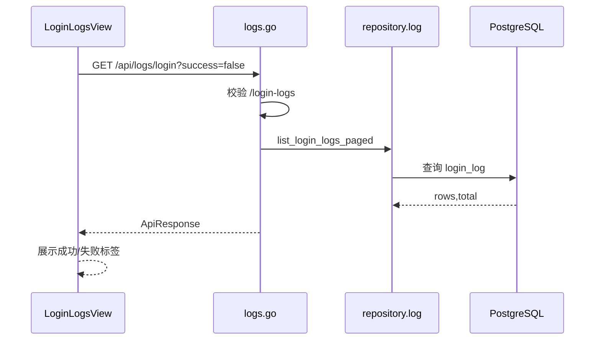

# 登录日志 - 技术实现文档

## 1. 功能概述

登录日志由 `LoginLogsView.vue` 实现只读分页查询，支持账号、IP、主体、日期和成功/失败筛选。后端由 `logs.go`、`repositories/log.go` 查询 `login_log` 表；登录流程由认证服务写入日志。权限为 `/login-logs` 和 `login:view`。平台管理员可跨主体筛选，普通租户只看本主体登录记录。

## 2. 技术实现总览

| 实现层 | 内容 | 关键文件 |
|---|---|---|
| 前端页面 | 登录日志筛选、列表、分页 | `frontend/src/views/LoginLogsView.vue` |
| 前端接口 | 登录日志查询 | `frontend/src/api/logs.ts` |
| 后端路由 | `/api/logs/login` | `internal/interfaces/http/handlers/logs.go` |
| Gin Handler | Gin router 函数 | `internal/interfaces/http/handlers/logs.go` |
| Application Service | 登录日志记录和查询范围（当前实现未覆盖，按后续增强处理） | `internal/application/internal/application/identity`, `internal/application/log_service.go` |
| 数据访问 | 登录日志分页查询 | `internal/infrastructure/persistence/postgres/repositories/log.go` |
| 数据模型 | `LoginLog`、日志 DTO | `internal/infrastructure/persistence/postgres/models`, `internal/interfaces/http/dto/log.go` |
| 权限控制 | 登录日志菜单权限 | `internal/interfaces/http/middleware`, `internal/domain/permission` |
| 日志记录 | 登录成功/失败写入 | `internal/application/internal/application/identity` |

## 3. 前端实现说明

### 3.1 页面入口与路由

路由 `/login-logs`；路由名 `LoginLogsView`；组件 `frontend/src/views/LoginLogsView.vue`；懒加载；菜单权限 `/login-logs`。

### 3.2 页面结构

页面使用 `NeuroAgentListPage`，包含筛选区、登录日志列表、分页。无新增、编辑、删除。

### 3.3 查询实现

`load()` 调用 `fetchLoginLogs(skip, limit, filters)`。筛选字段包括：

- `account`：账号模糊。
- `ip`：IP 模糊。
- `tenantName`：平台管理员可见，主体名称或编码。
- `loginDate`：日期范围。
- `success`：全部、成功、失败。

重置清空所有筛选并回到第一页。

### 3.4 列表实现

列定义在 `columns` 计算属性：ID、账号、结果、说明、IP、主体、时间。结果用 Element Plus Tag 展示成功/失败。时间使用 `formatDateTimeChina()`。

### 3.5 新增实现

当前页面无新增逻辑；登录日志由登录流程自动写入。

### 3.6 编辑实现

当前实现中未发现编辑逻辑。

### 3.7 删除实现

当前实现中未发现删除逻辑和批量删除。

### 3.8 状态变更实现

当前实现中未发现状态变更操作。`success` 字段表示登录结果。

### 3.9 前端权限控制

页面通过 `pageAction('login:view')` 判断查看权限，无权限时展示空态。主体筛选显示条件为 `perm.profile?.is_platform_admin || perm.profile?.tenant_is_platform`。

### 3.10 前端关键文件

| 类型 | 文件路径 | 说明 |
|---|---|---|
| 页面 | `frontend/src/views/LoginLogsView.vue` | 登录日志页面 |
| API | `frontend/src/api/logs.ts` | 日志查询接口 |
| 权限 | `frontend/src/stores/permission.ts` | 平台身份判断 |
| 工具 | `frontend/src/utils/datetime.ts` | 时间格式化 |

## 4. 后端实现说明

### 4.1 接口路由

| 接口名称 | 请求方法 | 接口路径 | 说明 | 权限标识 |
|---|---|---|---|---|
| 登录日志列表 | GET | `/api/logs/login` | 分页查询登录日志 | `/login-logs` |

### 4.2 Gin Handler 实现

`internal/interfaces/http/handlers/logs.go` 接收 `skip`、`limit`、`success`、`account`、`ip`、`tenant_name_hint`、`date_from`、`date_to`，注入 `_require_menu_path("/login-logs")` 后返回 `LoginLogListData`。

### 4.3 Application Service 实现

登录日志写入主要在认证服务中完成【具体写入函数需以 `internal/application/identity` 当前实现为准】。查询可能直接通过 `repositories/log.go` 或经 `log_service.go` 处理范围。

### 4.4 数据访问实现

`internal/infrastructure/persistence/postgres/repositories/log.go` 的 `list_login_logs_paged()` 负责按登录结果、账号、IP、主体名称、日期范围和租户范围分页查询。

### 4.5 参数校验

`success` 为布尔或空；`account`、`ip`、`tenant_name_hint` 为字符串；日期范围为字符串日期。日期合法性、limit 上限（当前实现未覆盖，按后续增强处理）。

### 4.6 异常处理

未登录、无菜单权限、日期参数错误、数据库查询异常。失败登录日志的 `message` 不应泄露密码校验细节。

### 4.7 后端关键文件

| 类型 | 文件路径 | 说明 |
|---|---|---|
| Handler | `internal/interfaces/http/handlers/logs.go` | 登录日志接口 |
| Repository | `internal/infrastructure/persistence/postgres/repositories/log.go` | 登录日志查询 |
| Application Service | `internal/application/internal/application/identity` | 登录流程和日志写入 |
| DTO | `internal/interfaces/http/dto/log.go` | 登录日志响应 |
| Model | `internal/infrastructure/persistence/postgres/models` | `LoginLog` |

## 5. 数据模型说明

### 5.1 数据表清单

| 表名 | 说明 | 对应模型 | 备注 |
|---|---|---|---|
| `login_log` | 登录尝试记录 | `LoginLog` | 成功/失败 |
| `tenant` | 主体信息 | `Tenant` | 主体筛选 |
| `app_user` | 用户信息 | `AppUser` | 登录用户 |

### 5.2 表结构说明

#### 表：`login_log`

| 字段名 | 类型 | 是否必填 | 默认值 | 说明 |
|---|---|---|---|---|
| `id` | Integer | 是 | 自增 | 主键 |
| `tenant_id` | Integer | 否 | NULL | 主体 ID |
| `user_id` | Integer | 否 | NULL | 用户 ID |
| `account` | String(128) | 是 | 无 | 登录账号 |
| `success` | Boolean | 是 | False | 是否成功 |
| `message` | String(500) | 否 | NULL | 说明 |
| `ip` | String(64) | 否 | NULL | IP |
| `user_agent` | String(500) | 否 | NULL | User-Agent |
| `created_at` | DateTime | 否 | now | 登录时间 |

### 5.3 关键字段说明

`tenant_id` 支持租户隔离；`account` 保存登录账号；`success` 区分成功/失败；`message` 保存说明；`ip` 和 `user_agent` 用于安全排查；`created_at` 支持日期筛选。

### 5.4 数据关系说明

登录日志弱关联主体和用户。登录失败时可能没有 `tenant_id` 或 `user_id`，但仍保留账号、IP 和失败说明。

### 5.5 索引与约束

模型对 `tenant_id`、`user_id`、`created_at` 建索引。无唯一约束。

## 6. 接口详细说明

## 6.1 登录日志列表

### 基本信息

| 项目 | 内容 |
|---|---|
| 请求方法 | GET |
| 接口路径 | `/api/logs/login` |
| 权限标识 | `/login-logs` |
| 用途 | 分页查询登录日志 |

### 请求参数

| 参数名 | 类型 | 是否必填 | 说明 |
|---|---|---|---|
| `skip` | int | 否 | 偏移 |
| `limit` | int | 否 | 页大小 |
| `success` | bool | 否 | 登录结果 |
| `account` | string | 否 | 账号 |
| `ip` | string | 否 | IP |
| `tenant_name_hint` | string | 否 | 主体名称或编码 |
| `date_from` | string | 否 | 开始日期 |
| `date_to` | string | 否 | 结束日期 |

### 返回结果

| 字段名 | 类型 | 说明 |
|---|---|---|
| `items` | array | 登录日志 |
| `total` | int | 总数 |

### 处理逻辑

1. 校验登录和菜单权限。
2. 判断是否允许跨主体查询。
3. 组装筛选条件。
4. 分页查询 `login_log`。
5. 返回结果。

### 异常情况

- 权限不足。
- 日期格式非法。

## 7. 权限实现说明

### 7.1 菜单权限

菜单路径 `/login-logs`，侧栏按钮权限 `login:view`。

### 7.2 按钮权限

当前仅查看权限 `login:view`。

### 7.3 API 权限

后端使用 `_require_menu_path("/login-logs")`，前端使用 `login:view` 判断页面可见性。

### 7.4 数据权限

租户用户只能查询本主体登录日志；平台管理员和平台主体用户可使用主体筛选。登录失败无主体时如何归属（当前实现未覆盖，按后续增强处理）。

## 8. 日志实现说明

| 操作 | 是否记录 | 记录内容 | 实现位置 |
|---|---|---|---|
| 登录成功 | 是 | 账号、主体、用户、IP、UA、时间 | `internal/application/identity` |
| 登录失败 | 是 | 账号、失败说明、IP、UA、时间 | `internal/application/identity` |
| 查询登录日志 | 后续增强 | 查询条件 | （当前实现未覆盖，按后续增强处理） |

## 9. 状态与枚举实现

| 字段/枚举 | 取值 | 说明 | 来源 |
|---|---|---|---|
| `success` | true/false | 成功/失败 | 数据库字段 |
| `created_at` | datetime | 登录时间 | 数据库字段 |

## 10. 关键业务逻辑实现

### 逻辑：平台和租户查询范围

- 触发入口：登录日志页面查询。
- 处理流程：前端按平台身份展示主体筛选；后端按当前用户身份限制 `tenant_id`。
- 涉及方法：`list_login_logs_paged()`。
- 涉及数据：`login_log`、`tenant`。
- 异常处理：非平台用户跨主体筛选应忽略或拒绝（当前实现未覆盖，按后续增强处理）。
- 注意事项：同一手机号多主体登录时必须按主体隔离。

### 逻辑：登录失败记录

- 触发入口：登录校验失败。
- 处理流程：认证服务记录账号、失败说明、IP、User-Agent、时间。
- 涉及方法：认证服务登录方法【具体名称后续增强】。
- 涉及数据：`login_log`。
- 异常处理：日志写入失败不应泄露内部错误。
- 注意事项：失败说明不能过度暴露账号枚举信息。

## 11. 前后端交互流程

## 12. 扩展点与技术风险

- 扩展点：导出、详情弹窗、异常 IP、设备指纹、账号锁定联动。
- 风险：前端 `login:view` 与后端 `/login-logs` 需保持权限数据同步。
- 风险：登录失败日志的主体归属在多主体账号场景需明确。
