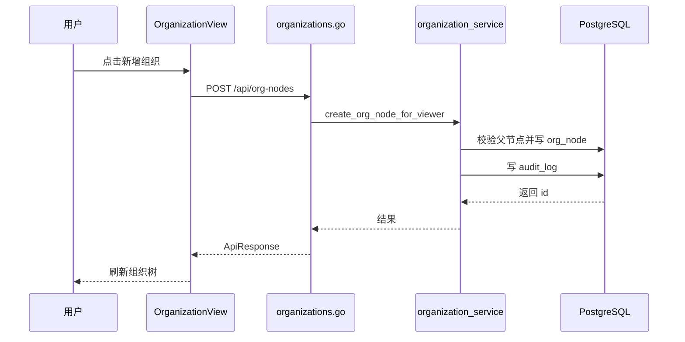

# 组织架构 - 技术实现文档

## 1. 功能概述

组织架构前端由 `OrganizationView.vue` 实现组织树、节点详情、新增/编辑/归档。后端由 `organizations.go`、`organization_service.go`、`tenant.go` 实现统一组织节点接口，同时保留公司、部门、门店兼容接口。数据模型为 `org_node` 单表树，支持 `tenant_id`、`parent_id`、`company_id`、`node_type`、`status`、`deleted_at`。权限为 `/organization` 和 `org:create`、`org:edit`、`org:delete`。创建公司、门店等计费节点时通过套餐配额校验。

## 2. 技术实现总览

| 实现层 | 内容 | 关键文件 |
|---|---|---|
| 前端页面 | 组织树、节点表单、详情和归档 | `frontend/src/views/OrganizationView.vue` |
| 前端接口 | 组织树、统一节点、公司/部门/门店兼容接口 | `frontend/src/api/organization.ts` |
| 后端路由 | `/api/organizations/tree`、`/api/org-nodes` 等 | `internal/interfaces/http/handlers/organizations.go` |
| Gin Handler | Gin router 函数 | `internal/interfaces/http/handlers/organizations.go` |
| Application Service | 创建、编辑、删除公司/部门/门店/统一节点 | `internal/application/organization_service.go` |
| 数据访问 | `org_node` Repository、组织树构建 | `internal/infrastructure/persistence/postgres/repositories/tenant.go`, `internal/infrastructure/persistence/postgres/repositories/org_tree_cache.go` |
| 数据模型 | `OrgNode`、组织 DTO | `internal/infrastructure/persistence/postgres/models`, `internal/interfaces/http/dto/organization.go` |
| 权限控制 | 菜单和操作依赖 | `internal/interfaces/http/middleware`, `internal/domain/permission` |
| 日志记录 | 组织创建、编辑、归档 | `internal/application/organization_service.go` |

## 3. 前端实现说明

### 3.1 页面入口与路由

菜单路径为系统管理 / 组织架构；路由 `/organization`；路由名 `OrganizationView`；组件 `frontend/src/views/OrganizationView.vue`；懒加载；受路由守卫菜单权限和按钮权限控制。

### 3.2 页面结构

页面包含组织树形结构区、节点信息展示区、操作按钮区、新增/编辑弹窗、归档确认和加载状态。组织树用于选择节点，表单用于维护节点名称、编码、类型、父级、状态等。

### 3.3 查询实现

前端调用 `fetchOrgTree()` -> `GET /api/organizations/tree` 加载当前主体组织树。统一节点增删改接口显式传 `tenant_id` 参数，平台视角可指定目标主体；租户视角通常使用当前主体。

### 3.4 列表实现

组织以树而非标准分页列表展示。节点字段包括 `id`、`name`、`code`、`node_type`、`parent_id`、`company_id`、`company_type`、`status`、`children`。状态 `1/0` 显示启用/停用。节点类型翻译依赖字典 `org_node_type` 和前端映射（当前实现未覆盖，按后续增强处理）。

### 3.5 新增实现

新增入口为页面新增按钮或节点新增子级按钮。调用 `createOrgNode(tenantId, body)`，兼容接口包括 `createCompany()`、`createDepartment()`、`createStore()`。表单校验包括名称、类型、父级、公司归属等（当前实现未覆盖，按后续增强处理）。成功后重新加载树。

### 3.6 编辑实现

编辑入口在选中节点操作区。前端回填节点数据，调用 `updateOrgNode(tenantId, nodeId, body)` 或兼容公司/部门/门店更新接口。成功后刷新组织树。

### 3.7 删除实现

删除入口为归档按钮，使用二次确认。调用 `deleteOrgNode(tenantId, nodeId)` 或兼容删除接口。成功后刷新树。未发现批量删除。

### 3.8 状态变更实现

状态字段为 `org_node.status`，取值 `1/0`。当前状态变更通过编辑组织节点表单完成，未发现独立启停接口。

### 3.9 前端权限控制

菜单权限为 `/organization`；按钮权限为 `org:create`、`org:edit`、`org:delete`。前端通过 `usePermissionStore`、`v-permission` 或 `usePageAction` 控制按钮显示和操作入口。

### 3.10 前端关键文件

| 类型 | 文件路径 | 说明 |
|---|---|---|
| 页面 | `frontend/src/views/OrganizationView.vue` | 组织架构页面 |
| API | `frontend/src/api/organization.ts` | 组织接口封装 |
| 类型 | `frontend/src/api/organization.ts` | `OrgNode` 类型 |
| 菜单 | `frontend/src/stores/sidebarMenu.ts` | 组织菜单和按钮 |

## 4. 后端实现说明

### 4.1 接口路由

| 接口名称 | 请求方法 | 接口路径 | 说明 | 权限标识 |
|---|---|---|---|---|
| 组织树 | GET | `/api/organizations/tree` | 当前主体组织树 | `/organization` |
| 组织详情 | GET | `/api/organizations/detail` | 公司/部门明细 | `/organization` |
| 创建公司 | POST | `/api/companies` | 兼容公司接口 | `org:create` |
| 编辑公司 | PUT | `/api/companies/{company_id}` | 兼容公司接口 | `org:edit` |
| 删除公司 | DELETE | `/api/companies/{company_id}` | 归档公司 | `org:delete` |
| 创建部门 | POST | `/api/departments` | 兼容部门接口 | `org:create` |
| 编辑部门 | PUT | `/api/departments/{department_id}` | 兼容部门接口 | `org:edit` |
| 删除部门 | DELETE | `/api/departments/{department_id}` | 归档部门 | `org:delete` |
| 创建门店 | POST | `/api/stores` | 兼容门店接口 | `org:create` |
| 编辑门店 | PUT | `/api/stores/{store_id}` | 兼容门店接口 | `org:edit` |
| 删除门店 | DELETE | `/api/stores/{store_id}` | 归档门店 | `org:delete` |
| 创建组织节点 | POST | `/api/org-nodes` | 统一节点创建 | `org:create` |
| 编辑组织节点 | PUT | `/api/org-nodes/{node_id}` | 统一节点编辑 | `org:edit` |
| 删除组织节点 | DELETE | `/api/org-nodes/{node_id}` | 统一节点归档 | `org:delete` |

### 4.2 Gin Handler 实现

`internal/interfaces/http/handlers/organizations.go` 注入 `_tenant_query_dep` 解析目标 `tenant_id`，使用 `_require_menu_path()` 和 `_require_operation()` 做权限校验，调用 `organization_service.go`。

### 4.3 Application Service 实现

主要方法：`create_company_for_viewer()`、`update_company_for_viewer()`、`delete_company_for_viewer()`、`create_department_for_viewer()`、`create_store_for_viewer()`、`create_org_node_for_viewer()`、`update_org_node_for_viewer()`、`delete_org_node_for_viewer()`。Application Service 处理租户隔离、节点类型、公司归属、配额校验、审计日志。

### 4.4 数据访问实现

`internal/infrastructure/persistence/postgres/repositories/tenant.go` 包含 `create_org_node()`、`update_org_node()`、`delete_org_node()`、`build_company_tree()` 以及公司/部门/门店兼容 Repository。删除通过设置 `deleted_at` 逻辑归档。`org_tree_cache.go` 提供组织树缓存能力【使用范围后续增强】。

### 4.5 参数校验

DTO 包括 `CompanyCreate`、`CompanyUpdate`、`DepartmentCreate`、`DepartmentUpdate`、`StoreCreate`、`StoreUpdate`、`OrgNodeCreate`、`OrgNodeUpdate`。校验内容包括名称、编码、类型、父级、状态。Application Service 额外校验租户、父节点、公司节点、配额和引用关系。

### 4.6 异常处理

组织不存在、父节点不存在、跨租户访问、配额不足、节点被引用、编码重复等以业务错误和统一响应返回。删除失败时返回可读信息。

### 4.7 后端关键文件

| 类型 | 文件路径 | 说明 |
|---|---|---|
| Handler | `internal/interfaces/http/handlers/organizations.go` | 组织接口 |
| Application Service | `internal/application/organization_service.go` | 组织业务逻辑 |
| Repository | `internal/infrastructure/persistence/postgres/repositories/tenant.go` | `org_node` 数据访问 |
| DTO | `internal/interfaces/http/dto/organization.go` | 组织请求响应 |
| Model | `internal/infrastructure/persistence/postgres/models` | `OrgNode` |

## 5. 数据模型说明

### 5.1 数据表清单

| 表名 | 说明 | 对应模型 | 备注 |
|---|---|---|---|
| `org_node` | 组织树节点 | `OrgNode` | 公司/部门/门店统一表 |
| `app_user` | 用户组织归属 | `AppUser` | `company_id`、`department_id` |
| `business_unit_org_map` | 业务单元组织映射 | `BusinessUnitOrgMap` | 关联组织节点 |

### 5.2 表结构说明

#### 表：`org_node`

| 字段名 | 类型 | 是否必填 | 默认值 | 说明 |
|---|---|---|---|---|
| `id` | Integer | 是 | 自增 | 主键 |
| `tenant_id` | Integer | 是 | 无 | 主体 ID |
| `node_type` | String(32) | 是 | 无 | 节点类型，来自字典 |
| `parent_id` | Integer | 否 | NULL | 父节点 |
| `company_id` | Integer | 否 | NULL | 所属公司 |
| `name` | String(200) | 是 | 无 | 节点名称 |
| `code` | String(64) | 否 | NULL | 节点编码 |
| `company_type` | String(32) | 否 | NULL | 公司类型 |
| `status` | Integer | 是 | 1 | 启用状态 |
| `created_at` | DateTime | 否 | now | 创建时间 |
| `deleted_at` | DateTime | 否 | NULL | 逻辑删除时间 |

### 5.3 关键字段说明

`tenant_id` 做租户隔离；`parent_id` 构建树；`company_id` 标识部门、门店所属公司；`node_type` 决定节点语义；`status` 控制启停；`deleted_at` 控制归档。

### 5.4 数据关系说明

一个主体有多个组织节点；组织节点可父子嵌套；用户通过 `company_id`、`department_id` 归属组织；业务单元可通过 `business_unit_org_map` 映射组织节点。

### 5.5 索引与约束

当前模型对 `tenant_id`、`parent_id`、`company_id`、`node_type` 建索引。未见 `tenant_id + code` 唯一约束，编码唯一性如存在由 service 逻辑保证（当前实现未覆盖，按后续增强处理）。

## 6. 接口详细说明

## 6.1 查询组织树

### 基本信息

| 项目 | 内容 |
|---|---|
| 请求方法 | GET |
| 接口路径 | `/api/organizations/tree` |
| 权限标识 | `/organization` |
| 用途 | 查询当前主体组织树 |

### 请求参数

无显式业务参数，租户来自登录上下文。

### 返回结果

| 字段名 | 类型 | 说明 |
|---|---|---|
| `data` | array | 组织节点树 |

### 处理逻辑

1. 校验菜单权限。
2. 获取当前主体。
3. 查询 `org_node` 未归档节点。
4. 构建树形结构并返回。

### 异常情况

- 权限不足。
- 租户上下文缺失。

## 6.2 新建组织节点

### 基本信息

| 项目 | 内容 |
|---|---|
| 请求方法 | POST |
| 接口路径 | `/api/org-nodes` |
| 权限标识 | `org:create` |
| 用途 | 新建统一组织节点 |

### 请求参数

| 参数名 | 类型 | 是否必填 | 说明 |
|---|---|---|---|
| `tenant_id` | int | 是 | 目标主体 |
| `name` | string | 是 | 节点名称 |
| `code` | string | 否 | 节点编码 |
| `node_type` | string | 是 | 节点类型 |
| `parent_id` | int | 否 | 父节点 |
| `company_id` | int | 否 | 所属公司 |
| `status` | int | 否 | 状态 |

### 返回结果

| 字段名 | 类型 | 说明 |
|---|---|---|
| `id` | int | 新节点 ID |

### 处理逻辑

1. 校验 `org:create`。
2. 解析目标主体。
3. 校验父节点和公司节点。
4. 按节点类型执行配额检查。
5. 写入 `org_node`。
6. 记录审计日志。

### 异常情况

- 父节点不存在。
- 配额不足。
- 参数非法。

## 7. 权限实现说明

### 7.1 菜单权限

菜单路径 `/organization`，通过后端 permission 和前端侧栏动态加载。

### 7.2 按钮权限

`org:create`、`org:edit`、`org:delete`。

### 7.3 API 权限

读接口使用 `_require_menu_path(MenuPath.ORGANIZATION)`；写接口使用 `_require_operation(OperationCode.ORG_*)`。

### 7.4 数据权限

组织数据按 `tenant_id` 隔离。是否对组织列表本身应用角色数据范围（当前实现未覆盖，按后续增强处理）。

## 8. 日志实现说明

| 操作 | 是否记录 | 记录内容 | 实现位置 |
|---|---|---|---|
| 新建组织 | 是 | 节点名称、类型、操作者、IP | `organization_service.go` |
| 编辑组织 | 是 | 节点变更摘要 | `organization_service.go` |
| 归档组织 | 是 | 节点归档摘要 | `organization_service.go` |

## 9. 状态与枚举实现

| 字段/枚举 | 取值 | 说明 | 来源 |
|---|---|---|---|
| `node_type` | `company`/`department`/`store` 等 | 组织节点类型 | 数据字典 `org_node_type` |
| `status` | `1`/`0` | 启用/停用 | 数据库字段 |
| `deleted_at` | NULL/datetime | 未归档/已归档 | 数据库字段 |

## 10. 关键业务逻辑实现

### 逻辑：组织树构建

- 触发入口：页面加载。
- 处理流程：查询当前主体未归档组织节点，根据 `parent_id` 组装树。
- 涉及方法：`build_company_tree()`、组织树相关 router。
- 涉及数据：`org_node`。
- 异常处理：租户缺失或权限不足。
- 注意事项：树结构需排除 `deleted_at` 非空节点。

### 逻辑：组织节点归档

- 触发入口：归档按钮。
- 处理流程：检查节点存在、引用和子节点后设置 `deleted_at`。
- 涉及方法：`delete_org_node_for_viewer()`、`repository.tenant.delete_org_node()`。
- 涉及数据：`org_node`。
- 异常处理：有引用时返回失败信息。
- 注意事项：不得物理删除。

## 11. 前后端交互流程

## 12. 扩展点与技术风险

- 扩展点：拖拽排序、批量导入、组织负责人、组织版本。
- 风险：统一 `org_node` 与历史公司/部门/门店接口并存，后续开发需避免写两套逻辑。
- 风险：模型未见编码唯一约束，重复编码控制需核对 service。
