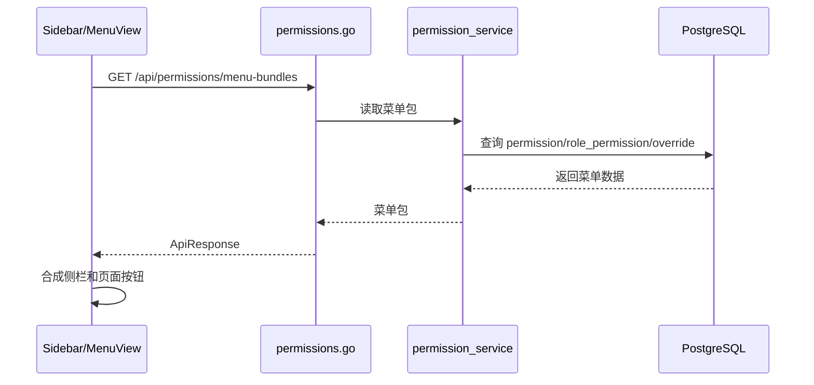

# 菜单管理 - 技术实现文档

## 1. 功能概述

菜单管理由 `MenuView.vue` 实现权限菜单树、平台菜单维护和租户菜单覆盖。后端使用 `permissions.go`、`permission_service.go`、`permission.go` 管理 `permission` 表，并提供菜单包、租户覆盖、数据权限模式更新等接口。数据模型包括 `permission`、`tenant_menu_override`、`role_permission`、`saas_feature`。菜单是权限、后台管理侧栏和按钮控制的共同来源；后台管理侧栏只抓取 `show_in_admin=true` 的目录和菜单，按钮不参与侧栏展示。套餐功能点的标准来源改为应用 Manifest 的 `package_features`，菜单自动同步只保留为历史兼容兜底。

## 2. 技术实现总览

| 实现层 | 内容 | 关键文件 |
|---|---|---|
| 前端页面 | 菜单树、平台维护、租户覆盖 | `frontend/src/views/MenuView.vue` |
| 前端接口 | 菜单包、租户覆盖、权限更新 | `frontend/src/api/permission.ts` |
| 后端路由 | `/api/permissions` 系列接口 | `internal/interfaces/http/handlers/permissions.go` |
| Gin Handler | Gin router 函数 | `internal/interfaces/http/handlers/permissions.go` |
| Application Service | 权限 Repository、菜单覆盖保存、历史功能点兼容同步 | `internal/application/permission_service.go`, `internal/application/plan_service.go` |
| 数据访问 | 权限树、菜单包、覆盖、种子权限 | `internal/infrastructure/persistence/postgres/repositories/permission.go` |
| 数据模型 | 权限、租户菜单覆盖、角色权限 | `internal/infrastructure/persistence/postgres/models`, `internal/interfaces/http/dto/role.go` |
| 权限控制 | `/menus`、`menu:create/edit/delete` 与 `/permissions` 兼容 | `internal/interfaces/http/middleware`, `internal/domain/permission` |
| 日志记录 | 菜单新增、编辑、归档、覆盖 | `permission_service.go` |

## 3. 前端实现说明

### 3.1 页面入口与路由

菜单路径系统管理 / 菜单管理；路由 `/menus`；路由名 `MenuView`；组件 `frontend/src/views/MenuView.vue`；懒加载。侧栏默认配置中按钮权限为 `menu:create`、`menu:edit`、`menu:delete`。

### 3.2 页面结构

页面由菜单树/树表、查询区、操作按钮、新增/编辑弹窗、租户覆盖配置、恢复默认、数据权限模式配置组成【具体 UI 以当前页面为准】。

### 3.3 查询实现

前端主要通过 `fetchMenuBundles()`、`fetchPermissionMenuBundles()`、`fetchTenantMenuOverrides()` 获取菜单包和覆盖数据。菜单管理页是否还有独立分页查询 `/api/permissions` 调用（当前实现未覆盖，按后续增强处理）。

### 3.4 列表实现

菜单节点字段包括名称、路径、类型、权限码、排序、启用、后台显示、平台专属、可套餐化、租户可见、租户可编辑、图标覆盖等。节点类型由 `permission.perm_type` 表示；后台显示由 `permission.show_in_admin` 和前端目录节点的 `showInAdmin` 共同控制。

### 3.5 新增实现

平台新增菜单/按钮调用权限创建接口【前端封装后续增强】。字段包括名称、路径、父级、权限类型、排序、启用、平台专属、可套餐化等。新增业务能力如果要进入套餐中心，必须同步补 Manifest 的 `package_features`；保存菜单本身不能替代 Manifest 声明。

### 3.6 编辑实现

平台编辑调用 `updatePermission(permissionId, payload)`；租户覆盖调用 `saveTenantMenuOverrides(overrides)`。平台编辑会更新 `permission`，租户编辑只写 `tenant_menu_override`。

### 3.7 删除实现

权限删除通过 `DELETE /api/permissions/{permission_id}`，后端逻辑删除。前端是否暴露删除入口以当前 UI 为准。未发现批量删除。

### 3.8 状态变更实现

平台菜单状态字段为 `permission.enabled`；后台管理侧栏显示字段为 `permission.show_in_admin`；租户覆盖状态字段为 `tenant_menu_override.enabled`、`visible`。平台状态影响所有租户；租户覆盖只影响当前主体；`show_in_admin=false` 只表示不进入后台管理菜单集合，不代表权限资源被删除。

### 3.9 前端权限控制

菜单页访问通过 `/menus`；按钮使用 `menu:create`、`menu:edit`、`menu:delete`。侧栏和路由守卫通过 `sidebarMenu.loadTenantMenuRuntime()` 获取覆盖后菜单，并阻止普通租户访问关闭菜单。

### 3.10 前端关键文件

| 类型 | 文件路径 | 说明 |
|---|---|---|
| 页面 | `frontend/src/views/MenuView.vue` | 菜单管理 |
| API | `frontend/src/api/permission.ts` | 菜单包与覆盖 |
| Store | `frontend/src/stores/sidebarMenu.ts` | 侧栏运行时菜单 |
| 工具 | `frontend/src/utils/menuVisibility.ts` | 菜单可见性 |
| 图标 | `frontend/src/utils/menuIconPicker.ts` | 图标选择 |

## 4. 后端实现说明

### 4.1 接口路由

| 接口名称 | 请求方法 | 接口路径 | 说明 | 权限标识 |
|---|---|---|---|---|
| 权限列表 | GET | `/api/permissions` | 分页查询权限 | `/permissions` |
| 新增权限 | POST | `/api/permissions` | 创建菜单/操作/数据权限 | `permission:create` |
| 权限树 | GET | `/api/permissions/tree` | 查询权限树 | `/permissions` |
| 菜单包 | GET | `/api/permissions/menu-bundles` | 前端菜单和权限包 | 登录/菜单权限（当前实现未覆盖，按后续增强处理） |
| 菜单覆盖 | GET | `/api/permissions/menu-overrides` | 查询租户覆盖 | 登录 |
| 保存菜单覆盖 | PUT | `/api/permissions/menu-overrides` | 保存覆盖 | `menu:create` 或 `menu:edit` |
| 菜单展示元数据 | PUT | `/api/permissions/menu-data-perm-mode/{permission_id}` | 更新菜单数据权限模式、平台归属、后台显示 | `menu:edit` 或 `permission:edit` |
| 权限详情 | GET | `/api/permissions/{permission_id}` | 查询权限 | `/permissions` |
| 编辑权限 | PUT | `/api/permissions/{permission_id}` | 更新权限 | `permission:edit` |
| 删除权限 | DELETE | `/api/permissions/{permission_id}` | 逻辑删除权限 | `permission:delete` |

### 4.2 Gin Handler 实现

`internal/interfaces/http/handlers/permissions.go` 负责权限接口。注意实际菜单管理前端使用 `menu:*`，后端权限路由仍保留 `permission:*` 语义，两套权限标识映射需要持续核对。

### 4.3 Application Service 实现

`permission_service.go` 提供 `list_permission_page()`、`create_permission_for_viewer()`、`save_tenant_menu_overrides_for_viewer()`、`get_permission_for_viewer()`、`update_permission_for_viewer()`、`delete_permission_for_viewer()`。创建/编辑权限触发的功能点同步只作为旧数据兼容；新增应用、内置应用和后续业务模块必须通过 Manifest 装载同步套餐功能点。

### 4.4 数据访问实现

`repositories/permission.go` 实现权限初始化、平台专属过滤、菜单包生成、用户权限码获取、权限 Repository 和软删除。

### 4.5 参数校验

DTO：`PermissionCreate`、`PermissionUpdate`、`MenuDataPermModeUpdate`、`TenantMenuOverrideSavePayload`。校验名称、类型、路径、数据范围、启用、平台专属、租户可见、租户可编辑等。

### 4.6 异常处理

权限不存在、路径重复（当前实现未覆盖，按后续增强处理）、父节点无效、平台专属误操作、租户覆盖不可编辑、权限被角色引用时删除等场景返回业务异常。

### 4.7 后端关键文件

| 类型 | 文件路径 | 说明 |
|---|---|---|
| Handler | `internal/interfaces/http/handlers/permissions.go` | 权限和菜单接口 |
| Application Service | `internal/application/permission_service.go` | 权限业务 |
| Repository | `internal/infrastructure/persistence/postgres/repositories/permission.go` | 权限数据和菜单包 |
| DTO | `internal/interfaces/http/dto/role.go` | 权限相关 DTO |
| Model | `internal/infrastructure/persistence/postgres/models` | `Permission`、`TenantMenuOverride` |

## 5. 数据模型说明

### 5.1 数据表清单

| 表名 | 说明 | 对应模型 | 备注 |
|---|---|---|---|
| `permission` | 菜单/按钮/数据权限源 | `Permission` | 树结构 |
| `tenant_menu_override` | 租户菜单覆盖 | `TenantMenuOverride` | 只存差异 |
| `role_permission` | 角色权限绑定 | `RolePermission` | 权限被角色引用 |
| `saas_feature` | 套餐功能点 | `SaasFeature` | 从可套餐化权限同步 |

### 5.2 表结构说明

#### 表：`permission`

| 字段名 | 类型 | 是否必填 | 默认值 | 说明 |
|---|---|---|---|---|
| `id` | Integer | 是 | 自增 | 主键 |
| `tenant_id` | Integer | 是 | 无 | 主体 ID |
| `parent_id` | Integer | 否 | NULL | 父权限 |
| `name` | String(200) | 是 | 无 | 名称 |
| `path` | String(500) | 否 | NULL | 路由或权限码 |
| `perm_type` | Integer | 是 | 无 | 1目录/2操作/3菜单/4数据/5按钮 |
| `data_scope` | String(32) | 否 | NULL | 数据范围 |
| `sort_order` | Integer | 是 | 0 | 排序 |
| `enabled` | Boolean | 是 | True | 启用 |
| `is_platform_only` | Boolean | 是 | False | 平台专属 |
| `is_package_feature` | Boolean | 是 | True | 是否可套餐化 |
| `feature_code` | String(100) | 否 | NULL | 功能点编码 |
| `feature_type` | String(32) | 否 | NULL | 功能类型 |
| `tenant_visible` | Boolean | 是 | True | 租户可见 |
| `tenant_editable` | Boolean | 是 | False | 租户可编辑 |
| `tenant_edit_scope` | String(100) | 否 | NULL | 租户编辑范围 |
| `data_perm_mode` | String(16) | 是 | ORG | 数据权限模式 |
| `deleted_at` | DateTime | 否 | NULL | 逻辑删除 |

#### 表：`tenant_menu_override`

| 字段名 | 类型 | 是否必填 | 默认值 | 说明 |
|---|---|---|---|---|
| `id` | Integer | 是 | 自增 | 主键 |
| `tenant_id` | Integer | 是 | 无 | 主体 ID |
| `permission_id` | Integer | 是 | 无 | 菜单权限 |
| `custom_name` | String(200) | 否 | NULL | 自定义名称 |
| `custom_icon` | String(100) | 否 | NULL | 自定义图标 |
| `enabled` | Boolean | 否 | NULL | 覆盖启用 |
| `visible` | Boolean | 否 | NULL | 覆盖可见 |
| `sort_order` | Integer | 否 | NULL | 覆盖排序 |
| `created_at` | DateTime | 否 | now | 创建时间 |
| `updated_at` | DateTime | 否 | now | 更新时间 |

### 5.3 关键字段说明

`permission.parent_id` 构建树；`perm_type` 区分目录、菜单、操作、数据、按钮；`is_platform_only` 控制租户过滤；`is_package_feature` 控制套餐同步；`tenant_menu_override` 只存租户差异。

### 5.4 数据关系说明

权限树是菜单、按钮、数据权限的源；角色通过 `role_permission` 绑定权限；可套餐化权限同步到 `saas_feature`；租户菜单最终由权限源和覆盖表合成。

### 5.5 索引与约束

`tenant_menu_override(tenant_id, permission_id)` 唯一。`permission` 对 `tenant_id`、`parent_id`、`feature_code` 等建索引。路径唯一性约束未在模型中确认（当前实现未覆盖，按后续增强处理）。

## 6. 接口详细说明

## 6.1 获取菜单包

### 基本信息

| 项目 | 内容 |
|---|---|
| 请求方法 | GET |
| 接口路径 | `/api/permissions/menu-bundles` |
| 权限标识 | 登录用户上下文（当前实现未覆盖，按后续增强处理） |
| 用途 | 返回前端侧栏和角色配置使用的菜单包 |

### 请求参数

无。

### 返回结果

| 字段名 | 类型 | 说明 |
|---|---|---|
| `data` | array | 菜单包、操作、数据权限 |

### 处理逻辑

1. 识别当前用户和平台/租户身份。
2. 查询权限树。
3. 过滤平台专属、套餐能力、角色权限。
4. 返回菜单包。

### 异常情况

- 未登录。
- 权限数据缺失。

## 6.2 保存租户菜单覆盖

### 基本信息

| 项目 | 内容 |
|---|---|
| 请求方法 | PUT |
| 接口路径 | `/api/permissions/menu-overrides` |
| 权限标识 | `menu:create` 或 `menu:edit` |
| 用途 | 保存当前主体菜单覆盖 |

### 请求参数

| 参数名 | 类型 | 是否必填 | 说明 |
|---|---|---|---|
| `overrides` | array | 是 | 覆盖项数组 |

### 返回结果

| 字段名 | 类型 | 说明 |
|---|---|---|
| `tenant_id` | int | 主体 ID |
| `overrides` | array | 保存后的覆盖 |

### 处理逻辑

1. 校验权限。
2. 校验权限节点存在且允许租户覆盖。
3. 写入或更新 `tenant_menu_override`。
4. 返回覆盖列表。

### 异常情况

- 权限节点不存在。
- 平台专属或不可编辑。

## 7. 权限实现说明

### 7.1 菜单权限

菜单管理侧栏路径 `/menus`，后端权限模块历史路径存在 `/permissions`。需持续保持前后端菜单包映射一致。

### 7.2 按钮权限

前端侧栏为 `menu:create`、`menu:edit`、`menu:delete`；后端权限 Repository 也存在 `permission:create/edit/delete`。映射关系（当前实现未覆盖，按后续增强处理）。

### 7.3 API 权限

读接口使用菜单权限；写接口使用操作权限。菜单覆盖保存用 `menu:create` 或 `menu:edit`。

### 7.4 数据权限

菜单数据按主体 `tenant_id` 存储。平台专属菜单不进入普通租户菜单包。租户覆盖只影响当前主体。

## 8. 日志实现说明

| 操作 | 是否记录 | 记录内容 | 实现位置 |
|---|---|---|---|
| 新增权限/菜单 | 是 | 名称、路径、类型 | `permission_service.go` |
| 编辑权限/菜单 | 是 | 变更摘要 | `permission_service.go` |
| 删除权限/菜单 | 是 | 归档摘要 | `permission_service.go` |
| 保存菜单覆盖 | 是（当前实现未覆盖，按后续增强处理） | 覆盖摘要 | `permission_service.go` |

## 9. 状态与枚举实现

| 字段/枚举 | 取值 | 说明 | 来源 |
|---|---|---|---|
| `perm_type` | 1/2/3/4/5 | 目录/操作/菜单/数据/按钮 | 数据库字段 |
| `enabled` | true/false | 启用 | 数据库字段 |
| `is_platform_only` | true/false | 平台专属 | 数据库字段 |
| `data_perm_mode` | `NONE`/`ORG`/`BU`/`ORG_BU` | 菜单数据权限模式 | 业务约定 |
| `deleted_at` | NULL/datetime | 未归档/已归档 | 数据库字段 |

## 10. 关键业务逻辑实现

### 逻辑：菜单运行时合成

- 触发入口：登录后加载菜单。
- 处理流程：读取平台权限源，过滤平台专属、套餐能力、角色权限，再叠加租户覆盖。
- 涉及方法：`menu_bundles_for_tenant()`【位于 repositories/permission.go】、`sidebarMenu.loadTenantMenuRuntime()`。
- 涉及数据：`permission`、`tenant_menu_override`、`role_permission`、`saas_feature`。
- 异常处理：无权限时前端路由守卫跳回首页。
- 注意事项：前端体验控制不能替代后端权限校验。

### 逻辑：Manifest 同步功能点

- 触发入口：Manifest 上传、扫描、diff 确认和装载。
- 处理流程：读取 Manifest 的 `package_features` 与 `quotas`，生成或更新 `saas_feature`、`saas_quota` 及后续默认套餐绑定。
- 涉及方法：Manifest parser、Manifest validator、Manifest diff service、Manifest load service。
- 涉及数据：Manifest 文件、`permission`、`saas_feature`、`saas_quota`。
- 异常处理：功能编码、权限码、菜单 path、API method + path 或配额单位冲突时阻断装载。
- 注意事项：主体管理、套餐中心、应用中心、系统监控等平台专属能力不得进入租户套餐池；未纳入套餐的能力应进入套餐外订阅或非售卖治理。

## 11. 前后端交互流程

## 12. 扩展点与技术风险

- 扩展点：菜单发布预览、权限冲突检测、引用检查。
- 风险：`menu:*` 与 `permission:*` 两套标识需要核对，避免前后端不一致。
- 风险：删除权限需处理角色、套餐功能和租户覆盖引用。
