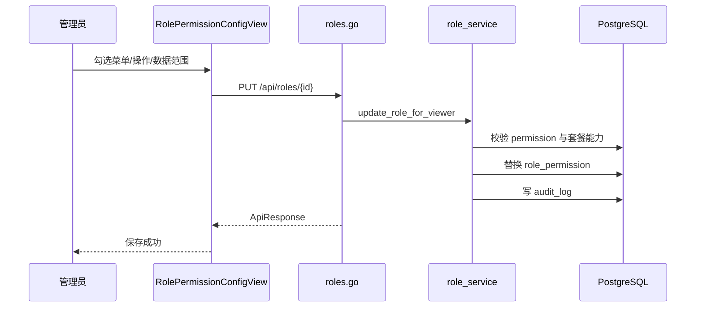

# 角色权限 - 技术实现文档

## 1. 功能概述

角色权限由 `RoleView.vue` 和 `RolePermissionConfigView.vue` 实现角色 Repository、权限配置、数据范围配置。后端由 `roles.go`、`role_service.go`、`role.go`、`permissions.go`、`permission_service.go` 支撑角色、权限树、菜单包和数据权限。数据模型包括 `role`、`permission`、`role_permission`、`business_unit_scope`。权限为 `/roles`、`role:create`、`role:edit`、`role:delete`，配置权限通常复用编辑权限。权限配置受套餐功能约束。

## 2. 技术实现总览

| 实现层 | 内容 | 关键文件 |
|---|---|---|
| 前端页面 | 角色列表 | `frontend/src/views/RoleView.vue` |
| 前端页面 | 角色权限配置 | `frontend/src/views/RolePermissionConfigView.vue` |
| 前端接口 | 角色 Repository | `frontend/src/api/role.ts` |
| 前端接口 | 菜单包、权限更新 | `frontend/src/api/permission.ts` |
| 后端路由 | `/api/roles`、`/api/permissions` 部分接口 | `internal/interfaces/http/handlers/roles.go`, `internal/interfaces/http/handlers/permissions.go` |
| Application Service | 角色与权限配置 | `internal/application/role_service.go`, `internal/application/permission_service.go` |
| 数据访问 | 角色、权限关系 | `internal/infrastructure/persistence/postgres/repositories/role.go`, `internal/infrastructure/persistence/postgres/repositories/permission.go` |
| 数据模型 | 角色、权限、角色权限 | `internal/infrastructure/persistence/postgres/models`, `internal/interfaces/http/dto/role.go` |
| 权限控制 | 菜单/操作/套餐功能 | `internal/interfaces/http/middleware`, `internal/domain/permission` |
| 日志记录 | 角色维护、权限配置 | `internal/application/role_service.go` |

## 3. 前端实现说明

### 3.1 页面入口与路由

角色列表路由 `/roles`，名称 `RoleView`，组件 `RoleView.vue`。权限配置路由 `/roles/:roleId/permission-config`，名称 `RolePermissionConfigView`，组件 `RolePermissionConfigView.vue`。均为懒加载。

### 3.2 页面结构

角色列表包含查询、列表、分页、新增/编辑弹窗、归档确认、进入权限配置按钮。权限配置页面包含菜单/操作权限树、数据权限配置、业务单元或组织范围选择、保存按钮。

### 3.3 查询实现

角色列表调用 `fetchRoles(skip, limit, kw)`。角色详情调用 `fetchRole(id)`。权限菜单包调用角色或权限相关 menu bundles 接口【具体页面调用以实现为准】。

### 3.4 列表实现

角色字段包括编码、名称、描述、创建时间、操作。当前 `role` 模型无状态字段；角色启停逻辑未发现。

### 3.5 新增实现

新增角色表单字段：`code`、`name`、`description`，调用 `createRole()`。成功后刷新列表。

### 3.6 编辑实现

编辑回显角色数据，调用 `updateRole(id, body)`。权限配置保存通过角色更新 payload 中的权限 ID 和数据权限覆盖实现。

### 3.7 删除实现

删除为归档，调用 `deleteRole(id)`，前端二次确认。未发现批量删除。

### 3.8 状态变更实现

当前实现中未发现明确状态变更逻辑；`role` 表无 `status` 字段。

### 3.9 前端权限控制

菜单权限 `/roles`；按钮权限 `role:create`、`role:edit`、`role:delete`。权限配置入口通常需要 `role:edit`。

### 3.10 前端关键文件

| 类型 | 文件路径 | 说明 |
|---|---|---|
| 页面 | `frontend/src/views/RoleView.vue` | 角色列表 |
| 页面 | `frontend/src/views/RolePermissionConfigView.vue` | 权限配置 |
| API | `frontend/src/api/role.ts` | 角色接口 |
| API | `frontend/src/api/permission.ts` | 菜单包和权限接口 |

## 4. 后端实现说明

### 4.1 接口路由

| 接口名称 | 请求方法 | 接口路径 | 说明 | 权限标识 |
|---|---|---|---|---|
| 角色列表 | GET | `/api/roles` | 分页查询角色 | `/roles` 或相关操作 |
| 权限菜单包 | GET | `/api/roles/permission-menu-bundles` | 角色配置权限包 | 【待确认】 |
| 角色详情 | GET | `/api/roles/{role_id}` | 查询角色及权限 | `/roles` 或相关操作 |
| 新增角色 | POST | `/api/roles` | 创建角色 | `role:create` |
| 编辑角色 | PUT | `/api/roles/{role_id}` | 更新角色和权限 | `role:edit` |
| 删除角色 | DELETE | `/api/roles/{role_id}` | 逻辑删除角色 | `role:delete` |

### 4.2 Gin Handler 实现

`internal/interfaces/http/handlers/roles.go` 使用 `_require_menu_path_or_any_operation()` 支持读场景，写接口使用 `_require_operation()`。入参包括 `RoleCreate`、`RoleUpdate`。

### 4.3 Application Service 实现

`role_service.go` 核心方法：`list_role_page()`、`get_role_for_viewer()`、`create_role_for_viewer()`、`update_role_for_viewer()`、`delete_role_for_viewer()`。`update_role_for_viewer()` 处理权限 ID、数据范围覆盖、自定义组织/用户/业务单元、套餐功能过滤。代码注释显示权限配置页读写使用完整 permission_ids，避免按套餐裁剪后保存误删不可见权限。

### 4.4 数据访问实现

`repositories/role.go` 提供角色 Repository、权限关系更新；`repositories/permission.go` 提供权限树、菜单包、用户权限码。角色删除逻辑设置 `deleted_at`。

### 4.5 参数校验

DTO 校验角色编码、名称、权限 ID 列表、数据范围覆盖值。Application Service 校验角色和权限属于当前主体，套餐是否支持分配的权限，自定义范围是否有效。

### 4.6 异常处理

角色不存在、编码重复、权限不存在、套餐不支持权限、跨租户访问、自定义范围非法、删除失败等返回业务异常。

### 4.7 后端关键文件

| 类型 | 文件路径 | 说明 |
|---|---|---|
| Handler | `internal/interfaces/http/handlers/roles.go` | 角色接口 |
| Application Service | `internal/application/role_service.go` | 角色权限业务 |
| Repository | `internal/infrastructure/persistence/postgres/repositories/role.go` | 角色数据访问 |
| Repository | `internal/infrastructure/persistence/postgres/repositories/permission.go` | 权限数据 |
| DTO | `internal/interfaces/http/dto/role.go` | 角色权限 DTO |
| Model | `internal/infrastructure/persistence/postgres/models` | `Role`、`RolePermission` |

## 5. 数据模型说明

### 5.1 数据表清单

| 表名 | 说明 | 对应模型 | 备注 |
|---|---|---|---|
| `role` | 角色 | `Role` | 租户内角色 |
| `permission` | 权限/菜单/按钮/数据 | `Permission` | 权限源 |
| `role_permission` | 角色权限关系 | `RolePermission` | 含数据范围覆盖 |
| `business_unit_scope` | 业务单元范围 | `BusinessUnitScope` | 数据权限扩展 |
| `user_role` | 用户角色 | `UserRole` | 用户继承角色 |

### 5.2 表结构说明

#### 表：`role`

| 字段名 | 类型 | 是否必填 | 默认值 | 说明 |
|---|---|---|---|---|
| `id` | Integer | 是 | 自增 | 主键 |
| `tenant_id` | Integer | 是 | 无 | 主体 ID |
| `code` | String(64) | 是 | 无 | 角色编码 |
| `name` | String(200) | 是 | 无 | 角色名称 |
| `description` | String(500) | 否 | NULL | 说明 |
| `created_at` | DateTime | 否 | now | 创建时间 |
| `deleted_at` | DateTime | 否 | NULL | 逻辑删除 |

#### 表：`role_permission`

| 字段名 | 类型 | 是否必填 | 默认值 | 说明 |
|---|---|---|---|---|
| `id` | Integer | 是 | 自增 | 主键 |
| `role_id` | Integer | 是 | 无 | 角色 ID |
| `permission_id` | Integer | 是 | 无 | 权限 ID |
| `data_scope_override` | String(32) | 否 | NULL | 数据范围覆盖 |
| `custom_company_ids_json` | Text | 否 | NULL | 自定义公司 |
| `custom_department_ids_json` | Text | 否 | NULL | 自定义部门 |
| `custom_user_ids_json` | Text | 否 | NULL | 自定义用户 |
| `custom_business_unit_ids_json` | Text | 否 | NULL | 自定义业务单元 |
| `bu_data_access_mode` | String(32) | 否 | NULL | 业务单元数据访问模式 |

### 5.3 关键字段说明

`role.tenant_id` 隔离主体；`role.deleted_at` 逻辑删除；`role_permission.data_scope_override` 和 custom json 字段实现数据权限；`bu_data_access_mode` 支撑业务单元模式。

### 5.4 数据关系说明

一个用户可有多个角色；一个角色可有多个权限；一个权限可为菜单、按钮、数据权限；角色权限可覆盖数据范围并引用业务单元。

### 5.5 索引与约束

`role(tenant_id, code)` 唯一；`role_permission(role_id, permission_id)` 唯一；`user_role(user_id, role_id)` 唯一；`business_unit_scope(role_permission_id, business_unit_id)` 唯一。

## 6. 接口详细说明

## 6.1 角色详情

### 基本信息

| 项目 | 内容 |
|---|---|
| 请求方法 | GET |
| 接口路径 | `/api/roles/{role_id}` |
| 权限标识 | `/roles` 或相关操作 |
| 用途 | 查询角色和已配置权限 |

### 请求参数

| 参数名 | 类型 | 是否必填 | 说明 |
|---|---|---|---|
| `role_id` | int | 是 | 角色 ID |

### 返回结果

| 字段名 | 类型 | 说明 |
|---|---|---|
| `id` | int | 角色 ID |
| `permission_ids` | array | 权限 ID |
| `data_overrides` | array | 数据权限覆盖 |

### 处理逻辑

1. 校验读权限。
2. 查询同主体角色。
3. 查询角色权限关系。
4. 返回完整权限配置。

### 异常情况

- 角色不存在。
- 权限不足。

## 6.2 保存角色权限

### 基本信息

| 项目 | 内容 |
|---|---|
| 请求方法 | PUT |
| 接口路径 | `/api/roles/{role_id}` |
| 权限标识 | `role:edit` |
| 用途 | 更新角色基础信息和权限配置 |

### 请求参数

| 参数名 | 类型 | 是否必填 | 说明 |
|---|---|---|---|
| `name` | string | 否 | 角色名称 |
| `description` | string | 否 | 描述 |
| `permission_ids` | array | 否 | 权限 ID |
| `data_overrides` | array | 否 | 数据范围覆盖 |

### 返回结果

| 字段名 | 类型 | 说明 |
|---|---|---|
| `id` | int | 角色 ID |
| `permission_ids` | array | 保存后的权限 |

### 处理逻辑

1. 校验 `role:edit`。
2. 校验角色属于当前主体。
3. 校验权限存在且属于当前主体。
4. 校验套餐支持被分配权限。
5. 替换角色权限和数据范围覆盖。
6. 记录审计日志。

### 异常情况

- 套餐不支持权限。
- 权限不存在。
- 自定义范围非法。

## 7. 权限实现说明

### 7.1 菜单权限

菜单路径 `/roles`。权限配置子页不单独作为侧栏菜单，但受角色管理权限保护。

### 7.2 按钮权限

`role:create`、`role:edit`、`role:delete`。

### 7.3 API 权限

读接口使用菜单或操作权限；写接口使用具体操作权限。保存角色权限时还调用套餐能力校验，防止角色突破套餐。

### 7.4 数据权限

角色权限自身按 `tenant_id` 隔离。角色配置的数据范围在其他业务查询中生效，支持 `ALL`、`ORG`、`ORG_SUB`、`SELF`、`CUSTOM` 及业务单元扩展。

## 8. 日志实现说明

| 操作 | 是否记录 | 记录内容 | 实现位置 |
|---|---|---|---|
| 新增角色 | 是 | 角色编码、名称 | `role_service.go` |
| 编辑角色/权限 | 是 | 角色和权限变更摘要 | `role_service.go` |
| 归档角色 | 是 | 角色归档摘要 | `role_service.go` |

## 9. 状态与枚举实现

| 字段/枚举 | 取值 | 说明 | 来源 |
|---|---|---|---|
| `deleted_at` | NULL/datetime | 未归档/已归档 | 数据库字段 |
| `data_scope_override` | `ALL`/`ORG`/`ORG_SUB`/`SELF`/`CUSTOM` | 数据范围 | 代码常量/业务约定 |
| `bu_data_access_mode` | `CURRENT_ORG_BU`/`SPECIFIED_BU` | 业务单元范围 | `internal/domain/organization` |

## 10. 关键业务逻辑实现

### 逻辑：套餐约束下的权限保存

- 触发入口：权限配置保存。
- 处理流程：接收权限 ID，校验权限归属，再校验当前套餐支持，最后替换关系。
- 涉及方法：`update_role_for_viewer()`。
- 涉及数据：`role_permission`、`permission`、`saas_feature`。
- 异常处理：不支持的权限返回错误。
- 注意事项：GET 角色详情不应按套餐裁剪，否则保存会误删历史权限。

### 逻辑：自定义数据范围

- 触发入口：配置角色数据权限。
- 处理流程：保存数据权限覆盖值和自定义组织、用户、业务单元 ID。
- 涉及方法：`update_role_for_viewer()`。
- 涉及数据：`role_permission`、`business_unit_scope`。
- 异常处理：自定义对象不存在或跨租户拒绝。
- 注意事项：数据过滤需要在查询层生效。

## 11. 前后端交互流程

## 12. 扩展点与技术风险

- 扩展点：角色复制、权限模板、差异预览、高危权限提醒。
- 风险：角色无状态字段，需求层的禁用角色当前未实现。
- 风险：套餐降级后旧权限是否清理需保持“不生效但不误删”的策略。
